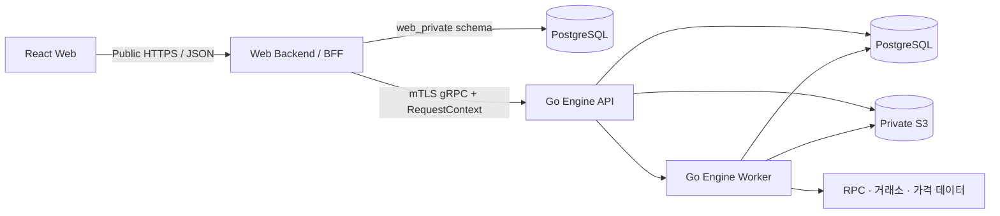

# 웹 앱 기술 명세 — GIWA MVP v0.1

> 상태: Draft
>
> 기준일: 2026-07-19
>
> 대상: `apps/web` 및 공개 Web API 연동
>
> 상위 기준: [Technical Spec — GIWA MVP v0.1](https://linear.app/giwa-daejang/document/technical-spec-giwa-mvp-v01-18d511232c66)

## 1. 문서 목적

이 문서는 상위 기술 명세를 웹 애플리케이션 구현 계약으로 구체화한다. React가 담당할 범위, Web Backend와의 통신 경계, 인증·비동기 작업·오류 처리·테스트 기준을 정의한다.

Go Engine 내부의 계산 모델, 데이터베이스 인덱스, 체인 Reorg, 가격·Lot·정책의 세부 구현은 상위 기술 명세를 기준으로 하며 이 문서에서 중복 정의하지 않는다.

결정 상태는 다음과 같이 구분한다.

- **확정**: 상위 기술 명세에서 구현 기준으로 정한 내용
- **초기 선택**: 현재 웹 프로젝트를 시작하기 위한 되돌릴 수 있는 선택
- **미결정**: 구현 전에 별도 결정 또는 API 계약이 필요한 내용

## 2. 결정 요약

| 항목 | 상태 | 내용 |
| --- | --- | --- |
| Frontend | 확정 | React + TypeScript |
| Web build tool | 초기 선택 | Vite |
| Package manager | 초기 선택 | npm workspaces |
| Public boundary | 확정 | React는 Web Backend의 HTTPS/JSON API만 호출 |
| Internal boundary | 확정 | Web Backend는 private gRPC로 Go Engine 호출 |
| Long-running work | 확정 | 요청은 즉시 `job_id`를 반환하고 웹은 polling |
| MVP 입력 | 확정 | Upbit 거래내역 PDF 1개 + 연결한 Ethereum 지갑 1개 |
| MVP 지갑 연결 | 확정 | Rabby, MetaMask, WalletConnect(Reown), Coinbase, Other Wallets 중 하나를 선택하고 브라우저 지갑에서 1회용 소유권 메시지 서명 |
| 지갑 수집 | 확정 | 선택 기간의 최근 90일 우선 backfill, 나머지는 background 처리, 이후 매일 자동 동기화와 수동 새로고침 |
| Web Backend runtime | 확정 | Node.js + TypeScript + Fastify 5 BFF |
| Web session | 확정 | 서버 저장 opaque session + `HttpOnly` host-only cookie |
| Web API deployment | 확정 | private gRPC 연결이 가능한 Node container/service |
| 회원가입 필수 절차 | 확정 | 이용약관·개인정보 처리방침을 각각 확인·동의한 뒤 선택한 서비스 계정 인증 진행 |
| 로그인 방식 | 미결정 | email, OIDC 또는 지갑 서명 |
| 첫 지원 체인 | 확정 | Ethereum. 다른 EVM 체인은 후속 확장 |

TS-01은 Fastify 기반 BFF로 확정한다. React는 계속 공개 HTTPS/JSON 계약에만 의존하며 Fastify 내부 구현이나 Engine gRPC 모델을 직접 사용하지 않는다.

## 3. 시스템 경계



핵심 원칙:

1. React는 Engine, PostgreSQL, S3 SDK와 직접 통신하지 않는다.
2. 브라우저가 접근하는 서버 경계는 공개 Web API 하나다.
3. Web Backend는 인증·권한·입력 검증과 응답 조합을 담당한다.
4. 정규화, 연결, 가격, Lot, 대사, 보고서 계산은 Go Engine이 담당한다.
5. 수집·계산·보고서 생성은 사용자 요청 안에서 동기 완료하지 않는다.

### 3.1 컴포넌트 책임

| 계층 | 담당 | 포함하지 않는 것 |
| --- | --- | --- |
| React | 화면, 입력, 세션 UI, API 호출, Job 진행률과 오류 표시 | DB/S3/RPC 자격증명, 도메인 계산, 거래소 Secret 저장 |
| Web Backend / BFF | 서버 Session·사용자 상태 검증, JSON API, 입력 검증, CSRF 방어, gRPC 변환 | Engine DB 직접 조회, 정규화·Lot·정책 계산 |
| Go Engine API | 사용자 소유권 검증, Job 생성·조회, 도메인 서비스 호출 | Public JWT 신뢰, 화면별 응답 조합 |
| Go Engine Worker | 수집·파싱·계산·재시도·checkpoint·결과 저장 | 장시간 작업의 동기 HTTP 처리 |

## 4. 저장소와 React 구조

현재 저장소 구조:

```text
apps/
  web/
    src/
      components/   공통 화면 구성 요소
      test/         테스트 공통 설정
      App.tsx       초기 애플리케이션 셸
      main.tsx      React 진입점
  web-api/
    src/
      auth/         PostgreSQL 사용자·Session·동의 저장소와 인증 경계
      engine/       private gRPC mTLS client와 SourceService adapter
      routes/       공개 HTTPS/JSON route
      app.ts        Fastify app 조립과 오류 계약
      server.ts     Node 실행 진입점
proto/
  giwa/engine/v1/   Web API와 Engine의 canonical protobuf 계약
services/
  engine/            SourceService gRPC server와 DB adapter
docs/
  00-web-app-technical-spec.md
  01-user-onboarding.md
```

기능 구현이 시작되면 다음처럼 feature 단위로 확장한다. 아직 사용하지 않는 빈 폴더나 추상화는 미리 만들지 않는다.

```text
apps/web/src/
  app/              provider, router, 전역 설정
  routes/           public, auth, onboarding, dashboard
  features/         auth, source, upload, job, ledger, review, report
  shared/           api, ui, lib, 공용 type
  test/             테스트 설정과 fixture
```

상위 기술 명세의 서비스 구조:

```text
apps/web
apps/web-api
services/engine (SourceService API)
별도 장기 실행 Engine worker 저장소
별도 중앙 DB schema/migration 저장소 (`daejang-db`)
```

## 5. 패키지와 개발 기준

초기 웹 패키지는 다음 역할만 포함한다.

| 패키지 | 역할 |
| --- | --- |
| `react`, `react-dom` | 웹 UI runtime |
| `vite`, `@vitejs/plugin-react` | 개발 서버와 production build |
| `typescript`, `@types/*` | 정적 타입 검사 |
| `oxlint` | 빠른 기본 lint |
| `vitest`, `jsdom` | 단위·컴포넌트 테스트 runtime |
| `@testing-library/react`, `@testing-library/jest-dom` | 사용자 관점의 컴포넌트 검증 |
| `fastify`, `@fastify/cookie` | Web API runtime, schema와 host-only session cookie 처리 |
| `pg` | Web Backend 소유 `web_private` schema와 내구성 있는 SessionStore |
| `@grpc/grpc-js`, `@grpc/proto-loader` | Engine private gRPC mTLS channel과 SourceService 호출 |
| `tsx` | Web API 로컬 개발 실행 |

라우터, 서버 상태, 폼, 스키마 라이브러리는 실제 route와 API 계약이 정해질 때 추가한다. 초기 틀에 후보 라이브러리를 선반영하지 않는다.

루트 명령:

```bash
npm install
npm run dev
npm run dev:api
npm run lint
npm run typecheck
npm test
npm run build
```

## 6. Web API 계약

React는 화면에서 직접 gRPC 또는 Engine 모델을 사용하지 않는다. 공개 API의 JSON 계약을 통해서만 데이터를 주고받는다.

| 사용자 동작 | Public Web API | 결과 |
| --- | --- | --- |
| 로그인 | 인증 방식 확정 후 추가 | 서버 Session 생성 및 host-only cookie 설정 |
| 세션 회전 | `POST /api/v1/auth/session/rotate` | 기존 Token 폐기 후 새 host-only cookie 설정 |
| 로그아웃 | `POST /api/v1/auth/logout` | Session 폐기 |
| 현재 사용자 확인 | `GET /api/v1/me` | 서버 Session에서 확인한 사용자 |
| 데이터 소스 목록 | `GET /api/v1/sources` | 현재 사용자의 등록된 source |
| 지갑 소유권 challenge 생성 | `POST /api/v1/sources/wallets/challenges` | 5분 만료 1회용 오프체인 서명 메시지 |
| 지갑 등록 | `POST /api/v1/sources/wallets` | 서명 검증 후 저장된 Ethereum 지갑 데이터 소스 |
| 데이터 소스 연결 해제 | `POST /api/v1/sources/{id}/disconnect` | 향후 자동·수동 수집 중단, 기존 데이터 보존 |
| 업로드 세션 생성 | `POST /api/v1/uploads` | 제한된 Presigned URL |
| 업로드 확정 | `POST /api/v1/uploads/{id}/confirm` | 검증된 데이터 소스 |
| 수집 preview | `POST /api/v1/collection-previews` | 데이터 소스별 기간·예상 건수·경고 |
| 수집 시작 | `POST /api/v1/syncs` | `job_id` |
| 작업 조회 | `GET /api/v1/jobs/{id}` | 상태·단계·진행률 |
| 활동 조회 | `GET /api/v1/activities` | cursor 기반 거래 목록 |
| 계산 시작 | `POST /api/v1/calculations` | `job_id` |
| 검토 조회·해결 | Review Item API | 사용자 사실관계와 새 계산 기준 |
| 보고서 생성·조회 | Report API | `job_id` 또는 immutable Report |

다음 계약은 아직 미결정이다.

- 회원가입 endpoint, 동의 문서 조회·기록 API와 계정 활성화 순서
- 등록된 데이터 소스 목록 및 온보딩 상태 조회 API
- 수집 기간의 timezone, 포함 범위와 source coverage 검증 계약
- 표준 JSON 성공·오류 envelope
- `Idempotency-Key` 전달 방식, 보존 시간, 충돌 규칙
- 보고서 다운로드용 공개 endpoint
- Job 취소 API 지원 여부

API 계약이 확정되면 OpenAPI 또는 동등한 schema를 source of truth로 두고, 프런트 타입을 수동으로 중복 작성하지 않는다.

### 6.1 Ethereum 지갑 연결 계약

MVP는 Reown AppKit의 Ethers adapter를 공통 연결 계층으로 사용한다. `MetaMask`, `WalletConnect`, `Coinbase`는 AppKit wallet button으로 직접 연결하고 `Rabby`와 `Other Wallets`는 AppKit 연결 화면에서 선택한다. Client는 연결된 Ethereum 주소에 대해 Web Backend가 발급한 1회용 소유권 메시지 서명을 요청한다.

- Client 설정은 `VITE_REOWN_PROJECT_ID`를 사용한다. Project ID는 공개 식별자이지만 Reown Dashboard에서 production domain allowlist를 설정한다.
- AppKit metadata URL은 실행 중인 `window.location.origin`과 일치시켜 Verify API의 도메인 판정을 보존한다.
- 지원 network는 AppKit의 Ethereum mainnet 하나로 제한한다.
- Project ID가 없으면 가짜 연결을 성공시키지 않고 provider 설정 오류를 표시한다.

- challenge는 현재 Session 사용자, Ethereum 주소, network, nonce와 발급 시각에 결합하고 발급 후 5분이 지나면 만료한다.
- challenge와 서명은 한 번만 사용할 수 있으며 성공·만료·주소 또는 network 변경 후에는 재사용하지 않는다.
- 서명은 오프체인 소유권 확인이다. 가스비, 거래 승인, token allowance, 자산 이동 또는 온체인 transaction을 만들지 않는다.
- Client와 Web Backend는 private key, seed phrase, 쓰기 권한과 출금 권한을 요청하거나 전달받지 않는다.
- 원본 challenge message와 signature는 URL, browser storage, 분석 이벤트와 일반 log에 남기지 않는다.
- 서버가 challenge와 signature를 검증하고 사용자별 주소 제한을 확인한 뒤에만 `source_id`를 만든다.
- Web Backend는 검증된 사용자 UUID, request ID, Session ID와 idempotency key를 `RequestContext`에 담아 SourceService를 호출한다. 브라우저 Session Token은 전달하지 않는다.

초기·수동 수집은 `POST /api/v1/syncs`로 Job을 생성한다. 초기 수집은 선택 범위의 종료일을 기준으로 최근 90일을 먼저 backfill하고, 선택 범위가 더 길면 나머지 과거 구간을 background에서 이어서 처리한다. 이후 서버 scheduler가 매일 checkpoint 이후 범위를 자동 수집하며, 사용자는 같은 Source에 수동 새로고침을 요청할 수 있다. 모든 trigger는 checkpoint와 idempotency key로 동일 거래·Job의 중복 생성을 막는다.

연결 해제는 향후 자동 동기화와 수동 새로고침만 중단한다. 이미 수집한 원본·정규화 결과와 보고서 근거는 보존하며, 데이터 삭제는 별도 동작과 정책으로 다룬다.

## 7. 인증과 세션

웹 인증 기준:

- 신규 사용자는 이용약관과 개인정보 처리방침을 각각 확인·동의한 뒤 서비스 계정 인증 방식을 선택한다.
- Web Backend는 동의 문서 종류·버전, 동의 시각과 사용자를 연결해 기록하며 Client의 동의 여부만 신뢰하지 않는다.
- 선택한 인증 방식의 서버 검증이 성공한 뒤에만 서비스 계정과 Session을 활성화한다.
- 브라우저에는 권한 정보나 Access Token 대신 추측할 수 없는 opaque Session Token만 둔다.
- Session Token은 운영에서 `__Host-daejang_session` 이름의 `HttpOnly; Secure; SameSite=Lax; Path=/` cookie로 설정한다.
- 서버 저장소에는 원문 Token이 아니라 SHA-256 hash, 사용자 UUID, session epoch, 생성·최근 활동 시각과 절대·유휴 만료 시각을 저장한다.
- Session Token을 `localStorage`, `sessionStorage` 또는 JavaScript 상태에 저장하지 않는다.
- 앱 시작 시 `/api/v1/me`로 서버 Session과 활성 사용자 상태를 확인한다. 사용자가 정지·삭제되거나 전체 로그아웃을 요청하면 `session_epoch`을 증가시키고 기존 Session을 폐기한다.
- 사용자 UUID나 소유권 범위를 브라우저 입력, query 또는 임의 header에서 신뢰하지 않는다.
- Web Backend는 서버 Session의 사용자 UUID, request ID와 Session ID로 내부 RequestContext를 만들고 브라우저 Session Token을 Go Engine으로 전달하지 않는다.
- 모든 `/api/*` `POST`, `PUT`, `PATCH`, `DELETE`는 body parsing 전에 정확한 Origin을 확인한다. `Sec-Fetch-Site`가 있으면 `same-origin`만 허용하고 `same-site`, `cross-site`, `none`과 알 수 없는 값은 거부한다.
- `/api/*` 응답은 성공·오류와 관계없이 `Cache-Control: no-store`를 적용하고, 전체 응답에 CSP, `nosniff`, frame 차단, referrer·권한 정책을 적용한다. 운영 HTTPS 응답에는 HSTS를 추가한다.
- Session은 활동 시 유휴 만료만 절대 만료 이내에서 연장한다. 일반 회전은 PostgreSQL의 단일 transaction으로 기존 hash와 Session ID를 교체한다. 로그인 성공·재인증·권한 상승 시에는 `LoginCompletionService`가 공급자별 제한을 먼저 적용하고 기존 브라우저 Session을 폐기한 뒤 새 Token을 발급한다.
- 존재 여부 노출을 막기 위해 다른 사용자가 소유한 리소스는 `404`로 응답한다.
- 운영 환경은 PostgreSQL SessionStore와 PostgreSQL rate-limit store 없이는 시작하지 않는다. 메모리 저장소는 로컬 개발과 테스트에만 사용한다.
- 로그인 공급자 정책은 SIWE, OIDC, email을 분리한다. begin/complete 단계의 IP bucket과 공급자 identity bucket을 각각 소비하고 하나라도 초과하면 거부한다. bucket key는 HMAC으로 저장해 원문 email·지갑 식별자를 DB에 남기지 않는다.
- 전체 Session 폐기는 사용자 `session_epoch`을 증가시킨 뒤 현재 row를 삭제한다. Session 생성은 사용자 row lock 아래 현재 epoch을 기록하므로 revoke-all과 동시에 발급된 구 epoch Session이 살아남지 않는다.
- 일반 API와 인증 경로의 1차 제한은 `deploy/nginx` ingress에서 적용하고, PostgreSQL 인증 제한을 우회 방지와 다중 인스턴스 누적 제한으로 함께 사용한다.

Web 인증 persistence는 다음 경계를 사용한다.

| 테이블 | 역할 |
| --- | --- |
| `users` | 유일한 canonical 사용자 UUID, 상태와 session epoch |
| `auth_identities` | OIDC·email·SIWE 등 공급자 subject와 사용자 UUID 연결 |
| `sessions` | hash 처리한 opaque Token과 활성 사용자 UUID·만료 상태 |
| `legal_documents` | 이용약관·개인정보 처리방침의 locale·버전·내용 hash·시행일 |
| `user_consents` | 사용자별 동의·철회 append-only 이력 |

사용자와 Engine 사이에 별도 ledger account ID나 Engine user ID를 만들지 않는다. Engine row의 `subject_id`에는 같은 UUID의 문자열 표현을 저장한다. 현재 지갑 source는 같은 PostgreSQL의 canonical 사용자 FK를 사용하고, 분리 배포되는 Engine schema는 DB 간 foreign key 없이 같은 식별자 계약을 사용한다.

### 7.1 가입·인증 완료와 사용자 상태 변경 순서

가입, 동의, 인증, Session 확인, Engine 사용자 요청과 전체 Session 폐기는 [인증·Session Sequence](auth-session-sequences.md)에 다섯 개의 독립된 흐름으로 정리한다.

인증 공급자별 challenge와 증명 검증 자체는 공급자가 확정된 뒤 추가한다. 공급자 route는 인증 성공 직후 반드시 `LoginCompletionService.complete`를 호출해야 하며 직접 Session을 생성하지 않는다.

### 7.2 Engine mTLS

- 운영 시작 시 CA, Web API client certificate, private key, Engine target이 모두 없으면 설정 검증에 실패한다.
- `server.ts`는 공개 listener를 열기 전에 client certificate가 필요한 TLS channel로 Engine 연결 preflight를 수행한다.
- 인증서의 서버 이름은 기본적으로 Engine target과 일치해야 한다. 별도 이름을 사용할 때만 `ENGINE_GRPC_SERVER_NAME`을 명시한다.
- Engine은 CA 서명만으로 application caller를 신뢰하지 않는다. health RPC 외에는 `ENGINE_WEB_API_CLIENT_DNS_NAME`을 wildcard 없이 정확히 포함한 DNS SAN의 Web API 인증서만 허용하므로 probe나 다른 내부 인증서가 `RequestContext`를 위조할 수 없다.
- 로컬 개발에서는 양쪽 runtime이 명시적으로 허용한 loopback target에만 plaintext gRPC를 사용할 수 있으며 production 설정은 이를 거부한다.
- 브라우저 Session Token이나 공급자 Token은 Engine으로 전달하지 않는다.
- SourceService의 지갑 등록·목록·연결 해제 RPC는 모든 요청에 서버 Session에서 만든 `RequestContext`를 요구한다.
- Engine은 사용자 UUID 형식과 mutation idempotency key를 검증하고, `daejang_source_app` 역할로 `source_private`만 읽고 쓴다.
- deadline 초과는 Web API `504`, Engine 연결 실패는 `503`으로 변환한다.

Session이 없거나 만료되어 API가 `401`을 반환하면 클라이언트는 인증 상태와 서버 상태 cache를 제거하고 로그인 화면으로 이동한다. 자동 refresh와 브라우저 보관 Access Token은 사용하지 않는다.

## 8. 비동기 Job UI 계약

MVP는 Web Backend의 Job API를 polling한다. SSE 또는 WebSocket은 후속 검토 대상이다.

| 서버 상태 | 웹 동작 |
| --- | --- |
| `QUEUED` | 대기 안내, polling 유지 |
| `RUNNING` | 사용자용 단계와 가능한 처리 건수 표시 |
| `WAITING_REVIEW` | polling을 완화·중지하고 검토 화면으로 안내 |
| `SUCCEEDED` | polling 중지, 관련 목록 갱신, 다음 화면 제공 |
| `FAILED` | 안전한 오류와 가능한 복구 동작 제공 |
| `CANCELLED` | polling 중지, 재시작 가능 여부 표시 |

서버 stage는 `COLLECTING`, `STORING_RAW`, `NORMALIZING`, `LINKING`, `VALUATING`, `BUILDING_LOTS`, `RECONCILING`, `RENDERING`, `COMMITTING`이다. 모든 Job이 모든 단계를 거친다고 가정하지 않고, 화면에는 사용자가 이해할 수 있는 문구로 변환한다.

Polling 규칙:

- terminal 상태에서는 즉시 중지한다.
- 백그라운드 탭에서는 주기를 늘리거나 일시 중지한다.
- `429`는 `Retry-After`를 우선하고 `503/504`는 제한된 backoff를 적용한다.
- 새로고침 후에도 데이터 소스의 활성 Job을 다시 조회할 수 있어야 한다.
- 같은 mutation을 재시도할 때 동일 idempotency key를 유지해 중복 생성을 막는다.
- Ethereum 지갑 Job은 `INITIAL`, `DAILY`, `MANUAL` trigger를 구분하되 동일한 Job 상태 계약을 사용한다.
- 최근 90일 우선 backfill과 나머지 background backfill의 진행 상태를 구분해 표시하고, 완료 checkpoint 이후부터 자동·수동 증분 수집을 재개한다.

## 9. 오류 계약

권장 오류 모양은 다음과 같으며, API 계약 전까지 **제안** 상태다.

```json
{
  "error": {
    "code": "INVALID_SOURCE_FILE",
    "message": "업로드한 파일 형식을 확인해 주세요.",
    "requestId": "req_...",
    "fieldErrors": []
  }
}
```

| HTTP | 의미 | 기본 UI 처리 |
| --- | --- | --- |
| `400` | 입력 schema·형식 오류 | 해당 필드에서 수정 |
| `401` | 인증 또는 Session 만료 | 제한된 refresh 후 로그인 |
| `403` | 사용자 상태 또는 허용된 동작 조건 불충족 | 상태 안내 |
| `404` | 없거나 다른 사용자의 resource | 존재 여부를 추가 노출하지 않음 |
| `409` | idempotency 또는 상태 전이 충돌 | 최신 상태 조회 후 안내 |
| `429` | rate limit | 대기 시간과 재시도 제공 |
| `503/504` | Engine 연결 또는 deadline 문제 | 제한된 재시도와 장애 안내 |

UI 분기는 HTTP status만이 아니라 안정적인 application error code를 기준으로 한다. 사용자 메시지와 관측 로그에는 Secret, 원본 파일 내용, stack trace, 내부 endpoint를 포함하지 않는다.

## 10. 데이터와 보안

- 지갑 private key와 seed phrase, 쓰기·출금 권한은 어떤 화면에서도 요청하지 않는다.
- Ethereum 소유권 서명은 5분 만료 1회용 오프체인 메시지이며 가스비·거래 승인·자산 이동을 발생시키지 않는다.
- 브라우저 지갑은 연결과 소유권 서명에만 사용하고, React가 wallet provider로 수집 RPC를 직접 호출하지 않는다.
- MVP 거래소 입력은 Upbit 거래내역 PDF이며 API Key·Secret 연결은 후속 범위다.
- PDF는 짧은 수명의 제한된 Presigned URL로 private Object Storage에 업로드한다.
- 서버가 크기, MIME type, checksum과 파일 구조를 검증하기 전에는 수집을 시작하지 않는다.
- 브라우저 로그·분석 이벤트·오류 추적에 토큰, PDF 내용, 전체 지갑 주소, 거래 금액을 보내지 않는다.
- GIWA가 생성하는 공개 체인 기록이나 온체인 commitment에는 지갑 주소와 거래 원문을 기록하지 않는다.
- 다운로드 산출물은 private object의 short-lived URL로만 제공한다.
- 다른 사용자의 리소스에 접근할 수 없음을 통합 테스트한다.

`VITE_` 접두사 변수는 browser bundle에 포함될 수 있으므로 공개 설정만 허용한다. 현재 예시는 다음 하나뿐이다.

```text
VITE_WEB_API_BASE_URL=/api/v1
```

DB URL, S3 장기 자격증명, RPC Key, 거래소 Secret, Engine private endpoint는 프런트 환경 변수에 넣지 않는다.

## 11. 테스트 전략

Frontend 단위·컴포넌트 테스트:

- 세션 확인 중 route 전환과 잘못된 화면 노출 방지
- 이용약관·개인정보 처리방침 개별 동의와 미동의 상태의 다음 단계 차단
- 서비스 계정 인증 방식 선택, 성공, 실패와 재시도 상태
- Session 만료와 logout 상태 정리
- 데이터 소스 선택, Upbit PDF, 지갑 방식 선택·연결·소유권 서명과 수집 기간 입력 검증
- 5분 challenge 만료, 사용자 서명 거절, 주소·network 변경과 재시도 상태
- 모든 Job 상태·stage·오류 code 렌더링
- keyboard, focus, label과 오류 연결
- Session Token을 Web Storage나 JavaScript 상태에 저장하지 않는지 확인

계약·통합 테스트:

- Web API client와 공개 API schema의 호환성
- 인증·schema·권한 실패 요청이 Engine gRPC에 도달하지 않음
- 다른 사용자 리소스 접근 차단
- 절대·유휴 Session 만료, Token 회전과 기존 Token 폐기
- 사용자 정지·삭제와 session epoch 변경 후 기존 Session 폐기
- 공급자별 로그인 bucket과 `429`/`Retry-After`
- client certificate가 필요한 Engine mTLS handshake
- 상태 변경 요청의 Origin·Fetch Metadata 조합별 허용·거부
- API cache 금지, 보안 헤더와 Cookie·Authorization 로그 redaction
- mutation 재시도 시 데이터 소스나 Job이 중복 생성되지 않음
- 지갑 등록·초기 backfill·매일 자동 동기화·수동 새로고침이 checkpoint와 idempotency를 지킴
- 연결 해제 후 새 수집은 중단되지만 기존 수집 데이터는 유지됨
- Presigned URL 만료, PDF MIME, 크기, checksum과 source coverage 검증

End-to-end 핵심 경로:

1. 신규 사용자가 이용약관과 개인정보 처리방침을 각각 확인·동의
2. 서비스 계정 인증 방식 선택과 인증 성공
3. 회원가입 완료 후 데이터 소스 등록 또는 나중에 하기
4. Upbit PDF 또는 Ethereum 지갑 방식 선택·연결·1회용 오프체인 서명과 수집 기간 설정
5. 수집 Job 생성과 홈 이동
6. Ethereum 선택 범위의 최근 90일 우선 backfill과 나머지 background 진행 확인
7. Job 성공·실패·검토 필요 상태와 매일 자동·수동 수집 확인
8. 새로고침 이후 진행 상태 복구
9. 지갑 연결 해제 후 기존 데이터 보존과 향후 수집 중단 확인

## 12. 웹 완료 기준

- [ ] React가 공개 Web API 외의 Engine·DB·S3 endpoint를 알지 못한다.
- [ ] Session Token이 Web Storage, bundle, log에 남지 않는다.
- [ ] 이용약관·개인정보 처리방침을 개별 동의하고 동의 버전을 추적할 수 있다.
- [ ] 선택한 서비스 계정 인증이 성공한 뒤에만 회원가입이 완료된다.
- [ ] Upbit PDF와 Ethereum 지갑 연결 경로 및 가입 중 나중에 하기 동작이 제공된다.
- [ ] 다섯 지갑 방식 선택, 브라우저 연결과 5분 만료 1회용 오프체인 소유권 서명이 동작한다.
- [ ] 지갑 연결은 private key·seed phrase·쓰기·출금 권한, 가스비·거래 승인·자산 이동을 요구하지 않는다.
- [ ] 과세연도 또는 시작일·종료일로 수집 기간을 설정하고 Upbit source coverage 또는 Ethereum RPC 수집 가능 범위를 확인할 수 있다.
- [ ] 직접 기간은 1년을 넘지 않고 시작일이 종료일보다 늦지 않으며 서버 정규화 결과를 확인한다.
- [ ] Ethereum 선택 범위의 최근 90일을 우선 backfill하고 나머지를 background에서 처리한다.
- [ ] Ethereum Source는 매일 자동 동기화되고 사용자가 수동 새로고침할 수 있다.
- [ ] 장시간 요청은 `job_id`로 추적하고 terminal 상태에서 polling을 중지한다.
- [ ] 여섯 Job 상태와 주요 오류를 명시적으로 표현한다.
- [ ] 새로고침 후 진행 중 작업을 복구한다.
- [ ] 중복 제출이 중복 Source·Event·Job을 만들지 않는다.
- [ ] 연결 해제는 향후 수집만 중단하고 기존 데이터를 보존하며 데이터 삭제와 구분된다.
- [ ] 지갑 주소와 거래 원문을 공개 체인에 기록하지 않는다.
- [ ] 다른 사용자 데이터 접근 차단 테스트가 통과한다.
- [ ] 절대·유휴 만료, Token 회전, CSRF matrix와 민감 로그 redaction 테스트가 통과한다.
- [ ] PostgreSQL 사용자 상태·session epoch 변경과 공급자 rate limit 통합 테스트가 통과한다.
- [ ] 배포 환경에서 ingress 설정과 Engine mTLS preflight가 통과한다.
- [ ] lint, typecheck, component test, production build가 통과한다.

## 13. 구현 전 결정 항목

- 로그인·회원가입 방식과 endpoint
- 이용약관·개인정보 처리방침 조회, 버전과 동의 기록 API
- 서비스 계정 인증 방식별 challenge, callback, 만료와 복구 계약
- Ethereum 주소 validation·정규화와 지원 account 유형의 세부 규칙
- Reown Dashboard production project와 domain allowlist 운영 주체
- 소유권 메시지의 정확한 문구·서명 표준과 locale
- 매일 자동 동기화 실행 시각·timezone, retry와 수동 새로고침 cooldown
- 연결 해제 시 이미 실행 중인 Job 처리와 재연결 UX
- 데이터 소스 목록 및 onboarding status API
- Upbit PDF 문서 종류, 최대 크기, 페이지 수와 파싱 제한
- 선택할 수 있는 가장 이른 날짜, timezone과 Upbit source coverage 정책
- 표준 API envelope와 field error schema
- Idempotency key의 header, TTL과 재사용 규칙
- Polling 주기, background 정책과 진행률 신뢰 수준
- Report 다운로드 공개 endpoint
- PostgreSQL Session·rate-limit 만료 row의 운영 정리 주기
- 실제 ingress 플랫폼에서 `deploy/nginx` 기준을 변환·적용하는 방식
- 원본·보고서 보존·삭제 정책
- 거래소 API Key 연동 도입 시점과 허용 권한

## 14. 관련 문서

- [사용자 온보딩 및 데이터 소스 연결](01-user-onboarding.md)
- [데이터 소스 등록 및 수집 기간 설정](02-data-source-collection.md)
- [대장 Flow](https://www.figma.com/board/9rt2FVwNe1Dfv9DXLThXok/%EB%8C%80%EC%9E%A5-flow?node-id=58-145)
- [Technical Spec — GIWA MVP v0.1](https://linear.app/giwa-daejang/document/technical-spec-giwa-mvp-v01-18d511232c66)
