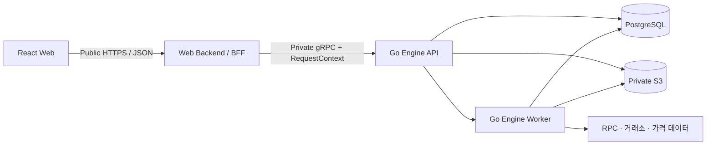

# 웹 앱 기술 명세 — GIWA MVP v0.1

> 상태: Draft
>
> 기준일: 2026-07-19
>
> 대상: `apps/web` 및 공개 Web API 연동
>
> 상위 기준: [Technical Spec — GIWA MVP v0.1](https://linear.app/giwa-daejang/document/technical-spec-giwa-mvp-v01-18d511232c66)

## 1. 문서 목적

이 문서는 상위 기술 명세를 웹 애플리케이션 구현 계약으로 구체화한다. React가 담당할 범위, Web Backend와의 통신 경계, 인증·비동기 작업·오류 처리·테스트 기준을 정의한다.

Go Engine 내부의 계산 모델, 데이터베이스 인덱스, 체인 Reorg, 가격·Lot·정책의 세부 구현은 상위 기술 명세를 기준으로 하며 이 문서에서 중복 정의하지 않는다.

결정 상태는 다음과 같이 구분한다.

- **확정**: 상위 기술 명세에서 구현 기준으로 정한 내용
- **초기 선택**: 현재 웹 프로젝트를 시작하기 위한 되돌릴 수 있는 선택
- **미결정**: 구현 전에 별도 결정 또는 API 계약이 필요한 내용

## 2. 결정 요약

| 항목 | 상태 | 내용 |
| --- | --- | --- |
| Frontend | 확정 | React + TypeScript |
| Web build tool | 초기 선택 | Vite |
| Package manager | 초기 선택 | npm workspaces |
| Public boundary | 확정 | React는 Web Backend의 HTTPS/JSON API만 호출 |
| Internal boundary | 확정 | Web Backend는 private gRPC로 Go Engine 호출 |
| Long-running work | 확정 | 요청은 즉시 `job_id`를 반환하고 웹은 polling |
| MVP 입력 | 확정 | Upbit CSV 1개 + 등록 EVM 주소 1개 |
| Web Backend runtime | 미결정 | TypeScript/Node 또는 Go |
| 로그인 방식 | 미결정 | email, OIDC 또는 지갑 서명 |
| 첫 지원 체인 | 미결정 | Golden Dataset을 기준으로 결정 |

Figma 아키텍처 그림에는 Web API 구현으로 Fastify가 표시되어 있지만, Linear 기술 명세의 TS-01은 Web Backend runtime을 아직 결정하지 않았다. 따라서 이 저장소의 React 코드는 Fastify 고유 기능에 의존하지 않는다.

## 3. 시스템 경계



핵심 원칙:

1. React는 Engine, PostgreSQL, S3 SDK와 직접 통신하지 않는다.
2. 브라우저가 접근하는 서버 경계는 공개 Web API 하나다.
3. Web Backend는 인증·권한·입력 검증과 응답 조합을 담당한다.
4. 정규화, 연결, 가격, Lot, 대사, 보고서 계산은 Go Engine이 담당한다.
5. 수집·계산·보고서 생성은 사용자 요청 안에서 동기 완료하지 않는다.

### 3.1 컴포넌트 책임

| 계층 | 담당 | 포함하지 않는 것 |
| --- | --- | --- |
| React | 화면, 입력, 세션 UI, API 호출, Job 진행률과 오류 표시 | DB/S3/RPC 자격증명, 도메인 계산, 거래소 Secret 저장 |
| Web Backend / BFF | JWT·세션·membership 검증, JSON API, 입력 검증, rate limit, gRPC 변환 | Engine DB 직접 조회, 정규화·Lot·정책 계산 |
| Go Engine API | RequestContext·workspace 검증, Job 생성·조회, 도메인 서비스 호출 | Public JWT 신뢰, 화면별 응답 조합 |
| Go Engine Worker | 수집·파싱·계산·재시도·checkpoint·결과 저장 | 장시간 작업의 동기 HTTP 처리 |

## 4. 저장소와 React 구조

현재 저장소 구조:

```text
apps/
  web/
    src/
      components/   공통 화면 구성 요소
      test/         테스트 공통 설정
      App.tsx       초기 애플리케이션 셸
      main.tsx      React 진입점
docs/
  00-web-app-technical-spec.md
  01-user-onboarding.md
```

기능 구현이 시작되면 다음처럼 feature 단위로 확장한다. 아직 사용하지 않는 빈 폴더나 추상화는 미리 만들지 않는다.

```text
apps/web/src/
  app/              provider, router, 전역 설정
  routes/           public, auth, onboarding, workspace
  features/         auth, source, upload, job, ledger, review, report
  shared/           api, ui, lib, 공용 type
  test/             테스트 설정과 fixture
```

상위 기술 명세의 장기 저장소 구조:

```text
apps/web
apps/web-api
services/engine
proto/giwa/engine/v1
migrations
fixtures
docs
```

## 5. 패키지와 개발 기준

초기 웹 패키지는 다음 역할만 포함한다.

| 패키지 | 역할 |
| --- | --- |
| `react`, `react-dom` | 웹 UI runtime |
| `vite`, `@vitejs/plugin-react` | 개발 서버와 production build |
| `typescript`, `@types/*` | 정적 타입 검사 |
| `oxlint` | 빠른 기본 lint |
| `vitest`, `jsdom` | 단위·컴포넌트 테스트 runtime |
| `@testing-library/react`, `@testing-library/jest-dom` | 사용자 관점의 컴포넌트 검증 |

라우터, 서버 상태, 폼, 스키마 라이브러리는 실제 route와 API 계약이 정해질 때 추가한다. 초기 틀에 후보 라이브러리를 선반영하지 않는다.

루트 명령:

```bash
npm install
npm run dev
npm run lint
npm run typecheck
npm test
npm run build
```

## 6. Web API 계약

React는 화면에서 직접 gRPC 또는 Engine 모델을 사용하지 않는다. 공개 API의 JSON 계약을 통해서만 데이터를 주고받는다.

| 사용자 동작 | Public Web API | 결과 |
| --- | --- | --- |
| 로그인 | `POST /api/v1/auth/login` | Access Token 및 Refresh Session 시작 |
| 세션 갱신 | `POST /api/v1/auth/refresh` | 회전된 Refresh Session과 새 Access Token |
| 로그아웃 | `POST /api/v1/auth/logout` | Session 폐기 |
| 현재 사용자 확인 | `GET /api/v1/me` | identity와 현재 workspace 상태 |
| 지갑 등록 | `POST /api/v1/sources/wallets` | 등록된 데이터 소스 |
| 업로드 세션 생성 | `POST /api/v1/uploads` | 제한된 Presigned URL |
| 업로드 확정 | `POST /api/v1/uploads/{id}/confirm` | 검증된 데이터 소스 |
| 수집 시작 | `POST /api/v1/syncs` | `job_id` |
| 작업 조회 | `GET /api/v1/jobs/{id}` | 상태·단계·진행률 |
| 활동 조회 | `GET /api/v1/activities` | cursor 기반 거래 목록 |
| 계산 시작 | `POST /api/v1/calculations` | `job_id` |
| 검토 조회·해결 | Review Item API | 사용자 사실관계와 새 계산 기준 |
| 보고서 생성·조회 | Report API | `job_id` 또는 immutable Report |

다음 계약은 아직 미결정이다.

- 회원가입 endpoint와 계정 활성화 방식
- 등록된 데이터 소스 목록 및 온보딩 상태 조회 API
- 표준 JSON 성공·오류 envelope
- `Idempotency-Key` 전달 방식, 보존 시간, 충돌 규칙
- 보고서 다운로드용 공개 endpoint
- Job 취소 API 지원 여부

API 계약이 확정되면 OpenAPI 또는 동등한 schema를 source of truth로 두고, 프런트 타입을 수동으로 중복 작성하지 않는다.

## 7. 인증과 세션

상위 기술 명세의 웹 인증 기준:

- Access Token은 약 10분 수명의 JWT이며 JavaScript memory에만 둔다.
- Refresh Token은 임의 문자열이며 `__Host-giwa_rt` 이름의 `HttpOnly; Secure; SameSite=Strict; Path=/` cookie에 둔다.
- Access Token과 Refresh Token을 `localStorage` 또는 `sessionStorage`에 저장하지 않는다.
- Access JWT에는 이메일, 지갑 주소, 거래, KYC, API Key·Secret을 넣지 않는다.
- 앱 시작 시 세션 복구 후 `/api/v1/me`로 최신 membership을 확인한다.
- workspace ID, role, permission을 브라우저 입력이나 임의 header에서 신뢰하지 않는다.
- Web Backend는 Public JWT 원문을 Go Engine으로 전달하지 않는다.
- refresh와 logout endpoint는 정확한 Origin 검증과 CSRF 방어를 적용한다.

동시에 여러 API가 `401`을 반환할 때 refresh 요청은 한 번만 수행하는 single-flight 처리가 필요하다. refresh 성공 후 원래 요청은 한 번만 재시도하고, 실패하면 메모리 인증 상태와 서버 상태 cache를 제거한 뒤 로그인 화면으로 이동한다.

## 8. 비동기 Job UI 계약

MVP는 Web Backend의 Job API를 polling한다. SSE 또는 WebSocket은 후속 검토 대상이다.

| 서버 상태 | 웹 동작 |
| --- | --- |
| `QUEUED` | 대기 안내, polling 유지 |
| `RUNNING` | 사용자용 단계와 가능한 처리 건수 표시 |
| `WAITING_REVIEW` | polling을 완화·중지하고 검토 화면으로 안내 |
| `SUCCEEDED` | polling 중지, 관련 목록 갱신, 다음 화면 제공 |
| `FAILED` | 안전한 오류와 가능한 복구 동작 제공 |
| `CANCELLED` | polling 중지, 재시작 가능 여부 표시 |

서버 stage는 `COLLECTING`, `STORING_RAW`, `NORMALIZING`, `LINKING`, `VALUATING`, `BUILDING_LOTS`, `RECONCILING`, `RENDERING`, `COMMITTING`이다. 모든 Job이 모든 단계를 거친다고 가정하지 않고, 화면에는 사용자가 이해할 수 있는 문구로 변환한다.

Polling 규칙:

- terminal 상태에서는 즉시 중지한다.
- 백그라운드 탭에서는 주기를 늘리거나 일시 중지한다.
- `429`는 `Retry-After`를 우선하고 `503/504`는 제한된 backoff를 적용한다.
- 새로고침 후에도 데이터 소스의 활성 Job을 다시 조회할 수 있어야 한다.
- 같은 mutation을 재시도할 때 동일 idempotency key를 유지해 중복 생성을 막는다.

## 9. 오류 계약

권장 오류 모양은 다음과 같으며, API 계약 전까지 **제안** 상태다.

```json
{
  "error": {
    "code": "INVALID_SOURCE_FILE",
    "message": "업로드한 파일 형식을 확인해 주세요.",
    "requestId": "req_...",
    "fieldErrors": []
  }
}
```

| HTTP | 의미 | 기본 UI 처리 |
| --- | --- | --- |
| `400` | 입력 schema·형식 오류 | 해당 필드에서 수정 |
| `401` | 인증 또는 Session 만료 | 제한된 refresh 후 로그인 |
| `403` | membership·permission 부족 | 권한 안내 |
| `404` | 없거나 다른 workspace의 resource | 존재 여부를 추가 노출하지 않음 |
| `409` | idempotency 또는 상태 전이 충돌 | 최신 상태 조회 후 안내 |
| `429` | rate limit | 대기 시간과 재시도 제공 |
| `503/504` | Engine 연결 또는 deadline 문제 | 제한된 재시도와 장애 안내 |

UI 분기는 HTTP status만이 아니라 안정적인 application error code를 기준으로 한다. 사용자 메시지와 관측 로그에는 Secret, 원본 파일 내용, stack trace, 내부 endpoint를 포함하지 않는다.

## 10. 데이터와 보안

- 지갑 private key와 seed phrase는 어떤 화면에서도 요청하지 않는다.
- MVP 거래소 입력은 Upbit CSV이며 API Key·Secret 연결은 후속 범위다.
- CSV는 짧은 수명의 제한된 Presigned URL로 private Object Storage에 업로드한다.
- 서버가 크기, MIME type, checksum과 파일 구조를 검증하기 전에는 수집을 시작하지 않는다.
- 브라우저 로그·분석 이벤트·오류 추적에 토큰, CSV 내용, 전체 지갑 주소, 거래 금액을 보내지 않는다.
- 다운로드 산출물은 private object의 short-lived URL로만 제공한다.
- 다른 workspace의 리소스에 접근할 수 없음을 통합 테스트한다.

`VITE_` 접두사 변수는 browser bundle에 포함될 수 있으므로 공개 설정만 허용한다. 현재 예시는 다음 하나뿐이다.

```text
VITE_WEB_API_BASE_URL=/api/v1
```

DB URL, S3 장기 자격증명, RPC Key, 거래소 Secret, Engine private endpoint는 프런트 환경 변수에 넣지 않는다.

## 11. 테스트 전략

Frontend 단위·컴포넌트 테스트:

- 세션 확인 중 route 전환과 잘못된 화면 노출 방지
- refresh single-flight와 logout 상태 정리
- 데이터 소스 선택, CSV, 지갑 입력 검증
- 모든 Job 상태·stage·오류 code 렌더링
- keyboard, focus, label과 오류 연결
- Access·Refresh Token을 Web Storage에 저장하지 않는지 확인

계약·통합 테스트:

- Web API client와 공개 API schema의 호환성
- 인증·schema·권한 실패 요청이 Engine gRPC에 도달하지 않음
- 다른 workspace 리소스 접근 차단
- mutation 재시도 시 데이터 소스나 Job이 중복 생성되지 않음
- Presigned URL 만료, MIME, 크기, checksum 검증

End-to-end 핵심 경로:

1. 신규 사용자 로그인 또는 회원가입
2. Upbit CSV 또는 EVM 주소 등록
3. 수집 Job 생성과 홈 이동
4. Job 성공·실패·검토 필요 상태 확인
5. 새로고침 이후 진행 상태 복구

## 12. 웹 완료 기준

- [ ] React가 공개 Web API 외의 Engine·DB·S3 endpoint를 알지 못한다.
- [ ] 인증 토큰이 Web Storage, bundle, log에 남지 않는다.
- [ ] Upbit CSV와 EVM 주소 등록 경로가 제공된다.
- [ ] 장시간 요청은 `job_id`로 추적하고 terminal 상태에서 polling을 중지한다.
- [ ] 여섯 Job 상태와 주요 오류를 명시적으로 표현한다.
- [ ] 새로고침 후 진행 중 작업을 복구한다.
- [ ] 중복 제출이 중복 Source·Event·Job을 만들지 않는다.
- [ ] 다른 workspace 데이터 접근 차단 테스트가 통과한다.
- [ ] lint, typecheck, component test, production build가 통과한다.

## 13. 구현 전 결정 항목

- TS-01 Web Backend runtime
- 로그인·회원가입 방식과 endpoint
- 첫 EVM 체인과 주소 validation 규칙
- 데이터 소스 목록 및 onboarding status API
- CSV 최대 크기, encoding, 필수 column과 행 수 제한
- 표준 API envelope와 field error schema
- Idempotency key의 header, TTL과 재사용 규칙
- Polling 주기, background 정책과 진행률 신뢰 수준
- Report 다운로드 공개 endpoint
- 배포 topology, CORS와 CSRF 방식
- 원본·보고서 보존·삭제 정책
- 거래소 API Key 연동 도입 시점과 허용 권한

## 14. 관련 문서

- [사용자 온보딩 및 데이터 소스 연결](01-user-onboarding.md)
- [대장 Flow](https://www.figma.com/board/9rt2FVwNe1Dfv9DXLThXok/%EB%8C%80%EC%9E%A5-flow?node-id=58-145)
- [Technical Spec — GIWA MVP v0.1](https://linear.app/giwa-daejang/document/technical-spec-giwa-mvp-v01-18d511232c66)
