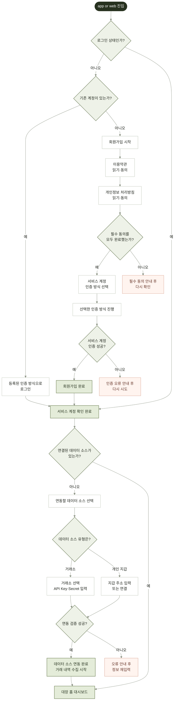

# 사용자 온보딩 및 데이터 소스 연결

> 상태: Draft
>
> 대상: GIWA MVP Web
>
> 관련 기술 명세: [웹 앱 기술 명세](00-web-app-technical-spec.md)

## 1. 목적

이 문서는 사용자가 대장 웹 앱에 진입한 뒤 이용약관·개인정보 처리방침 동의와 서비스 계정 인증을 거쳐 로그인 또는 회원가입을 완료하고, 첫 데이터 소스를 등록해 거래 내역 수집을 시작하기까지의 화면 흐름과 고려사항을 정의한다.

온보딩 완료는 모든 거래 분석이 끝난 시점이 아니다. 유효한 데이터 소스가 등록되고 서버가 비동기 수집 Job을 생성해 `job_id`를 반환한 시점을 완료로 본다. 수집·정규화·계산 상태는 홈에서 계속 확인한다.

## 2. 개념 흐름

이 Mermaid는 목표 사용자 흐름을 표현한다. 오류 안내 노드에서는 직전 입력 단계로 돌아가 재시도한다. 역방향 선이 전체 흐름을 밀어내지 않도록 재시도 경로는 다이어그램에서 생략했다. MVP에서는 거래소 API Key·Secret 대신 Upbit 거래내역 PDF를 받고, 브라우저 지갑 연결 대신 EVM 공개 주소를 직접 입력한다.

## 3. 용어

- **서비스 계정**: 사용자가 대장에 로그인하기 위한 identity와 session
- **필수 동의**: 회원가입 전에 각각 내용을 확인하고 동의해야 하는 이용약관과 개인정보 처리방침
- **서비스 계정 인증 방식**: email, OIDC, 지갑 서명 등 사용자가 계정을 생성하고 로그인할 때 선택하는 인증 수단
- **데이터 소스**: Upbit 거래내역 PDF, EVM 지갑 주소처럼 거래 기록을 가져오는 출처
- **데이터 소스 등록**: 입력 형식과 접근 가능 여부를 확인해 소스를 저장한 상태
- **수집 Job**: 등록된 소스의 원본을 비동기로 가져오고 처리하는 작업
- **수집 완료**: Job이 원본 수집과 초기 처리를 마친 상태

화면 문구에서는 로그인 계정과 연동 대상을 모두 “계정”이라고 부르지 않는다. 연동 대상에는 “데이터 소스”, “거래소 내역”, “지갑 주소”처럼 구체적인 용어를 사용한다.

## 4. MVP 적용 범위

| 개념 흐름 | MVP 구현 | 후속 범위 |
| --- | --- | --- |
| 회원가입 동의 | 이용약관·개인정보 처리방침 각각 확인 및 동의 | 선택 동의 항목과 동의 관리 화면 |
| 서비스 계정 인증 | 지원 방식 중 하나를 선택해 인증 완료 | 인증 방식 추가·변경·복구 |
| 거래소 연결 | Upbit 거래내역 PDF 업로드 | 거래소 API Key·Secret 연결 |
| 개인 지갑 | EVM 주소 1개 직접 입력 | 브라우저 지갑 연결과 서명 |
| 연동 검증 | 파일·주소 검증과 데이터 소스 등록 | 실시간 계정 권한 검사 |
| 거래 수집 | 등록 주소 기반 on-demand 수집 | 상시 자동 동기화 |
| 진행 상태 | Web API polling | 실시간 streaming 알림 |
| 완료 후 이동 | 홈에서 Job 진행 상태 표시 | 고급 알림·백그라운드 동기화 설정 |

거래소 API Key·Secret 입력 UI는 MVP에 노출하지 않는다. 후속 도입 시에는 조회 전용 권한만 허용하고 거래·출금 권한이 있는 Key는 거부해야 한다.

## 5. 화면 흐름과 상태

### 5.1 앱 진입과 세션 확인

앱 진입 직후 브라우저에 값이 있다는 이유만으로 로그인 상태를 판단하지 않는다. Web API가 Session과 최신 workspace membership을 확인한 뒤 이동 경로를 결정한다.

| 상태 | 화면 동작 |
| --- | --- |
| `CHECKING_SESSION` | 전용 loading 상태를 표시하고 로그인·홈을 미리 노출하지 않음 |
| `AUTHENTICATED` | 데이터 소스 존재 여부 확인 |
| `ANONYMOUS` | 로그인 또는 회원가입 진입 |
| `SESSION_EXPIRED` | 로그인 화면으로 이동하고 복구 가능한 이동 목적 보존 |
| `UNAVAILABLE` | 네트워크·서버 오류 안내와 재시도 제공 |

### 5.2 로그인과 회원가입

로그인 방식은 email, OIDC, 지갑 서명 중 아직 결정되지 않았다. 로그인용 지갑과 거래 수집용 지갑은 서로 다른 개념이다.

#### 회원가입 동의

회원가입 사용자는 이용약관과 개인정보 처리방침의 내용을 각각 열어 확인하고, 각 항목에 별도로 동의해야 한다. 두 필수 동의가 모두 완료되기 전에는 인증 방식 선택으로 진행할 수 없다.

동의 화면 기준:

- 이용약관과 개인정보 처리방침의 제목, 현재 버전, 시행일과 전체 내용 링크를 구분한다.
- 각 문서의 동의 checkbox를 별도로 제공하고 미리 선택하지 않는다.
- 서버는 사용자, 문서 종류, 문서 버전, 동의 시각을 기록한다.
- 문서 내용 또는 동의 정책의 최종 문구와 보관 기준은 별도 법무·개인정보 검토로 확정한다.

#### 개인정보 처리 동의

이 문서에서는 회원가입 중 개인정보 관련 내용을 확인하고 동의하는 단계를 “개인정보 처리 동의”로 부른다. 다만 실제 화면에서는 `개인정보 처리방침 확인`과 별도의 `개인정보 수집·이용 동의`가 필요한지를 구분해야 한다. 필수·선택 여부와 최종 고지 문구는 수집하는 정보, 처리 목적과 보관 정책이 확정된 뒤 법무·개인정보 검토를 거쳐 결정한다.

화면 표시 기준:

- 문서 제목, 문서 버전, 시행일과 전체 내용 진입점을 항상 함께 표시한다.
- 처리 목적, 처리 항목, 보관 기간, 동의를 거부할 수 있는지와 거부 시 영향을 사용자가 확인하기 쉬운 구조로 제공한다. 실제 표시 범위와 문구는 별도 검토로 확정한다.
- 내용을 열어 본 사실만으로 동의 처리하지 않으며 checkbox는 미리 선택하지 않는다.
- 전체 내용 화면이나 modal을 닫고 돌아와도 사용자가 선택한 상태를 유지한다.
- “전체 동의”를 제공하더라도 이용약관, 필수 개인정보 항목과 선택 항목의 개별 상태를 유지하고 각각 해제할 수 있게 한다.
- 마케팅 등 선택 동의는 필수 동의와 시각적으로 구분하고, 거부해도 회원가입 자체를 막지 않는다.

동의 기록은 화면의 checkbox 값만 저장하지 않고 다음 정보를 서버 기준으로 남긴다.

| 기록 항목 | 기준 |
| --- | --- |
| 동의 주체 | 계정 생성 전에는 만료 시간이 있는 `signup_session_id`, 생성 후에는 해당 `user_id`와 연결 |
| 문서 식별자 | 문서 종류와 서버가 발급한 고유 ID |
| 문서 버전 | 사용자가 실제 확인한 버전과 필요 시 내용 무결성을 확인할 수 있는 hash |
| 동의 상태 | 필수 항목별 동의 결과. 선택 동의는 별도 항목으로 저장 |
| 동의 시각 | Client 시간이 아닌 서버 수신 시각 |
| 동의 경로 | Web, locale 등 재현에 필요한 최소 정보 |

IP 주소나 User-Agent처럼 추가 개인정보가 될 수 있는 값은 단순 감사 편의를 위해 기본 저장하지 않는다. 기록 필요성과 보관 기간이 확정된 항목만 수집하며, 동의 본문이나 민감한 입력값을 분석 이벤트와 일반 애플리케이션 로그에 복제하지 않는다.

처리 순서:

1. Client가 서버에서 현재 유효한 문서 ID, 버전, 시행일과 본문 URL을 조회한다.
2. 사용자가 내용을 확인하고 개인정보 항목에 직접 동의한다.
3. Client가 문서 ID와 버전, 동의 결과, idempotency key를 제출한다.
4. 서버가 현재 유효한 버전인지 확인하고 동의 기록을 한 번만 생성한다.
5. 계정 생성 전 기록은 signup session에 임시 연결하고, 인증 성공 후 생성된 사용자에게 원자적으로 귀속한다.
6. 제출 중 문서 버전이 바뀌었다면 이전 버전을 자동 동의 처리하지 않고 최신 내용을 다시 보여 준다.
7. 저장 실패 시 회원가입을 완료한 것처럼 표시하지 않고 같은 화면에서 안전하게 재시도한다.

UI 상태:

- `NOT_REVIEWED`: 내용을 아직 확인하지 않음
- `READY_TO_AGREE`: 문서를 확인했고 사용자가 선택할 수 있음
- `SUBMITTING_CONSENT`: 중복 제출을 막고 저장 중임을 표시
- `CONSENT_RECORDED`: 서버가 현재 버전의 동의를 기록함
- `CONSENT_FAILED`: 기록 실패 원인과 재시도 제공
- `RECONSENT_REQUIRED`: 문서 버전 변경 등으로 최신 내용 재확인이 필요함

동의 철회, 재동의와 계정 삭제는 같은 동작으로 취급하지 않는다. 각 동작이 데이터 처리와 서비스 이용에 미치는 영향, 기존 기록의 보관 기준과 사용자 안내 방식은 정책 확정 후 별도 화면 흐름으로 정의한다.

#### 서비스 계정 인증

필수 동의 완료 후 사용 가능한 서비스 계정 인증 방식을 보여 주고, 사용자가 하나를 선택해 해당 인증 절차를 완료하도록 한다.

상태:

- `SELECTING_AUTH_METHOD`: 인증 방식 선택
- `AUTHENTICATING`: 선택한 방식으로 인증 진행
- `AUTH_FAILED`: 인증 실패와 안전한 재시도 안내
- `ACCOUNT_CREATED`: 인증 성공과 서비스 계정 생성 완료

인증 실패 시 필수 동의를 다시 받지 않고 인증 방식 선택 또는 해당 인증 단계로 돌아간다. 인증 방식별 challenge, callback, 만료와 재시도 계약은 인증 방식이 결정될 때 구체화한다.

공통 UI 상태:

- 입력 대기
- 제출 중
- 필드 오류
- 인증 실패
- Rate Limit
- 성공

로그인 이후 서버가 확인한 기본 workspace를 기준으로 데이터 소스 존재 여부를 조회한다. 브라우저가 전달한 `workspace_id`, role 또는 permission은 신뢰하지 않는다.

### 5.3 데이터 소스 상태 확인

데이터 소스 존재 여부를 단순 boolean 하나로만 표현하지 않는다.

- 없음
- 등록됨
- 수집 대기
- 수집 중
- 사용자 검토 필요
- 수집 완료
- 수집 실패

등록된 소스가 있으면 Job이 진행 중이거나 일부 실패한 상태여도 홈으로 이동한다. 진행 상황과 복구 동작은 홈에서 제공한다.

### 5.4 데이터 소스 선택

MVP 선택지:

1. Upbit 거래내역 PDF 업로드
2. EVM 지갑 주소 입력

권장 정책은 첫 소스 하나를 정상 등록하면 홈 진입을 허용하고, 홈의 “데이터 소스 추가”에서 두 번째 소스를 연결하는 방식이다. 두 소스를 모두 필수로 할지는 제품 결정이 필요하다.

## 6. 화면별 필드와 검증

| 화면 | 필드 | Client 검증 | Server 검증 |
| --- | --- | --- | --- |
| 회원가입 동의 | 이용약관 동의, 개인정보 처리방침 동의 | 두 항목 개별 확인과 필수 동의 | 문서 종류·버전, 동의 시각, 사용자 연결 |
| 서비스 계정 인증 | 인증 방식, 방식별 인증 입력 | 지원 방식 선택과 필수값 | challenge, identity, rate limit, session 생성 |
| 로그인 | 등록된 인증 방식에 필요한 입력 | 형식과 필수값 | identity, rate limit, session 생성 |
| 데이터 소스 선택 | `Upbit 문서` 또는 `EVM 지갑` | 하나 선택 | 지원 source type |
| Upbit PDF | 파일 1개 | 확장자, 크기 사전 안내 | MIME, 크기, checksum, 문서 구조, 거래 기간 |
| EVM 지갑 | 체인, 공개 주소, 선택 별칭 | 필수값과 기본 주소 형식 | 지원 체인, 주소 형식, workspace 중복, 개수 제한 |
| 수집 기간 | 과세연도 또는 시작일·종료일 | 필수값, 날짜 순서 | timezone, 허용 범위, source coverage |

브라우저 검증은 빠른 피드백을 위한 보조 수단이며 서버 검증을 최종 기준으로 한다.

### 6.1 Upbit 거래내역 PDF 업로드

처리 순서:

1. React가 Web API에 Upload Session을 요청한다.
2. 제한된 object key와 만료 시간을 가진 Presigned URL을 받는다.
3. React가 private Object Storage에 파일을 직접 업로드한다.
4. 업로드 완료를 Web API에 확인 요청한다.
5. 서버가 크기, MIME type, checksum, PDF 구조와 문서 포함 기간을 검증한다.
6. 성공한 경우에만 데이터 소스를 생성한다.
7. 사용자가 수집 기간을 설정하고 확인하면 수집 Job을 생성한다.
8. React는 `job_id`를 기준으로 홈에서 진행 상태를 조회한다.

검증 고려사항:

- 허용 파일 크기와 최대 페이지 수
- 실제 MIME type과 확장자
- 지원하는 Upbit 문서 종류와 버전
- 암호화, 빈 문서 또는 손상 여부
- 거래 레코드와 날짜·수량·금액 추출 가능 여부
- 문서에 포함된 최초·최종 거래일
- 동일 checksum 파일의 중복 등록

원본은 같은 object key로 덮어쓰지 않는다. 파일명과 PDF 내용은 분석 이벤트나 일반 application log에 기록하지 않는다. 상세 흐름과 날짜 기준은 [데이터 소스 등록 및 수집 기간 설정](02-data-source-collection.md)을 따른다.

### 6.2 EVM 지갑 주소

필드:

- 체인
- 지갑 공개 주소
- 사용자용 별칭(선택)

검증 고려사항:

- 지원 체인인지 확인
- EVM 주소 형식과 빈 값
- 같은 workspace 안의 중복 주소
- MVP 주소 개수 제한
- 등록 mutation의 idempotency

지갑 private key와 seed phrase는 어떤 경우에도 요청하지 않는다. 공개 주소 등록만으로 가능한 작업에 불필요한 서명이나 지갑 연결을 요구하지 않는다.

### 6.3 등록 완료

완료 화면은 다음을 분명히 전달한다.

- 데이터 소스 등록이 완료됨
- 거래 내역 수집은 background에서 시작됨
- 화면을 닫거나 새로고침해도 서버 작업은 계속됨
- 진행 상태는 홈에서 확인할 수 있음

“분석 완료”, “세금 계산 완료”, “모든 거래 검증 완료”처럼 오해할 수 있는 문구는 사용하지 않는다.

## 7. API와 비동기 Job

관련 공개 API:

| 목적 | API |
| --- | --- |
| 현재 사용자·workspace 확인 | `GET /api/v1/me` |
| 지갑 등록 | `POST /api/v1/sources/wallets` |
| 업로드 세션 생성 | `POST /api/v1/uploads` |
| 업로드 확정 | `POST /api/v1/uploads/{id}/confirm` |
| 수집 시작 | `POST /api/v1/syncs` |
| Job 진행 조회 | `GET /api/v1/jobs/{id}` |

수집 요청은 즉시 `job_id`를 반환한다. MVP 웹은 Job endpoint를 polling한다.

| 서버 상태 | 사용자 표시 | Polling |
| --- | --- | --- |
| `QUEUED` | 수집 준비 중 | 유지 |
| `RUNNING` | 거래 내역을 불러오는 중 | 유지 |
| `WAITING_REVIEW` | 확인이 필요한 항목이 있음 | 완화 또는 중지 |
| `SUCCEEDED` | 수집 완료 | 중지 |
| `FAILED` | 수집하지 못함 | 중지 |
| `CANCELLED` | 작업이 취소됨 | 중지 |

`WAITING_REVIEW`는 데이터 소스 연결 실패가 아니다. 사용자를 입력 화면으로 되돌리지 않고 홈 또는 Review 화면으로 안내한다.

## 8. 오류와 복구

| 유형 | 예시 | 사용자 동작 |
| --- | --- | --- |
| 입력 오류 | 잘못된 주소, 지원하지 않는 PDF | 해당 입력 화면에서 수정 |
| 중복 | 이미 등록된 주소·파일 | 기존 데이터 소스로 이동 |
| 일시적 외부 오류 | RPC Rate Limit, Source unavailable | 안내된 시간 이후 재시도 |
| 인증 오류 | Session 만료 | 재로그인 후 진행 상태 복구 |
| 처리 오류 | 정규화·대사 실패 | 홈에서 상태와 지원 경로 확인 |
| 검토 필요 | 주소 소유, 송금 목적 불명확 | Review 화면에서 사실관계 제출 |

Mermaid는 오류 후 데이터 소스 선택으로 돌아가지만 실제 UX는 사용자가 입력한 비민감 값을 유지하고 해당 입력 화면에서 바로 수정하게 한다. 후속 Secret 입력 기능에서는 Secret 값을 다시 표시하지 않는다.

오류에는 안전한 설명과 `request_id` 또는 `job_id`를 제공하되 다음 정보는 노출하지 않는다.

- 내부 stack trace와 private endpoint
- RPC 원문과 원본 PDF 내용
- Access·Refresh Token
- API Key·Secret
- 다른 workspace 리소스의 존재 여부

## 9. 보안 고려사항

- Access JWT는 JavaScript memory에만 저장한다.
- Refresh Token은 `HttpOnly; Secure; SameSite=Strict; Path=/` cookie에 저장한다.
- 두 Token을 `localStorage`와 `sessionStorage`에 저장하지 않는다.
- refresh와 logout endpoint는 Origin 검증과 CSRF 방어를 적용한다.
- Public Access JWT를 Go Engine으로 전달하지 않는다.
- Web Backend가 active Session, 최신 membership, resource ownership을 확인한다.
- Presigned URL은 짧은 만료 시간과 제한된 object key만 허용한다.
- 원본 Object Storage는 private, versioned, encrypted 상태로 유지한다.
- 지갑 주소도 사용자 데이터로 보고 로그와 분석 이벤트에서 원문을 피한다.

## 10. 접근성과 사용성

- 모든 입력에는 지속적으로 보이는 label을 둔다.
- 오류를 색상만으로 구분하지 않는다.
- 필드 오류를 해당 입력과 연결하고 화면 읽기 도구에 알린다.
- 키보드만으로 소스 선택과 파일 업로드를 완료할 수 있게 한다.
- 제출 중 중복 실행을 막고 진행 중임을 명확히 표시한다.
- 이전 단계로 이동해도 비민감 입력은 유지한다.
- 모바일 너비에서 CTA와 오류 메시지가 잘리지 않게 한다.
- 예상 처리 시간과 background 처리 여부를 설명한다.

## 11. 관측성과 제품 지표

온보딩 funnel 후보:

- 온보딩 시작
- 이용약관 동의 완료
- 개인정보 처리방침 동의 완료
- 서비스 계정 인증 방식 선택
- 서비스 계정 인증 성공·실패
- 로그인 또는 회원가입 완료
- 데이터 소스 유형 선택
- 데이터 소스 등록 성공·실패
- 수집 Job 생성
- 첫 수집 성공·실패
- 추가 데이터 소스 등록

분석 이벤트에 지갑 주소, 파일명, PDF 내용, API Key, Secret, 오류 원문을 포함하지 않는다. 운영 추적에는 `request_id`, `trace_id`, `job_id`를 사용한다.

## 12. 완료 기준

- [ ] 세션 확인 중 로그인 또는 홈이 잘못 표시되지 않는다.
- [ ] 인증되지 않은 사용자가 보호 경로에 접근하면 인증 화면으로 이동한다.
- [ ] 이용약관과 개인정보 처리방침을 각각 읽고 개별 동의할 수 있다.
- [ ] 두 필수 동의가 모두 완료되기 전에는 서비스 계정 인증을 시작할 수 없다.
- [ ] Client가 지정한 임의 버전이 아니라 서버가 현재 유효하다고 확인한 개인정보 문서에만 동의할 수 있다.
- [ ] 계정 생성 전 동의 기록이 인증 성공 후 생성된 사용자에게 중복 없이 연결된다.
- [ ] 선택 개인정보 동의를 거부해도 필수 동의가 충족되면 회원가입을 계속할 수 있다.
- [ ] 문서 버전이 변경되면 이전 선택을 최신 버전 동의로 자동 승계하지 않는다.
- [ ] 선택한 서비스 계정 인증 방식이 성공해야 회원가입이 완료된다.
- [ ] 동의 문서 종류·버전과 동의 시각을 서버에서 추적할 수 있다.
- [ ] 기존 데이터 소스가 있는 사용자는 홈으로 이동한다.
- [ ] 데이터 소스가 없는 사용자는 연결 흐름으로 이동한다.
- [ ] Upbit 거래내역 PDF 1개와 EVM 주소 1개를 각각 등록할 수 있다.
- [ ] 가입 중 등록을 미루고 홈에서 다시 시작할 수 있다.
- [ ] 과세연도 또는 시작일·종료일로 수집 기간을 설정할 수 있다.
- [ ] 주소·파일 검증 실패 시 수정 가능한 오류를 보여 준다.
- [ ] 수집 요청은 즉시 `job_id`를 반환한다.
- [ ] 새로고침 후에도 진행 중인 Job을 복구한다.
- [ ] 중복 제출이 데이터 소스나 Job을 중복 생성하지 않는다.
- [ ] Token과 자격증명이 browser storage, bundle, log, 분석 이벤트에 남지 않는다.
- [ ] 다른 workspace의 데이터 소스와 Job에 접근할 수 없다.

## 13. 미결정 사항

- 첫 소스 하나만 등록해도 온보딩 완료로 볼지 여부
- 가입 중 데이터 소스 등록을 완료할지 나중에 할지에 따른 홈 빈 상태
- MVP 로그인·회원가입 방식
- 이용약관·개인정보 처리방침의 버전 조회와 동의 기록 API
- 동의 철회·재동의가 필요한 조건과 보관 기준
- 개인정보 처리방침 확인과 별도 수집·이용 동의를 구분할지 여부
- 필수·선택 개인정보 항목, 처리 목적과 각 보관 기간
- 지원할 서비스 계정 인증 방식과 인증 실패·복구 정책
- 첫 지원 EVM 체인
- 사용자당 주소·파일 개수 제한
- Upbit PDF 문서 종류, 업로드 크기와 최대 페이지 수
- 수집 기간의 최대 범위, timezone과 source coverage 정책
- 실패 Job의 사용자 직접 재시도 정책
- 데이터 소스 삭제와 원본 보관 기간
- 거래소 API Key 연결 도입 시점과 지원 권한

## 14. 기준 자료

- [대장 Flow](https://www.figma.com/board/9rt2FVwNe1Dfv9DXLThXok/%EB%8C%80%EC%9E%A5-flow?node-id=58-145)
- [Technical Spec — GIWA MVP v0.1](https://linear.app/giwa-daejang/document/technical-spec-giwa-mvp-v01-18d511232c66)
- [데이터 소스 등록 및 수집 기간 설정](02-data-source-collection.md)
