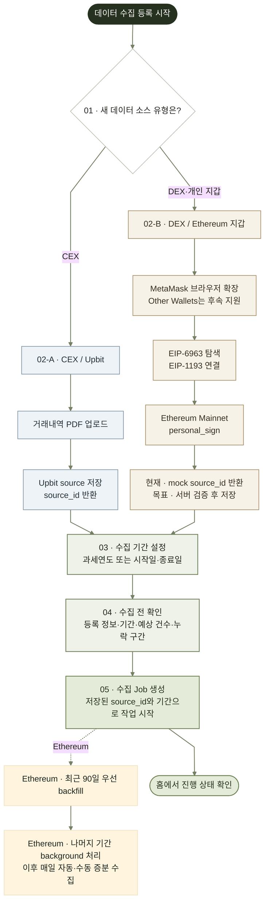

# 데이터 소스 등록 및 수집 기간 설정

> 상태: Draft
>
> 대상: GIWA MVP Web
>
> 관련 문서: [웹 앱 기술 명세](00-web-app-technical-spec.md), [사용자 온보딩](01-user-onboarding.md)

## 1. 목적

이 문서는 사용자가 회원가입 중 또는 홈에서 `데이터 수집 등록`을 선택한 뒤 Upbit와 DEX·개인 지갑 중 새 데이터 소스 유형을 고르고, 유형별 등록 정보와 날짜 범위를 입력해 비동기 수집 Job을 시작하는 흐름을 정의한다.

회원가입 중 데이터 소스 등록은 선택 사항이다. 사용자는 `나중에 등록하기`로 홈에 먼저 진입할 수 있으며, 이후 홈의 데이터 수집 CTA에서 같은 등록 흐름을 다시 시작한다.

## 2. MVP 결정 사항

| 항목 | MVP 기준 |
| --- | --- |
| 가입 중 데이터 소스 등록 | 등록하거나 `나중에 등록하기` 선택 가능 |
| 등록 화면 진입 | CTA 선택 즉시 새 데이터 소스 유형 선택 화면으로 이동 |
| CEX | Upbit부터 지원 |
| Upbit 연결 | API Key가 아니라 거래내역 PDF 문서 업로드 |
| DEX·개인 지갑 | MetaMask 브라우저 확장을 EIP-6963 우선·EIP-1193 fallback으로 연결하고 Ethereum Mainnet에서 실제 `personal_sign` |
| 현재 지갑 완료 상태 | 서버 challenge 검증, Source 저장과 backfill은 아직 mock preview |
| 지갑 후속 범위 | `Other Wallets`와 Rabby, WalletConnect(Reown), Coinbase 실제 연결 |
| 기간 설정 | 과세연도 preset 또는 시작일·종료일 직접 선택 |
| 수집 시작 | 등록 정보와 기간 확인 후 비동기 Job 생성 |
| Ethereum 초기 수집 | 선택 범위의 최근 90일 우선 backfill, 나머지는 background 처리 |
| Ethereum 갱신 | 매일 자동 동기화와 사용자 수동 새로고침 |

`데이터 소스 등록`과 `수집 등록`은 같은 동작이 아니다.

- **데이터 소스 등록**: 사용자가 제출한 Upbit 문서 또는 소유권 서명을 검증한 Ethereum 지갑을 서버가 workspace DB에 저장하고 `source_id`를 반환하는 목표 동작이다. 현재 지갑 flow의 `source_id`는 mock preview다.
- **수집 등록**: 저장된 `source_id`와 이번 작업의 날짜 범위를 연결한다.
- **수집 시작**: 확정된 설정으로 Job을 만들고 거래 내역 처리를 시작한다.

## 3. 진입 규칙

| 진입 위치 | CTA | 다음 화면 |
| --- | --- | --- |
| 회원가입 완료 화면 | `데이터 수집 등록` | 새 데이터 소스 유형 선택 |
| 소스 없이 진입한 홈 | `데이터 수집 등록` | 새 데이터 소스 유형 선택 |
| 데이터 소스 관리 | `데이터 소스 추가` | 새 데이터 소스 유형 선택 |

회원가입의 `나중에 등록하기`는 등록 CTA를 누르기 전에 선택하는 별도 이탈 동작이다. 사용자가 등록 CTA를 선택한 뒤에는 중간 진입 화면이나 기존 소스 비교 화면을 거치지 않는다.

기존 소스 존재 여부, 중복 주소와 중복 문서는 Frontend가 미리 판단하지 않는다. 유형별 등록 정보를 제출하면 서버가 인증된 workspace와 DB의 unique 조건을 기준으로 저장·충돌 여부를 결정한다. Frontend는 서버 결과를 표시할 뿐 별도의 “소스 검증 성공?” 단계를 만들지 않는다.

## 4. 개념 흐름



`데이터 수집 등록` CTA는 별도의 사전 판단 없이 `01 · 새 데이터 소스 유형 선택`으로 바로 이동한다. Upbit는 거래내역 PDF를 업로드한다. 현재 DEX·개인 지갑 Frontend는 MetaMask 브라우저 확장을 EIP-6963 우선·EIP-1193 fallback으로 연결하고 Ethereum Mainnet에서 실제 `personal_sign`을 요청한다. 이후 `source_id`와 backfill 상태는 mock preview이며 서버 challenge 검증, Source 저장과 실제 수집은 아직 수행하지 않는다. 목표 서버 연동 후 두 경로는 저장된 `source_id`를 반환받아 `03 · 수집 기간 설정`에서 합류한다.

Frontend 흐름에는 기존 소스 조회·비교와 별도 검증 decision을 두지 않는다. 서버가 등록 요청을 처리하면서 DB 기준으로 중복·형식 오류를 반환하면 `02`에서 수정하고, 기간 오류는 `03`에서 수정한다.

## 5. 새 데이터 소스 유형 선택

선택지는 다음 두 가지다.

1. `CEX / Upbit`: Upbit 거래내역 PDF 등록으로 이동
2. `DEX / 개인 지갑`: MetaMask 브라우저 확장 연결과 Ethereum Mainnet `personal_sign`으로 이동

유형 선택 화면은 DB에 저장된 기존 소스를 불러와 비교하지 않는다. 같은 문서나 주소가 이미 존재하는지는 사용자가 유형별 등록 정보를 제출한 뒤 서버가 판단한다.

회원가입 중 등록을 원하지 않는 사용자는 이 화면에 진입하기 전에 `나중에 등록하기`를 선택한다. 그 경우 데이터 소스와 수집 Job을 만들지 않고 홈에 등록 CTA를 유지한다.

등록 도중 취소하면 가입 상태나 이미 생성된 다른 데이터 소스에는 영향을 주지 않는다. 업로드 중인 문서의 즉시 삭제 또는 만료 정책은 별도로 확정한다.

## 6. Upbit 거래내역 문서 등록

MVP의 Upbit 연결은 API Key·Secret을 사용하지 않고 거래내역 PDF 문서 1개를 업로드하는 방식으로 시작한다. 문서는 연결 자격증명이 아니라 특정 시점의 원본 거래내역 snapshot으로 취급한다.

필드:

- 거래소: `Upbit` 고정
- 거래내역 PDF 문서
- PDF 비밀번호(선택, 암호화된 문서에만 사용)
- 사용자용 별칭(선택)

처리 순서:

1. Client가 Web API에 제한된 Upload Session을 요청한다.
2. 짧은 만료 시간과 제한된 object key를 가진 Presigned URL을 받는다.
3. Client가 private Object Storage에 PDF를 직접 업로드한다.
4. Client가 업로드 완료를 Web API에 확인 요청하며 암호화된 문서인 경우에만 비밀번호를 HTTPS request body로 전달한다.
5. 서버가 비밀번호를 요청 처리 중에만 사용해 파일과 문서 구조를 검증하고 거래 내역 및 문서 포함 기간을 추출한다.
6. 검증이 성공한 경우에만 Upbit 문서 데이터 소스를 생성한다.
7. 서버가 반환한 `source_id`를 기준으로 사용자가 날짜 범위를 설정한다.

5~6번은 Frontend의 별도 화면 단계가 아니라 업로드 확정 요청을 처리하는 서버 내부 절차다. Frontend는 미리 DB와 비교하지 않고 `confirm` 응답의 성공 또는 안정적인 오류 code만 표시한다.

검증 기준:

| 구분 | 검증 항목 |
| --- | --- |
| 파일 | 실제 MIME type, 확장자, 크기, checksum, 빈 파일 여부 |
| 문서 | 비밀번호를 사용한 암호화 문서 해제 가능 여부, 손상 여부, 지원하는 Upbit 문서 종류와 버전 |
| 내용 | 거래 레코드 파싱 가능 여부, 필수 값과 날짜 형식 |
| 기간 | 문서에서 확인한 최초·최종 거래일 또는 명시된 조회 기간 |
| 중복 | 같은 workspace에서 동일 checksum 또는 동일 원본의 재등록 여부 |

원본 파일은 같은 object key로 덮어쓰지 않는다. 파일명, PDF 본문, PDF 비밀번호와 추출한 거래 내역은 browser storage, URL, 분석 이벤트나 일반 애플리케이션 로그에 기록하지 않는다. PDF 비밀번호는 Presigned URL, object key, Object Storage metadata 또는 장기 저장소에 넣지 않고 `confirm` 요청 처리 후 폐기한다.

## 7. DEX·Ethereum 지갑 등록

현재 live-connect 지원 범위:

- MetaMask 브라우저 확장
- EIP-6963 provider announce/request 탐색 우선
- EIP-6963 결과가 없을 때 EIP-1193 호환 `window.ethereum` fallback
- Ethereum Mainnet(`0x1`)

`Other Wallets`와 Rabby, WalletConnect(Reown), Coinbase의 실제 연결은 후속 범위다. 선택 UI에 표시되더라도 현재 지원 완료로 보지 않는다.

현재 Client 연결 정보:

- 탐색한 MetaMask provider
- 브라우저 지갑이 반환한 Ethereum 주소와 network
- 사용자용 별칭(선택)
- Frontend preview용 message와 실제 `personal_sign` signature

현재 처리 순서:

1. Client가 `eip6963:requestProvider`를 dispatch하고 `eip6963:announceProvider`로 MetaMask provider를 찾는다.
2. 탐색 결과가 없으면 EIP-1193 호환 `window.ethereum`을 fallback으로 확인한다.
3. `eth_requestAccounts`로 사용자의 명시적인 연결 승인을 요청한다.
4. `eth_chainId`가 Ethereum Mainnet(`0x1`)인지 확인하고 다른 chain에서는 진행을 막는다.
5. Client가 이 서명이 가스비·거래 승인·token allowance·자산 이동을 만들지 않는 오프체인 확인임을 표시한다.
6. 사용자가 브라우저 지갑에서 실제 `personal_sign`을 승인한다.
7. Frontend는 mock verification ID로 기간 설정에 진입하고, mock Source와 Job으로 완료·backfill 화면을 preview한다.

Client는 `accountsChanged`, `chainChanged`, `disconnect`를 구독한다. 계정 변경, 빈 계정 목록, chain 변경 또는 provider disconnect가 발생하면 진행 중 요청과 기존 서명 상태를 무효화한다. 이후 Ethereum Mainnet의 현재 계정으로 다시 연결하고 서명해야 한다.

private key, seed phrase, 쓰기 권한과 출금 권한은 어떤 단계에서도 요청하거나 수집하지 않는다. `personal_sign`은 온체인 transaction이 아니므로 가스비, 거래 승인과 자산 이동이 발생하지 않는다. 원문 message, 반환된 signature와 전체 지갑 주소는 browser storage, URL, 분석 이벤트와 일반 log에 남기지 않는다. message와 signature는 요청 처리 중 메모리에서만 사용하며 mock 완료 결과에 포함하지 않는다.

목표 Web Backend 계약은 다음 순서로 mock preview를 교체한다.

1. Client가 현재 Session·workspace·주소·network에 결합된 소유권 challenge를 Web API에 요청한다.
2. 서버가 nonce와 발급 시각을 포함한 메시지, challenge ID와 5분 만료 시각을 반환한다.
3. 사용자가 서버 challenge message에 `personal_sign`한다.
4. Client가 challenge ID와 signature를 HTTPS request body로 제출한다.
5. 서버가 challenge의 Session·workspace·주소·network 일치, 미사용, 5분 TTL과 signature를 검증한다.
6. 서버가 Ethereum 지원 여부, 주소 형식, 같은 workspace의 중복 여부와 등록 개수 제한을 확인한다.
7. 검증이 성공한 경우에만 지갑 데이터 소스를 저장하고 `source_id`를 반환한다.

현재 저장소에는 이 Web Backend 구현이 없고 Web Backend runtime도 미결정이다. API 표와 lifecycle은 구현할 목표 계약이다. Frontend는 기존 주소를 미리 조회해 비교하지 않으며, 목표 서버 연동에서 주소 또는 network가 바뀌면 이전 challenge를 폐기하고 새 challenge부터 다시 시작한다. 사용한 signature와 만료된 challenge는 재사용하지 않는다.

지갑은 문서와 달리 사용자가 선택한 기간을 기준으로 RPC 수집 범위를 계산한다. 시작일·종료일을 블록 범위로 변환하는 기준과 chain reorg 대응은 Engine 계약에서 정의한다. React는 browser wallet provider나 공개 RPC로 거래를 직접 수집하지 않는다.

GIWA가 생성하는 공개 체인 기록이나 온체인 commitment에는 지갑 주소와 거래 원문을 기록하지 않는다.

### 7.1 Ethereum 수집·동기화 lifecycle

아래 lifecycle은 목표 서버 동작이다. 현재 완료 화면의 Source와 backfill 상태는 mock preview이며 거래를 실제로 수집하지 않는다.

초기 수집은 선택 범위의 종료일을 기준으로 최근 90일 구간을 먼저 backfill한다. 선택 범위가 90일 이하이면 전체 범위를 우선 처리하고, 90일을 초과하면 더 이른 나머지 구간을 background에서 이어서 처리한다.

초기 backfill 뒤에는 서버가 마지막 완료 checkpoint 이후의 새 범위를 매일 자동 동기화한다. 사용자는 같은 Source에 수동 새로고침을 요청할 수 있다. 초기·자동·수동 수집은 trigger와 checkpoint를 기록하고 idempotency key를 사용해 같은 거래, Source 또는 Job이 중복 생성되지 않게 한다. 부분 실패 후에는 마지막 안전한 checkpoint부터 재개한다.

연결 해제는 해당 Source에 대한 향후 매일 자동 동기화와 수동 새로고침 요청을 중단한다. 이미 저장된 원본, 정규화 결과, 계산과 보고서 근거는 유지한다. 연결 해제와 데이터 삭제는 별도 동작이며, 데이터 삭제 API와 보존 정책은 별도로 확정한다.

## 8. 수집 기간 설정

사용자는 유형별 등록 요청에서 반환된 `source_id`를 기준으로 이번 수집에 적용할 날짜 범위를 반드시 확인한다.

### 8.1 입력 방식

| 방식 | 입력 | 결과 |
| --- | --- | --- |
| 과세연도 | 연도 1개 | 해당 연도의 1월 1일~12월 31일로 설정 |
| 직접 설정 | 시작일, 종료일 | 두 날짜를 포함하는 사용자 지정 기간 |

공통 필드:

- `period_mode`: `TAX_YEAR` 또는 `CUSTOM`
- `tax_year`: 과세연도 방식에서 사용
- `start_date`: `YYYY-MM-DD`
- `end_date`: `YYYY-MM-DD`
- `timezone`: workspace의 보고 기준 timezone

### 8.2 날짜 의미와 검증

- 화면에서 시작일과 종료일은 모두 포함되는 날짜로 표현한다.
- 서버 내부에서는 timezone을 적용한 `[start_at, end_exclusive)` 구간으로 변환해 마지막 날 누락과 중복을 방지한다.
- 시작일은 종료일보다 늦을 수 없다.
- 직접 설정 기간은 시작일과 종료일을 포함해 최대 1년이다.
- MVP의 과거 거래 수집에서는 미래 날짜를 선택할 수 없다.
- 직접 설정의 상한은 1년이며, 데이터 소스·Engine 제약에 따른 더 좁은 허용 범위와 가장 이른 시작일은 서버 설정으로 제공한다.
- Client는 날짜를 임의로 보정하지 않고 서버가 검증한 정규화 기간을 확인 화면에 다시 표시한다.
- workspace timezone은 기간 화면에 명시하며, 변경이 필요하면 별도의 workspace 설정으로 이동한다.

### 8.3 Upbit 소스 포함 기간과 불일치

Upbit 문서에서 추출한 포함 기간이 선택 기간 전체를 덮는지 서버가 확인한다.

- 선택 기간이 문서 포함 기간 안에 있으면 해당 범위의 거래만 수집한다.
- 문서보다 좁은 기간을 선택해도 원본은 그대로 보존하고 처리 결과만 기간으로 제한한다.
- 선택 기간이 문서 포함 기간보다 넓으면 누락 가능 구간을 날짜로 표시한다.
- MVP에서는 누락 가능 구간이 있는 상태로 최종 수집을 시작하지 않고, 기간을 줄이거나 문서를 교체하도록 안내한다.
- 현재 등록한 source의 포함 기간과 누락 구간을 표시한다.

기간 검증 실패로 사용자가 소스 등록부터 다시 시작하게 하지 않는다. 등록한 소스는 유지하고 기간 설정 화면에서 수정한다.

### 8.4 Ethereum 수집 범위

Ethereum 지갑은 PDF 문서 coverage 대신 서버가 선택 기간을 RPC block 범위로 정규화하고 수집 가능 여부를 확인한다.

- 과세연도 전체와 직접 기간 모두 최대 1년 제한을 적용한다.
- 선택 범위의 종료일 기준 최근 90일을 우선 backfill 대상으로 표시한다.
- 90일을 초과한 나머지 구간은 background 처리 구간으로 표시한다.
- 예상 거래 건수, RPC 제한과 처리 경고는 preview 응답을 기준으로 표시하고 확정값처럼 표현하지 않는다.
- 부분 실패 또는 재시작은 server checkpoint부터 이어지며 Client가 마지막 block을 임의로 계산하지 않는다.
- 자동·수동 수집은 같은 Source·범위·checkpoint에 대한 중복 Job을 만들지 않는다.

## 9. 수집 전 확인

최종 확인 화면에는 다음 정보를 보여 준다.

- 이번에 등록한 데이터 소스 유형과 식별 정보
- Ethereum인 경우 지갑 방식, network와 마스킹한 주소
- Upbit인 경우 문서의 확인된 포함 기간
- 선택한 시작일·종료일과 timezone
- Ethereum인 경우 최근 90일 우선 backfill 구간, 나머지 background 구간과 매일 자동 동기화 안내
- 예상 거래 건수 또는 아직 계산 중이라는 상태
- 중복 가능성, 기간 누락과 검토가 필요한 경고
- 수집이 background에서 실행되고 홈에서 계속 확인할 수 있다는 안내

예상 거래 건수 계산이 오래 걸리면 별도 preview 상태로 처리한다. 예상치라는 이유만으로 확정값처럼 표현하지 않으며, 실제 수집 건수와 다를 수 있음을 안내한다.

## 10. 상태 모델

아래 Source·Job 상태는 목표 서버 계약이다. 현재 MetaMask live-connect는 실제 `personal_sign` 이후 이 상태들을 mock preview로 전이하며 서버에 Source를 저장하거나 Job을 만들지 않는다.

| 상태 | 의미 | 주요 사용자 동작 |
| --- | --- | --- |
| `SOURCE_TYPE_SELECTING` | CEX/Upbit 또는 DEX/개인 지갑 선택 | 선택, 취소 |
| `SOURCE_EDITING` | 유형별 등록 정보 입력 | 입력, 제출, 취소 |
| `WALLET_METHOD_SELECTING` | Ethereum 지갑 방식 선택 | 방식 선택, 취소 |
| `WALLET_CONNECTING` | browser wallet 연결 요청 중 | 승인, 거절, 다른 방식 선택 |
| `OWNERSHIP_CHALLENGE_REQUESTING` | 5분 만료 1회용 메시지 발급 중 | 대기, 재시도 |
| `OWNERSHIP_SIGNING` | 오프체인 소유권 메시지 서명 대기 | 서명, 거절, 만료 후 재발급 |
| `DOCUMENT_UPLOADING` | Upbit PDF 업로드 중 | 취소 |
| `SOURCE_SUBMITTING` | 서버가 등록 요청을 처리하는 중 | 중복 제출 방지, 대기 |
| `SOURCE_SAVE_FAILED` | 서버가 중복·형식·저장 오류 반환 | 입력 수정, 재시도 |
| `SOURCE_SAVED` | DB 저장 완료와 `source_id` 반환 | 기간 설정으로 진행 |
| `PERIOD_EDITING` | 과세연도 또는 직접 기간 설정 | 날짜 수정 |
| `PERIOD_INVALID` | 날짜, Upbit source coverage 또는 Ethereum RPC 수집 가능 범위 불일치 | 기간 수정, 문서 교체 |
| `PREVIEWING` | 예상 건수와 경고 계산 중 | 대기, 취소 |
| `READY_TO_COLLECT` | 소스와 기간 확인 완료 | 수집 시작 |
| `CREATING_JOB` | 중복 제출을 막고 Job 생성 중 | 대기 |
| `JOB_CREATED` | Job 생성 완료 | 홈에서 진행 확인 |
| `RECENT_BACKFILLING` | Ethereum 선택 범위의 최근 90일 우선 처리 | 홈에서 진행 확인 |
| `HISTORICAL_BACKFILLING` | 90일 이전 나머지 범위 background 처리 | 홈에서 진행 확인 |
| `SOURCE_ACTIVE` | 매일 자동 동기화와 수동 새로고침 가능 | 상태 확인, 수동 새로고침, 연결 해제 |
| `SOURCE_DISCONNECTING` | 향후 수집 중단 요청 처리 중 | 중복 실행 방지, 대기 |
| `SOURCE_DISCONNECTED` | 향후 자동·수동 수집 중단, 기존 데이터 보존 | 기존 데이터 확인 |

단계별 초안에는 문서 원본, 지갑 전체 주소, challenge message와 signature 같은 민감하거나 불필요한 값을 browser storage에 저장하지 않는다. 서버 초안은 소유 workspace와 만료 시간을 검증한 뒤에만 복구한다. 연결 해제는 진행 중 Job과 과거 데이터를 삭제한 상태로 표시하지 않는다.

## 11. API 계약 초안

다음 지갑 관련 API는 아직 구현되지 않은 목표 계약이다. 현재 MetaMask `personal_sign` 이후에는 mock verification ID, Source와 Job 응답을 사용하며 실제 서버 challenge 검증·Source 저장·backfill을 수행하지 않는다.

| 목적 | API | 결과 |
| --- | --- | --- |
| 업로드 세션 생성 | `POST /api/v1/uploads` | 제한된 Presigned URL |
| Upbit 문서 확정 | `POST /api/v1/uploads/{id}/confirm` | 저장된 문서 source와 `source_id` |
| 지갑 소유권 challenge 생성 | `POST /api/v1/sources/wallets/challenges` | 5분 만료 1회용 message, `challenge_id`, `expires_at` |
| 지갑 등록 | `POST /api/v1/sources/wallets` | 저장된 지갑 source와 `source_id` |
| 수집 preview | `POST /api/v1/collection-previews` | 기간·예상 건수·경고 |
| 수집 시작 | `POST /api/v1/syncs` | `job_id`와 정규화된 기간 |
| 수동 새로고침 | `POST /api/v1/syncs` (`trigger=MANUAL`) | checkpoint 이후 증분 수집 `job_id` |
| Source 연결 해제 | `POST /api/v1/sources/{id}/disconnect` | 향후 수집 중단과 `SOURCE_DISCONNECTED` |
| Job 조회 | `GET /api/v1/jobs/{id}` | 상태·단계·진행률 |

지갑 challenge 요청 예시:

```json
{
  "wallet_method": "METAMASK",
  "network": "ethereum",
  "address": "0x..."
}
```

지갑 등록 요청 예시:

```json
{
  "challenge_id": "wch_123",
  "signature": "0x...",
  "alias": "세금 신고 지갑"
}
```

목표 구현에서 challenge는 현재 Session·workspace·address·network에 결합하며 5분 뒤 만료한다. 서버는 성공·실패·만료된 challenge의 재사용을 거부하고, signature 검증 성공 후에만 Source를 만든다. 현재 preview와 목표 구현 모두 원본 message와 signature를 browser storage, URL, 일반 log나 분석 이벤트에 기록하지 않는다.

수집 시작 요청 예시:

```json
{
  "source_id": "src_wallet_123",
  "trigger": "INITIAL",
  "period": {
    "mode": "CUSTOM",
    "start_date": "2025-01-01",
    "end_date": "2025-12-31",
    "timezone": "Asia/Seoul"
  }
}
```

`source_id`가 현재 workspace 소유인지 서버가 다시 확인한다. 날짜 검증과 정규화 결과는 Client 입력을 그대로 신뢰하지 않는다. source 등록과 초기·자동·수동 수집 mutation은 각각 idempotency key를 받아 동일한 제출이 중복 Source·Event·Job을 만들지 않게 한다. 서버는 trigger별 checkpoint를 원자적으로 갱신하고 실패한 범위는 마지막 안전한 checkpoint부터 재개한다.

## 12. 오류와 복구

MetaMask provider·계정·network·서명 오류는 현재 Frontend에서 처리한다. challenge, Source 저장, Job과 sync 오류는 Web Backend를 연결한 뒤 적용할 목표 계약이다.

| 오류 | 사용자 안내 | 복구 동작 |
| --- | --- | --- |
| 지원하지 않는 문서 | 허용하는 Upbit 문서 종류 안내 | 파일 교체 |
| 잘못된 PDF 비밀번호 | 비밀번호가 올바르지 않음을 안내 | 파일은 유지하고 빈 비밀번호 입력란에 포커스 |
| 손상·해독 불가 PDF | 문서를 읽을 수 없는 이유 안내 | 다른 파일로 교체 |
| 중복 문서·주소 | 서버가 DB 기준으로 이미 등록된 항목임을 안내 | 입력 화면 유지 또는 소스 관리로 이동 |
| provider 반환 주소 형식 오류 | 연결된 주소를 등록할 수 없는 이유 안내 | 지갑 계정 확인 후 재연결 |
| MetaMask provider 없음·연결 거절 | MetaMask 확장을 찾을 수 없거나 사용자가 취소했음을 안내 | 설치·잠금·사이트 접근 상태를 확인한 뒤 재시도 |
| Ethereum Mainnet이 아닌 network | 현재 지원 network 안내 | MetaMask를 Ethereum Mainnet으로 전환 후 재시도 |
| challenge 만료 | 5분 만료와 재사용 불가 안내 | 새 challenge 발급 후 다시 서명 |
| 서명 거절·검증 실패 | 자산 이동 없는 소유권 서명임을 안내 | 주소·network 확인 후 새 challenge로 재시도 |
| 연결 중 주소·network 변경 | 이전 challenge가 무효임을 안내 | 변경된 상태로 challenge 재발급 |
| 잘못된 날짜 범위 | 시작일·종료일 규칙 안내 | 기간 수정 |
| 직접 기간 1년 초과 | 최대 기간 안내 | 시작일 또는 종료일 수정 |
| 기간 coverage 부족 | 누락 가능 시작일·종료일 표시 | 기간 축소 또는 문서 교체 |
| preview 실패 | 입력은 유지하고 일시적 실패 안내 | 제한된 재시도 |
| Job 생성 충돌 | 최신 Job 상태 표시 | 기존 Job으로 이동 |
| 자동·수동 sync 충돌 | 같은 checkpoint의 활성 Job 안내 | 기존 Job 진행 상태로 이동 |
| 증분 수집 실패 | 마지막 안전한 checkpoint와 일시적 실패 안내 | 제한된 재시도와 checkpoint 재개 |
| 연결 해제된 Source 새로고침 | 향후 수집이 중단된 상태임을 안내 | 기존 데이터 확인 |
| Session 만료 | 로그인 필요 안내 | 재로그인 후 서버 초안 복구 |

오류 응답에는 안정적인 application error code와 `request_id`를 포함하되 PDF 내용, 전체 지갑 주소, challenge message, signature, RPC 원문, 내부 stack trace와 다른 workspace 리소스 존재 여부를 노출하지 않는다.

## 13. 접근성과 사용성

- PDF 비밀번호 입력에는 지속적으로 보이는 label을 두고, 비밀번호 오류 시 파일은 유지한 채 빈 입력란으로 focus를 이동한다.
- 현재는 MetaMask provider 연결, network 확인과 `personal_sign` 상태를 화면 읽기 도구에 알린다. 목표 서버 연동 후 challenge 발급·검증 상태를 추가한다.
- 서명 전 가스비·거래 승인·자산 이동이 없는 오프체인 소유권 확인임을 텍스트로 제공한다.
- 날짜 입력에는 지속적으로 보이는 label과 `YYYY-MM-DD` 형식 안내를 둔다.
- date picker만 강제하지 않고 키보드로 날짜를 직접 입력할 수 있게 한다.
- 기간 오류를 색상만으로 구분하지 않고 시작일·종료일 입력과 연결한다.
- Upbit source coverage, Ethereum RPC 수집 가능 범위와 선택 기간을 텍스트로도 제공한다.
- 업로드·저장·preview·Job 생성 상태를 화면 읽기 도구에 알린다.
- 뒤로 이동해도 선택한 source 유형과 유효한 날짜는 유지한다.
- `나중에 등록하기`, `취소`, `수집 시작`의 결과가 서로 다름을 버튼 문구로 분명히 한다.

## 14. 관측성과 제품 지표

이벤트 후보:

- 데이터 수집 등록 CTA 선택
- 온보딩 중 등록 선택 또는 나중에 하기
- source 유형 선택
- MetaMask provider 탐색, 연결 성공·거절, network 확인과 `personal_sign` 성공/실패
- 목표 서버 challenge 발급·서명 검증 성공/실패
- Upbit 문서 업로드·등록 성공/실패
- 지갑 등록 성공/실패
- 기간 방식 선택과 기간 검증 실패 유형
- preview 성공/실패
- 수집 Job 생성 성공/실패
- 최근 90일·나머지 background backfill, 매일 자동 동기화와 수동 새로고침 성공/실패
- 지갑 연결 해제

분석 이벤트에는 파일명, PDF 내용, 전체 지갑 주소, challenge message, signature, 거래 원문, 선택한 정확한 날짜 범위와 거래 건수를 포함하지 않는다. 필요한 집계는 지갑 방식, 기간 길이 bucket, sync trigger, source 유형과 비식별 오류 code로 기록한다.

## 15. 완료 기준

- [ ] 회원가입 중 데이터 소스 등록을 완료하거나 나중에 하기를 선택할 수 있다.
- [ ] 나중에 하기를 선택해도 홈에서 데이터 수집 등록 흐름을 다시 시작할 수 있다.
- [ ] 데이터 수집 등록 CTA를 누르면 중간 화면 없이 새 데이터 소스 유형 선택으로 이동한다.
- [ ] Frontend가 기존 source 존재 여부를 미리 조회·비교하지 않는다.
- [ ] 사용자가 CEX/Upbit 또는 DEX/개인 지갑 중 새 source 유형을 선택할 수 있다.
- [ ] MVP CEX 등록은 Upbit 거래내역 PDF 업로드로 동작하고 API Key·Secret을 요청하지 않는다.
- [ ] 암호화된 Upbit PDF는 선택 비밀번호로 처리할 수 있고 비밀번호를 저장·로그·URL에 남기지 않는다.
- [ ] EIP-6963 우선 탐색과 EIP-1193 fallback으로 MetaMask 브라우저 확장을 연결할 수 있다.
- [ ] Ethereum Mainnet에서 실제 `personal_sign`을 요청할 수 있다.
- [ ] `accountsChanged`, `chainChanged`, `disconnect`에서 진행 중 요청과 기존 서명 상태를 무효화한다.
- [ ] `Other Wallets` 실제 연결을 후속 provider adapter로 제공한다.
- [ ] 5분 만료 1회용 오프체인 소유권 message와 signature를 서버가 검증한 뒤에만 Ethereum Source를 저장한다.
- [ ] mock verification ID, Source와 backfill Job을 실제 Web Backend 응답으로 교체한다.
- [ ] 지갑 연결은 private key·seed phrase·쓰기·출금 권한, 가스비·거래 승인·자산 이동을 요구하지 않는다.
- [ ] Upbit 문서와 Ethereum 지갑은 서버 검증 성공 후에만 source로 등록된다.
- [ ] 사용자가 과세연도 또는 시작일·종료일로 수집 기간을 설정할 수 있다.
- [ ] 직접 기간은 시작일이 종료일보다 늦지 않고 최대 1년이다.
- [ ] 선택 기간, Upbit source coverage 또는 Ethereum RPC 수집 가능 범위와 timezone을 수집 전에 확인할 수 있다.
- [ ] 문서 coverage가 부족하면 누락 구간을 표시하고 잘못된 수집 시작을 막는다.
- [ ] 수집 요청은 즉시 `job_id`를 반환하고 홈에서 진행 상태를 복구한다.
- [ ] Ethereum 선택 범위의 최근 90일을 우선 backfill하고 나머지를 background에서 처리한다.
- [ ] Ethereum Source를 매일 checkpoint 이후 자동 동기화하고 수동 새로고침도 제공한다.
- [ ] 중복 제출이 source 또는 Job을 중복 생성하지 않는다.
- [ ] 중복·형식·workspace 검사는 등록 요청을 받은 서버가 DB 기준으로 수행한다.
- [ ] 다른 workspace의 source를 수집에 포함할 수 없다.
- [ ] 연결 해제는 향후 수집만 중단하고 기존 데이터를 보존하며 데이터 삭제와 구분된다.
- [ ] 지갑 주소와 거래 원문을 공개 체인에 기록하지 않는다.

## 16. 미결정 사항

- Upbit에서 지원할 정확한 PDF 문서 종류와 발급 경로
- PDF 최대 크기, 페이지 수, 언어와 문서 버전
- 첫 등록에서 PDF 1개만 허용할지 여러 문서로 기간을 보완할지 여부
- 다른 EVM 체인의 지원 순서와 주소 개수 제한
- `Other Wallets`에 포함할 provider 범위와 Rabby, WalletConnect(Reown), Coinbase 지원 순서
- 소유권 message의 정확한 문구·서명 표준과 locale
- 매일 자동 동기화 실행 시각·timezone, retry와 수동 새로고침 cooldown
- 연결 해제 시 진행 중 Job 처리와 재연결 UX
- 선택할 수 있는 가장 이른 날짜와 1년 이내의 소스별 추가 제한
- 과세연도의 기준과 workspace timezone 변경 정책
- 예상 거래 건수 preview의 정확도와 timeout 기준
- coverage 부족 시 추가 문서 업로드를 같은 flow에서 허용할지 여부
- 중단된 업로드와 등록 초안의 만료·삭제 정책
- 중복 source 응답에서 기존 source 상세 화면으로 이동을 허용할지 여부

## 17. 기준 자료

- [대장 Flow — 2. 데이터 연결](https://www.figma.com/board/9rt2FVwNe1Dfv9DXLThXok/%EB%8C%80%EC%9E%A5-flow?node-id=82-275)
- [웹 앱 기술 명세](00-web-app-technical-spec.md)
- [사용자 온보딩](01-user-onboarding.md)
