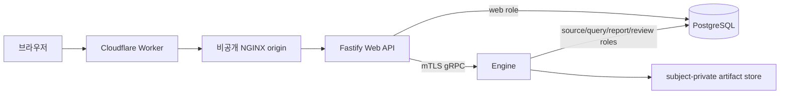

# 계정 인증·Review 통합 배포 실행 순서

이 문서는 계정 인증과 Review 응답 기능을 DB부터 Web API·Engine·프론트까지
배포하는 순서를 정의한다. 기준 변경은 다음 두 PR이다.

- DB: [BackwardLabs/daejang-db#17](https://github.com/BackwardLabs/daejang-db/pull/17)
- App·Engine·Web: [BackwardLabs/daejang#20](https://github.com/BackwardLabs/daejang/pull/20)

DB #17을 먼저 병합하고, 그 **병합 커밋**으로 Engine 모듈을 다시 pin한 PR #20만
배포한다. PR #20의 중간 `daejang-db` 커밋 pin이나 로컬 checkout을 운영 계약으로
사용하지 않는다.

## 1. 배포 전 필수 게이트

다음 조건을 모두 충족하기 전에는 PR #20을 ready로 바꾸거나 병합하지 않는다.

1. DB #17의 migration `000015`-`000018`, runtime role 권한과 CI를 리뷰한다.
2. DB #17을 병합하고 병합 커밋과 migration digest를 기록한다.
3. `services/engine/go.mod`와 `go.sum`을 그 병합 커밋으로 갱신한다.
4. GitHub Actions의 `Node quality`, `Engine quality`가 모두 성공한다.
5. 기존 DB라면 migration 17 적용 전에 OPEN Review를 0건으로 만든다.
6. 운영 Compose, DB role, Engine mTLS 인증서 SAN과 비공개 network를 확인한다.

`DAEJANG_DB_READ_TOKEN`은 GitHub Actions에서 private Go module을 읽는 전용
secret이다. `BackwardLabs/daejang-db`의 Contents read 권한만 부여하고 코드나
환경 예시 파일에 값을 넣지 않는다.

## 2. 런타임 경계



- 브라우저 인증은 opaque server session cookie를 사용한다.
- Web API는 `web_private`만 직접 사용하고 도메인 조회·변경은 Engine gRPC로 보낸다.
- PostgreSQL과 Engine 포트는 공개하지 않는다.
- Engine 서버 인증서 SAN은 Web API가 사용하는 `ENGINE_GRPC_SERVER_NAME`과
  일치해야 한다. Web API client 인증서 SAN은
  `ENGINE_WEB_API_CLIENT_DNS_NAME`과 일치해야 한다.

## 3. 저장소와 도구 확인

배포 계정은 두 저장소와 Docker daemon을 사용할 수 있어야 한다. 기존 checkout을
삭제하거나 dirty 상태에서 pull하지 않는다.

```bash
export GIWA_DEPLOY_ROOT=/Users/Shared/Projects/01_Daejang

git -C "$GIWA_DEPLOY_ROOT/daejang-db" status --short --branch
git -C "$GIWA_DEPLOY_ROOT/daejang" status --short --branch
docker version
docker compose version
```

두 저장소가 clean하지 않거나 Docker Compose를 사용할 수 없으면 중단한다.

## 4. DB #17 병합 커밋과 digest 고정

DB #17이 병합된 뒤 DB 저장소의 `main`을 fast-forward로 갱신한다. App 저장소는
아직 PR #20이 병합되기 전이므로 PR 작업 checkout을 사용한다.

```bash
git -C "$GIWA_DEPLOY_ROOT/daejang-db" fetch origin
git -C "$GIWA_DEPLOY_ROOT/daejang-db" checkout main
git -C "$GIWA_DEPLOY_ROOT/daejang-db" pull --ff-only origin main

git -C "$GIWA_DEPLOY_ROOT/daejang-db" rev-parse HEAD
shasum -a 256 "$GIWA_DEPLOY_ROOT"/daejang-db/migrations/0000{15,16,17,18,19}_*.sql
```

기록한 DB 병합 커밋으로 Engine module을 갱신하고 PR #20의 검증을 다시 실행한다.
병합 전 임시 커밋이나 `replace` directive를 남기지 않는다.
현재 검증된 pin은 DB merge commit
`aadb1eabf98e0848276f8d7d95bfc19d9d48b6c5`의 pseudo-version
`v0.0.0-20260728124403-aadb1eabf98e`다.

```bash
cd /PR-20-작업-checkout/services/engine
GOPRIVATE=github.com/BackwardLabs/* \
  go get github.com/BackwardLabs/daejang-db@<DB_17_MERGE_COMMIT>
go mod tidy
go test ./...
go vet ./...
go build ./...
```

이 pin 변경과 CI가 성공한 뒤 PR #20을 병합한다. 실제 배포 서버의 App `main`은
그 이후에만 `pull --ff-only origin main`으로 갱신한다.

## 5. 기존 운영 DB migration 17 cutover

새 DB는 migration 15-19를 순서대로 적용하면 된다. 기존 데이터가 있는 DB는
migration 17이 OPEN Review를 발견하면 의도적으로 중단하므로 아래 순서를 지킨다.

1. Review를 새로 만드는 writer와 Review 해결 API를 maintenance 상태로 전환한다.
2. migration 15와 16까지만 적용한다.
3. 현재 pointer가 가리키는 OPEN Review를 조회한다.

```sql
SELECT
  item.subject_id,
  item.review_id,
  item.current_revision_id,
  item.pointer_version
FROM review.review_item AS item
JOIN review.review_revision AS revision
  ON revision.subject_id = item.subject_id
 AND revision.review_id = item.review_id
 AND revision.revision_id = item.current_revision_id
WHERE revision.status = 'OPEN'
ORDER BY item.subject_id, item.review_id;
```

4. 조회 결과가 0건이면 migration 17, 18과 19를 적용한다.
5. 1건 이상이면 **여기서 배포를 중단한다.** DB PR #17의 migration-16
   `ResolveV2` 기반은 commit
   `596d51603a0d4e2d7fe14cc702ae49ca46ec38bc`에 있지만, 그 계약으로
   Review를 해결하는 버전된 cutover 명령·바이너리는 PR #20에 존재하지
   않는다. PR #20의 Engine pin `aadb1eabf98e0848276f8d7d95bfc19d9d48b6c5`은
   migration 17을 요구하므로 pre-17 resolver로 사용하지 않는다.
6. OPEN Review가 있는 운영 DB를 전환하려면 별도 후속 변경으로 다음을
   먼저 제공하고 동료 리뷰를 받는다.
   - 위 DB commit에 고정된 `review-cutover-v16` 소스와 재현 가능한 build 명령
   - subject, review, 예상 revision·pointer, 허용 option, schema digest를 검증하는
     입력 manifest 계약
   - `--dry-run`과 실행 명령, 바이너리 digest, 실행 주체·시각·결과 audit log
   - migration 16 복제 DB에서 같은 manifest로 검증한 통합 테스트
7. 승인된 명령으로 해결한 뒤 위 SQL이 0건임을 독립적으로 재확인한다.
   자동 삭제, 상태 강제 변경, 검증되지 않은 SQL 수정은 하지 않는다.
8. migration 17·18·19, runtime role, Review evidence query 검증을 실행한다.
9. 병합 DB commit으로 pin한 Engine을 배포한 뒤 writer를 다시 연다.

운영 데이터가 기록된 migration을 down하지 않는다. 실패는 새 migration으로
forward-fix한다.

## 6. DB와 역할 준비

기존 `daejang-db/.env`는 secret 파일이다. 없을 때만 예시를 복사하고 권한을
제한한다.

```bash
cd "$GIWA_DEPLOY_ROOT/daejang-db"
test -f .env || cp .env.example .env
chmod 600 .env
```

App stack에는 역할별 DSN을 주입한다.

| 설정 | 최소 역할 | 용도 |
| --- | --- | --- |
| `WEB_DATABASE_URL` | `daejang_web_app` | session, OAuth/email, 동의 |
| `SOURCE_DATABASE_URL` | `daejang_source_app` | source·sync job |
| `QUERY_DATABASE_URL` | `daejang_query_app` | ledger·Review evidence 조회 |
| `REPORT_DATABASE_URL` | `daejang_event_app` | report snapshot 조회 |
| `REVIEW_DATABASE_URL` | `daejang_event_app` | Review CAS·V2 delivery |
| `REVIEW_ARTIFACT_DATABASE_URL` | 현재 `daejang_source_app` | artifact metadata writer |

artifact-only role이 DB에 추가되면 마지막 DSN을 더 좁은 역할로 교체한다.

```bash
cd "$GIWA_DEPLOY_ROOT/daejang-db"
docker compose config --quiet
make database-up
make database-status
make database-verify
docker compose ps
```

성공 기준은 PostgreSQL `healthy`, migrations 15-19 적용, runtime role 검증과
Review evidence access 검증 성공이다.

## 7. App 운영 환경

```bash
cd "$GIWA_DEPLOY_ROOT/daejang"
test -f deploy/production.env || \
  cp deploy/production.env.example deploy/production.env
chmod 600 deploy/production.env
```

현재 운영에는 production identity verifier가 없으므로 `SIGNUP_ENABLED=false`와
`IDENTITY_VERIFICATION_MODE=disabled`를 유지한다. `disabled`는 운영 본인확인을
대체하지 않으며 이 상태에서 신규 가입을 열지 않는다. 실사용 provider와 callback 검증,
실패·재시도·감사 기록을 구현하고 운영 환경에서 검증한 뒤에만 가입을 활성화한다.
신규 가입이 닫혀 있어도 기존 계정 로그인은 계속 사용할 수 있다.

신규 가입을 닫은 상태에서 운영용 이메일 계정이 필요하면 migration이나 프런트에
계정·비밀번호를 넣지 않고 one-shot provisioning 명령을 사용한다. 명령은 일반
`web_private.users`, `user_emails`, `email_credentials` 행을 만들며 비밀번호는
Argon2id로만 저장한다. 동일한 사용자 ID나 이메일이 이미 있으면 전체 transaction이
실패한다. 이 명령은 비밀번호 변경 수단으로 사용하지 않는다.

```bash
read -r -s -p "Account password: " GIWA_ACCOUNT_PASSWORD
echo

DATABASE_URL="$WEB_DATABASE_URL" \
PROVISION_ACCOUNT_USER_ID="<운영 사용자 UUID>" \
PROVISION_ACCOUNT_DISPLAY_NAME="<운영 표시명>" \
PROVISION_ACCOUNT_EMAIL="<운영 이메일>" \
PROVISION_ACCOUNT_CONFIRM_EMAIL="<운영 이메일>" \
PROVISION_ACCOUNT_PASSWORD="$GIWA_ACCOUNT_PASSWORD" \
npm run account:provision --workspace @daejang/web-api

unset GIWA_ACCOUNT_PASSWORD
```

운영에서는 가능하면 `PROVISION_ACCOUNT_PASSWORD_FILE`에 secret mount 경로를
지정하고 `PROVISION_ACCOUNT_PASSWORD`는 생략한다. 성공 출력에는 상태와 user ID만
포함되며 표시명, 이메일, 비밀번호와 해시는 출력하지 않는다. 실행 후 일반 로그인 화면에서
이메일과 지정한 비밀번호를 입력해 로그인한다.

TLS private key, DB password, OAuth secret, Resend key와 `GH_PAT`는 Git에 넣지 않는다.
Engine image의 private module fetch에 쓰는 `GH_PAT`는 build 중에만 secret mount로
전달한다.

### Upbit PDF 활성화 게이트와 비공개 저장소

현재 Upbit PDF 등록은 비활성 상태를 유지한다. UI만 열거나 환경 변수만 바꿔 우회하지
않으며, 다음 조건을 모두 구현하고 운영 환경에서 검증하기 전에는 파일을 접수하지 않는다.

1. 지원 대상 Upbit 문서 레이아웃을 판별하고 실패를 닫힌 상태로 처리하는 parser가 있다.
2. 암호화 PDF의 비밀번호는 브라우저의 격리된 처리 경계에서만 사용하고 API, 로그,
   DB와 object metadata로 전송하거나 저장하지 않는다.
3. Web API가 확인한 object를 Engine이 durable하게 인수했다는 상태 계약이 있으며,
   timeout·재시도·정리 작업이 처리 중인 object를 먼저 삭제하지 않는다.
4. 운영 비공개 object storage가 아래 보안·복구 요건을 충족하고 실제 배포 설정과
   복구 시험으로 입증된다.

운영 비공개 object storage는 저장 데이터 암호화(encryption at rest), 서비스 계정별
최소 권한과 네트워크 접근 통제, 감사 가능한 접근 기록을 제공해야 한다. 또한 backup,
object versioning, 보존·삭제 기한과 복구 절차를 하나의 retention 정책으로 정의하고
정기적으로 복구와 만료 삭제를 시험한다. 로컬 파일시스템이나 Compose named volume을
사용한다는 사실만으로 이 요건을 충족했다고 간주하지 않는다. 개인정보가 backup이나
이전 version에 무기한 남지 않도록 동일한 보존·삭제 정책을 적용한다.

위 조건이 하나라도 충족되지 않으면 Upbit capability는 비활성으로 응답하고, Web API는
업로드 body를 저장하거나 upload row를 만들기 전에 요청을 거절한다.

## 8. App stack 시작

```bash
cd "$GIWA_DEPLOY_ROOT/daejang"

read -s -p "GH_PAT: " GH_PAT
echo
export GH_PAT

docker compose \
  --env-file deploy/production.env \
  --file deploy/compose.production.yaml \
  config --quiet

docker compose \
  --env-file deploy/production.env \
  --file deploy/compose.production.yaml \
  build

unset GH_PAT

docker compose \
  --env-file deploy/production.env \
  --file deploy/compose.production.yaml \
  up -d

docker compose \
  --env-file deploy/production.env \
  --file deploy/compose.production.yaml \
  ps
```

`web-api`, `engine`, `sync-worker`, `nginx`가 정상 상태여야 한다. 현재 aggregate
Engine health는 Source·Query·Report·Review·artifact 중 하나가 실패해도 전체를
`NOT_SERVING`으로 만들며 Web API 가용성까지 막을 수 있다. 이는 이번 배포의
fail-closed 선택이고, per-service health 분리는 후속 가용성 작업이다.

## 9. Edge 연결과 smoke test

공개 사이트 주소를 `WEB_API_ORIGIN`으로 다시 넣으면 Worker가 자기 자신을 호출한다.
NGINX 8443으로 연결되는 별도 비공개 API hostname과 Cloudflare Access service token을
사용한다.

```bash
curl -i https://daejang.backwardlabs.io/api/v1/me
curl -i https://daejang.backwardlabs.io/api/v1/auth/capabilities
curl -i \
  'https://daejang.backwardlabs.io/api/v1/auth/oauth/naver/start?intent=login'
```

성공 기준:

- `/me`는 HTML이 아닌 JSON `401`과 `Cache-Control: no-store`를 반환한다.
- capability는 `signup.enabled=false`와 서버가 현재 허용하는 가입 method를 반환한다.
  로그인 provider 목록은 이 endpoint의 계약이 아니다.
- 활성 OAuth login은 provider로 향하는 `302`와 보호된 transaction cookie를 반환한다.
- signup API와 UI는 안정적인 unavailable 상태로 닫혀 있다.
- 브라우저 실제 login callback 뒤 이전 session cookie는 거절되고 새 cookie만 유효하다.

## 10. Review delivery와 artifact 운영 경계

Review 해결 성공은 immutable revision, V2 event와 consumer delivery row가 durable하다는
뜻이다. recalculation, anchoring, receipt, report delivery 완료를 의미하지 않는다.

CAS 또는 DB 실패 전에 기록된 content-addressed subject-private artifact는 pin되지 않은
채 남을 수 있다. 현재 artifact API에는 안전한 cross-store transaction이나 삭제/list
계약이 없으므로 이 PR은 원자성을 가장하지 않는다.

- subject-private ACL을 유지한다.
- artifact volume 사용량을 모니터링한다.
- storage owner가 retention을 정하고 reconciliation/GC 후속 작업을 추적한다.
- downstream 완료 표시는 delivery worker와 proof/report gate가 실제 완료 신호를 저장한
  뒤에만 제공한다.

## 11. 롤백 원칙

- App 문제는 직전 정상 image/commit으로 되돌리되 DB migration은 down하지 않는다.
- Review writer를 다시 열기 전에 DB schema와 Engine module pin이 일치하는지 확인한다.
- `docker compose down --volumes`는 운영 DB와 artifact를 지울 수 있으므로 실행하지 않는다.
- production signup을 임시 우회, `disabled` identity mode 또는 mock으로 열지 않는다.
