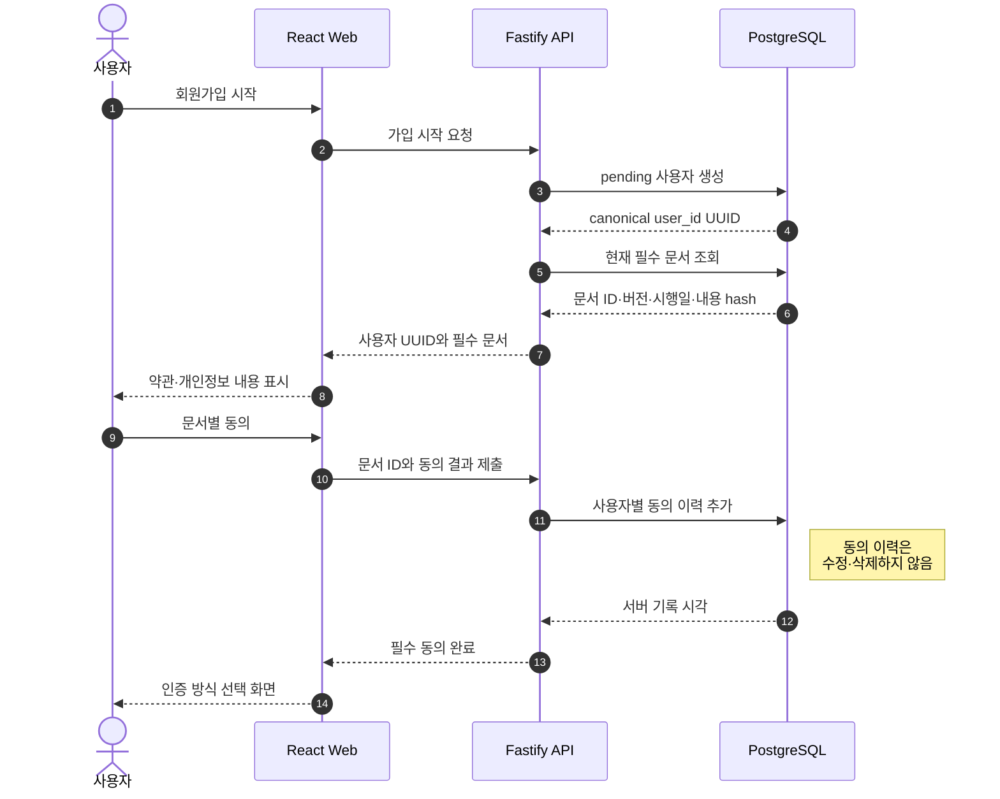
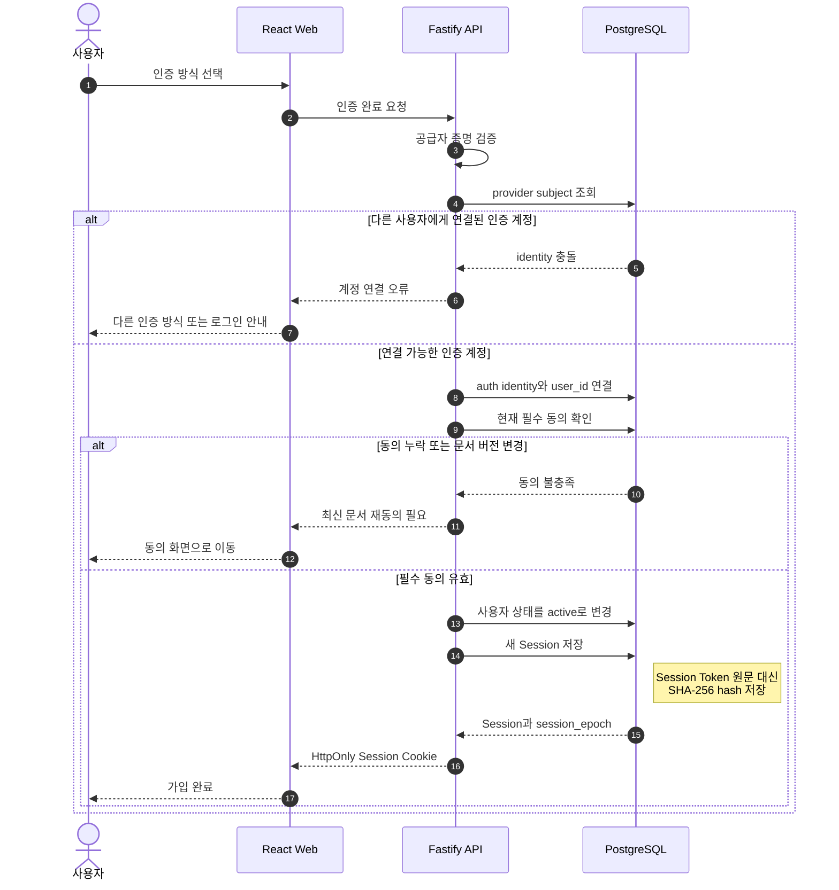
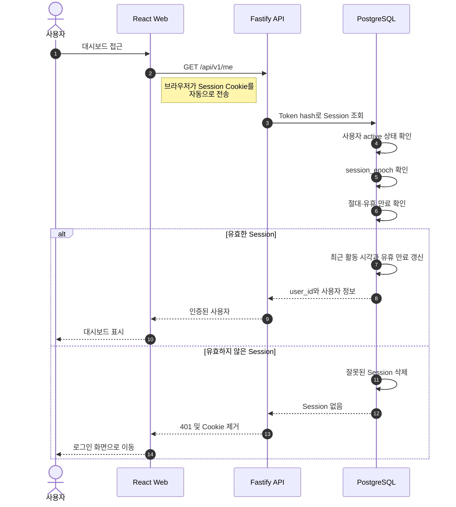
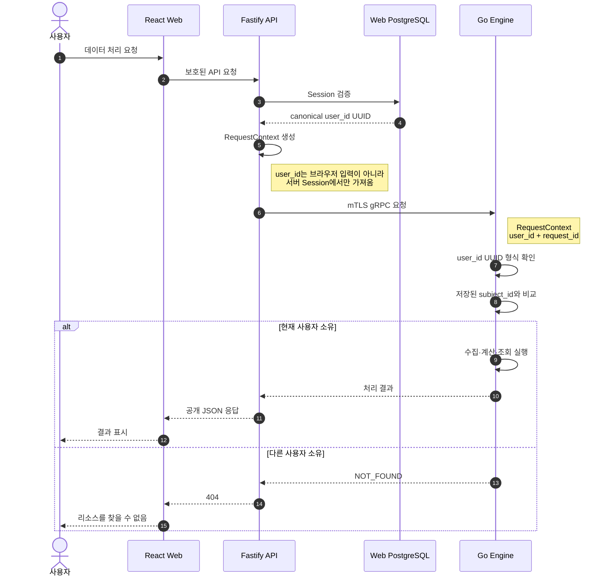
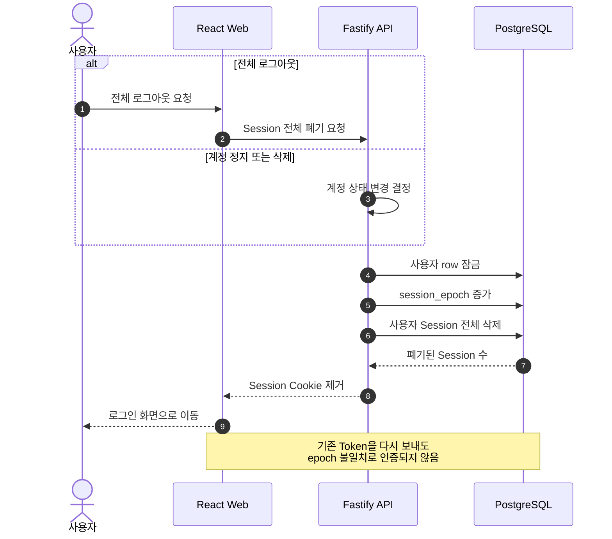

# 인증·Session Sequence

이 문서는 회원가입 시작부터 필수 동의, 서비스 계정 인증, Session 확인, Engine 요청과 전체 Session 폐기까지의 경계를 단계별로 설명한다.

공통 원칙:

- `web_private.users.id` UUID가 유일한 사용자 식별자다.
- 브라우저가 보낸 `user_id`는 인증이나 데이터 소유권 판단에 사용하지 않는다.
- 별도 workspace, ledger account ID 또는 Engine user ID를 만들지 않는다.
- Engine의 `subject_id`에는 같은 사용자 UUID의 문자열 표현을 사용한다.
- 현재 Engine 연동은 mTLS readiness 확인까지만 구현되어 있다. 4번의 사용자 RPC와 소유권 비교는 Engine API를 연결할 때 적용한다.

## 1. 가입 시작과 필수 동의

## 2. 서비스 계정 인증과 사용자 활성화

## 3. 로그인 이후 Session 확인

## 4. 데이터·장부·보고서 Engine 요청

현재 구현은 client certificate 기반 mTLS 연결 readiness 확인까지다. 실제 Engine 사용자 RPC를 추가할 때 다음 경계를 적용한다.

## 5. 전체 로그아웃·정지·삭제

