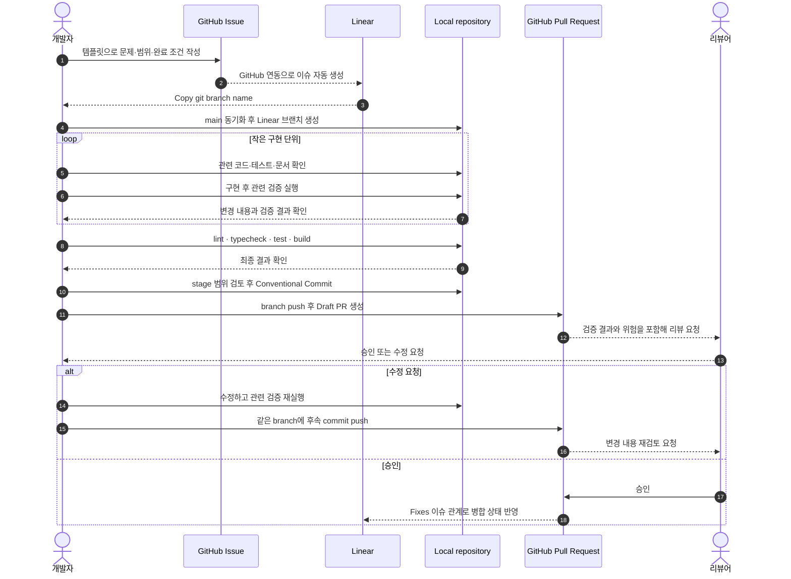

# 개발 가이드

> 상태: Draft
>
> 대상: `BackwardLabs/daejang` 기여자와 코딩 에이전트
>
> 정책 원본: [CONTRIBUTING.md](../CONTRIBUTING.md), [AGENTS.md](../AGENTS.md)

## 1. 목적

이 문서는 `BackwardLabs/daejang`에서 하나의 작업을 이슈로 정의하고, Linear 브랜치를 만든 뒤 구현·검증·Pull Request·리뷰·병합까지 진행하는 실제 순서를 설명한다.

협업 정책은 `CONTRIBUTING.md`, 코딩 에이전트의 작업 원칙은 `AGENTS.md`를 기준으로 한다. 이 문서는 해당 정책을 바꾸지 않고 개발자가 로컬에서 수행할 절차와 확인 지점을 구체화한다.

## 2. 기본 원칙

- 하나의 PR에는 하나의 논리적 변경만 포함한다.
- 구현 전에 이슈의 목적, 범위와 완료 조건을 확인한다.
- Linear에서 복사한 브랜치명을 그대로 사용하고 이슈 ID를 제거하지 않는다.
- 관련 없는 파일과 다른 사람이 만든 변경을 정리하거나 덮어쓰지 않는다.
- 실제로 실행한 검증 결과만 PR에 기록한다.
- 비밀 정보, 토큰, 개인정보와 내부 URL을 commit, log, issue 또는 PR에 포함하지 않는다.
- 여러 저장소가 함께 바뀌면 의존 PR과 안전한 병합·배포 순서를 문서화한다.

## 3. 전체 개발 순서



현재 `.github/workflows/ci.yml`은 PR과 `main`에서 Node quality, Engine quality와 production Compose 렌더링을 실행한다. 이 CI는 실행된 결과만 PR에서 인용하며, 아직 release image publish 또는 전체 서비스 통합 테스트를 수행하지 않는다. 서비스·migration 변경의 격리 Docker 검증과 main 병합 뒤 image digest 통합 검증은 [컨테이너 통합 검증과 release image 흐름](release-image-flow.md)을 따른다.

## 4. 작업 시작 전

### 4.1 이슈 확인

작업 목적에 맞는 GitHub Issue 템플릿을 사용한다.

| 작업 성격 | 템플릿 | 필수 내용 |
| --- | --- | --- |
| 버그 | 버그 제보 | 재현 방법, 기대 동작, 실제 동작, 환경, 영향도 |
| 기능 | 기능 요청 | 해결할 문제, 기대 결과, 완료 조건 |
| 구현·문서·운영 | 작업 등록 | 목적, 포함·제외 범위, 관련 저장소, 완료 조건 |

GitHub Issue는 Linear에 자동 생성된다. Linear에 같은 이슈를 다시 만들지 않고, 생성된 Linear 이슈에서 **Copy git branch name**을 사용한다.

### 4.2 로컬 상태 확인

```bash
git status --short
git branch --show-current
git remote -v
```

예상하지 못한 변경이 있으면 먼저 소유자와 범위를 확인한다. 다른 사람의 변경을 삭제하거나 `git reset --hard`, `git checkout --` 같은 명령으로 되돌리지 않는다.

### 4.3 main과 작업 브랜치 준비

작업 디렉터리가 안전한 상태에서 최신 `main`을 기준으로 브랜치를 만든다.

```bash
git fetch origin
git switch main
git pull --ff-only origin main
git switch -c "<Linear에서 복사한 브랜치명>"
```

브랜치명은 예시를 새로 만들지 않고 Linear에서 복사한 값을 그대로 사용한다.

## 5. 로컬 환경 준비

요구 사항:

- Node.js `20.19+` 또는 `22.12+`
- npm

처음 실행하거나 lockfile이 변경된 경우:

```bash
npm install
```

개발 서버:

```bash
npm run dev
```

기본 접속 주소는 `http://localhost:5173`이다.

GitHub 인증은 개인 로컬 설정 또는 승인된 credential helper를 사용한다. PAT를 remote URL, `.env`, Git config의 평문 값, shell history 또는 저장소 파일에 기록하지 않는다.

## 6. 구현 루프

작업마다 다음 순서를 반복한다.

1. 관련 코드, 테스트, 문서와 현재 Git diff를 읽는다.
2. 이슈 완료 조건을 만족하는 가장 작은 변경 단위를 정한다.
3. 기존 구조와 이름을 우선해 구현한다.
4. 변경과 가장 가까운 테스트 또는 수동 검증을 먼저 실행한다.
5. 실패하면 원인을 수정하고 같은 검증을 다시 실행한다.
6. 동작과 문서가 서로 달라졌다면 같은 PR에서 관련 문서를 갱신한다.
7. 다음 변경 전에 `git diff`로 의도한 범위만 바뀌었는지 확인한다.

새 의존성, 공통 추상화 또는 디렉터리는 실제 필요성이 확인될 때만 추가한다. 아직 구현하지 않는 미래 구조를 빈 파일과 폴더로 미리 만들지 않는다.

## 7. 검증

### 7.1 코드 변경

완료 전 루트에서 다음 명령을 실행한다.

```bash
npm run lint
npm run typecheck
npm test
npm run build
```

| 명령 | 확인 대상 |
| --- | --- |
| `npm run lint` | 정적 lint 오류 |
| `npm run typecheck` | TypeScript 타입 오류 |
| `npm test` | Vitest 단위·컴포넌트 테스트 |
| `npm run build` | production bundle 생성 가능 여부 |

버그 수정은 가능하면 기존 실패를 재현하는 테스트를 먼저 추가하거나, 재현 절차와 수정 후 결과를 PR에 기록한다.

### 7.2 문서만 변경

현재 별도 Markdown lint 명령은 없다. 문서 변경에서는 최소한 다음을 확인한다.

```bash
git diff --check
```

추가로 Markdown preview에서 heading, 표, 상대 링크와 Mermaid 렌더링을 확인한다. 문서 변경이 코드의 명령, 패키지 또는 실제 동작을 설명한다면 해당 내용이 현재 저장소와 일치하는지도 검사한다.

### 7.3 검증을 실행할 수 없는 경우

검사를 조용히 생략하지 않는다. PR의 `검증 결과`에 다음을 적는다.

- 실행하지 못한 명령 또는 시나리오
- 실행하지 못한 이유
- 대신 확인한 범위
- 남아 있는 위험과 후속 확인 주체

## 8. Commit

stage 전후로 변경 범위를 직접 검토한다.

```bash
git diff
git add <의도한 파일>
git diff --staged
```

커밋 메시지는 영어 명령형 Conventional Commits 형식을 사용한다.

```text
feat: add wallet source registration
fix: preserve collection date range
docs: document development workflow
test: cover onboarding consent state
refactor: simplify source form state
chore: update development tooling
```

하나의 커밋에도 가능한 한 하나의 설명 가능한 변경을 담는다. 민감 정보나 작업과 무관한 파일이 stage되었다면 commit 전에 제외한다.

## 9. Push와 Pull Request

현재 브랜치를 처음 push할 때:

```bash
git push -u origin "<현재 브랜치명>"
```

초기 구현은 Draft PR로 공유할 수 있다.

```bash
gh pr create --draft
```

PR 템플릿의 모든 항목을 작성한다.

- 변경 요약: 무엇을 왜 바꿨는지
- 관련 이슈: 완료 시 `Fixes TEAM-123`, 연결만 할 때 `References TEAM-123`
- 변경 내용: 리뷰 가능한 단위의 핵심 변경
- 관련 저장소 및 진행 순서
- 검증 결과: 실행한 명령과 실제 결과
- 영향 및 위험: 호환성, 데이터, 권한, 보안, 운영, rollback
- 리뷰 요청 사항: 집중해서 봐야 할 부분과 미결정 사항

GitHub 이슈를 직접 종료해야 할 때만 `Closes #123`을 추가한다. 하나의 PR로 Linear 이슈를 완료하지 않는다면 `Fixes` 대신 `References`를 사용한다.

## 10. 리뷰 대응

리뷰 의견마다 다음을 구분한다.

- 반드시 수정해야 하는 정확성·보안·호환성 문제
- 제품 또는 API 결정이 필요한 질문
- 현재 PR 범위 밖의 후속 제안

수정한 뒤 관련 검증을 다시 실행하고 같은 branch에 commit을 push한다. PR 설명의 검증 결과와 위험이 달라졌다면 본문도 함께 갱신한다.

리뷰 의견을 해결하기 위해 관련 없는 리팩터링을 추가하지 않는다. 범위를 넓혀야 완료할 수 있다면 이유와 영향을 먼저 공유한다.

## 11. 병합 이후

PR이 실제로 병합된 것을 확인한 뒤 로컬 `main`을 갱신한다.

```bash
git switch main
git pull --ff-only origin main
git branch -d "<병합된 브랜치명>"
```

다른 저장소의 후속 PR이나 배포 순서가 남아 있다면 관련 이슈를 닫기 전에 상태를 확인한다. 데이터 마이그레이션, 권한 또는 운영 작업이 있다면 PR 병합만으로 완료 처리하지 않는다.

## 12. 완료 체크리스트

- [ ] GitHub Issue와 연결된 Linear 이슈의 목적·범위·완료 조건을 확인했다.
- [ ] Linear에서 복사한 branch name을 사용했다.
- [ ] 관련 없는 사용자 변경을 수정하거나 삭제하지 않았다.
- [ ] 코드·테스트·문서가 같은 동작을 설명한다.
- [ ] 필요한 lint, typecheck, test와 build를 실행했다.
- [ ] 실행하지 못한 검증과 남은 위험을 기록했다.
- [ ] stage된 diff에 민감 정보나 관련 없는 파일이 없다.
- [ ] Conventional Commit 형식을 사용했다.
- [ ] PR에 Linear 관계, 검증 결과, 영향과 리뷰 요청 사항을 작성했다.
- [ ] 여러 저장소가 관련되면 PR과 안전한 진행 순서를 연결했다.

## 13. 관련 문서

- [프로젝트 개요와 실행 방법](../README.md)
- [기여 정책](../CONTRIBUTING.md)
- [코딩 에이전트 지침](../AGENTS.md)
- [컨테이너 통합 검증과 release image 흐름](release-image-flow.md)
- [웹 앱 기술 명세](00-web-app-technical-spec.md)
