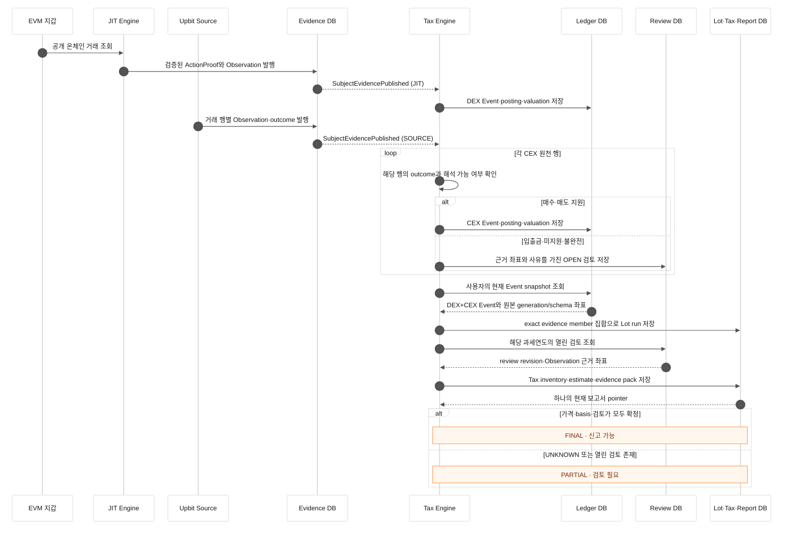

# DEX·CEX 통합 세금 보고서 흐름

> 대상: EVM 지갑 거래, Upbit 거래내역, 장부·검토·세금 보고서
>
> 기준: 같은 사용자와 과세연도의 공개된 근거를 하나의 재현 가능한 보고서로 구성

## 목적

DEX와 CEX 기록은 수집 방식이 다르지만 보고서 단계에서는 같은 사용자의 연간 거래 근거로 합쳐져야 한다. DEX는 JIT가 온체인 실행 근거를 해석하고, CEX는 Source worker가 거래소 문서의 행을 정규화한다. 두 입력은 모두 `SubjectEvidencePublished` 이후에만 Tax Engine으로 전달된다.

지원하는 거래는 장부 Event와 valuation으로 이어진다. 가격을 알 수 없는 leg나 아직 지원하지 않는 입출금은 0원 거래로 바꾸지 않고 `UNKNOWN`과 열린 검토 항목으로 남는다. 이 상태에서는 보고서가 생성되더라도 `PARTIAL`이며 신고 가능 상태로 승격되지 않는다.

## 전체 시퀀스

## 두 입력을 합치는 기준

Tax Engine은 producer 이름으로 DEX와 CEX를 임의 병합하지 않는다. 현재 장부 Event가 참조하는 정확한 `(generation_id, schema_digest)` 쌍을 정렬하고 중복 제거한 뒤 Lot run의 immutable member로 저장한다.

- 원본 generation이 하나면 기존 generation과 schema digest를 그대로 유지한다.
- 둘 이상이면 현재 Event 좌표 집합에서 aggregate generation을 계산한다.
- aggregate ID는 원본 producer generation을 대신하지 않는다. 보고서에서 Lot artifact를 따라가면 원본 member 쌍을 다시 확인할 수 있다.
- member에 없는 generation이나 schema 조합을 참조하는 allocation·basis·publication은 DB가 거부한다.

## CEX 행별 처리

하나의 Upbit 문서가 `PARTIAL`이어도 모든 행을 실패시키지 않는다.

| 원천 행 outcome | Tax Engine 처리 | 보고서 영향 |
| --- | --- | --- |
| `NORMALIZED` 매수·매도 | Event와 posting 생성 | 계산 가능한 범위에 포함 |
| 지원하지만 가격 일부 누락 | 알려진 leg만 valuation 저장 | 누락 leg는 `UNKNOWN`, 보고서 `PARTIAL` |
| 입금·출금 또는 미지원 의미 | 값을 추정하지 않고 Review 생성 | 검토 사유와 Observation 좌표 표시 |
| 근거 좌표 불일치 | fail-closed | 보고서 갱신 안 함 |

열린 검토는 같은 사용자, 같은 한국 과세연도, 현재 Lot member에 포함된 근거만 보고서 limitation으로 들어간다. supersede된 과거 fragment나 다른 연도의 검토가 현재 보고서를 막지 않는다.

## 보고서 재현 근거

Evidence pack은 다음 연결을 보존한다.

- aggregate generation과 schema digest
- Lot run ID와 canonical Lot artifact digest
- Tax inventory와 estimate artifact digest
- Event·revision·leg 좌표
- Review ID·열린 revision ID
- Review가 참조한 fragment·Observation·원본 generation/schema 좌표

금액을 계산할 수 없으면 `UNKNOWN`을 유지하고 `amount`를 만들지 않는다. `UNKNOWN`을 0원으로 바꾸거나 열린 검토가 있는 보고서를 `FINAL`로 표시하지 않는다.

## 운영에 필요한 입력

- 같은 사용자와 연도에 대한 지갑·거래소 account binding
- 모든 DEX·CEX 자산의 tax asset binding
- KRW denomination과 유효 구간이 명확한 quote snapshot
- 지갑·거래소 account의 실제 ownership assertion
- JIT·Tax policy 및 Engine artifact pin
- `daejang-db` migration 42
- JIT와 SOURCE producer 각각의 서명된 publication claim 정책
- private artifact 저장소와 PostgreSQL runtime role

현재 공식 연간 세금 보고서는 구성된 지원 연도에만 생성한다. 이전 연도 기록은 수집·정규화·검토할 수 있지만 지원되지 않는 연도를 공식 보고서로 바꾸지 않는다.

## 완료 검증

실제 PostgreSQL E2E는 한 사용자·한 과세연도에 DEX publication 하나와 `NORMALIZED` CEX 거래 및 미지원 이체가 포함된 CEX publication 하나를 발행한다. 두 worker 실행 후 다음을 확인한다.

1. 장부에 DEX와 CEX Event가 모두 존재한다.
2. Lot run에 서로 다른 원본 member 쌍이 정확히 저장된다.
3. 지원하는 CEX 거래는 fragment 전체 상태와 무관하게 처리된다.
4. 미지원 이체는 열린 Review와 보고서 limitation으로 남는다.
5. 누락 가격은 `UNKNOWN`, 보고서는 `PARTIAL`과 신고 차단 상태를 유지한다.
6. evidence pack에서 Lot artifact와 Review Observation까지 역추적할 수 있다.
