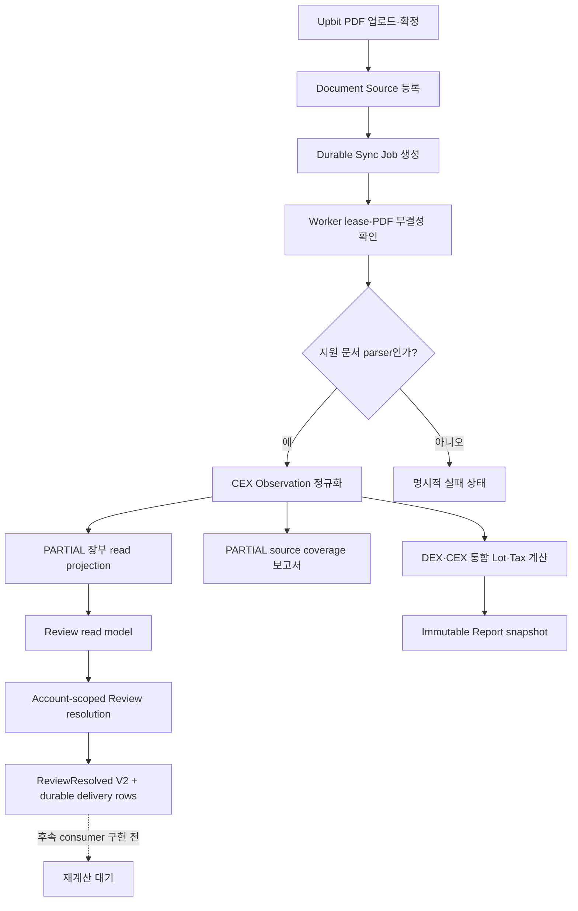

# Engine 연동 구현 현황과 계획

이 문서는 Web API가 도메인 DB를 직접 쓰지 않고 private gRPC Engine을
통해 처리한다는 기술 명세를 기준으로 현재 구현과 다음 작업을 구분합니다.

## 현재 구현

| 경계 | 상태 | 검증 기준 |
| --- | --- | --- |
| Session·동의·지갑 challenge | 구현 | Web API가 `web_private`만 직접 사용 |
| SourceService 계약 | 구현 | canonical protobuf의 등록·목록·연결 해제 RPC |
| 지갑 source 저장 | 구현 | Engine이 `daejang_source_app`으로 `source_private` 사용 |
| 내부 인증 | 구현 | mTLS, 서버 Session 기반 `RequestContext`, mutation idempotency key |
| 장애 변환 | 구현 | Engine unavailable `503`, deadline `504` |
| Web의 source DB 접근 차단 | 구현 | migration 권한 검증에서 USAGE·table 권한 부재 확인 |
| Engine production 패키징 | 구현 | non-root container, mTLS secret mount, private network, gRPC DB health probe |
| Upbit PDF 업로드 | 구현 | 20 MiB 제한, private object root, PDF magic·size·SHA-256 확인, source·job 원자 경계 |
| Sync Job | 구현 | durable idempotency, fenced lease, `SKIP LOCKED`, 성공·실패 상태 |
| Activity·Ledger·Review 조회 | 구현 | Web JSON → QueryService → read-only DB role |
| Review 상세·응답 revision | 구현 | account scope, option validation, CAS, private artifact, V2 event·consumer delivery row |
| Report snapshot | 구현 | immutable digest snapshot, 실제 계산 전 `PARTIAL` 표시 |
| Upbit 행 추출·Observation 정규화 | 구현 | 매수·매도·입금·출금, 명시적 미지원 outcome, immutable successor backfill |
| 미물질화 Observation 장부 조회 | 구현 | `OBSERVATION_ONLY`·`PARTIAL`, 실제 posting 생성 시 자동 제외 |
| Source coverage 보고서 | 구현 | 연도별 거래·완료·예외 집계, 손익 `UNKNOWN`, private manifest |
| DEX·CEX 통합 Lot·세금 Report | 구현 | 원본 generation member, 행별 CEX outcome, UNKNOWN·Review provenance 보존 |
| Review delivery·anchor·Report gate·PDF | 후속 | delivery worker, anchor/application receipt, latest proof 일치, immutable manifest 필요 |
| 운영 환경 배포 | 배포 대기 | DB 변경 commit 배포, 인증서·DSN·Cloudflare `/api/*` route 필요 |

## 현재 실행 흐름

Upbit PDF의 매수·매도·입금·출금 행은 Source Evidence Observation으로 정규화되고,
아직 tax posting이 없는 Observation도 `PARTIAL` 장부와 source coverage 보고서에서
조회됩니다. 지원하는 매수·매도는 기존 ledger/review/lot 저장 계약으로 물질화되고,
DEX와 CEX의 원본 generation member를 보존한 하나의 연간 Report를 구성합니다.
열린 Review나 알 수 없는 가격이 있으면 Report는 `PARTIAL`과 `UNKNOWN`을 유지합니다.
현재 Tax 계산은 `SubjectEvidencePublished` 처리 시 실행됩니다. delivery row는 downstream
handoff가 저장됐다는 뜻일 뿐이며, `ReviewResolved`를 소비해 Tax를 다시 계산하는 consumer는
아직 구현되지 않았습니다. 따라서 delivery는 recalculation, anchor 또는 report delivery 완료
신호가 아닙니다. parser가
없는 문서는 성공한 거래 0건으로 위장하지 않고 지원 불가 실패로 종료해야 합니다.

세부 매핑과 재처리 불변조건은 [Upbit PDF Observation 정규화](upbit-observation-pipeline.md), 통합 계산과 증빙 연결은 [DEX·CEX 통합 세금 보고서 흐름](dex-cex-tax-report-flow.md)을 따릅니다.

## 단계별 완료 조건

- protobuf lint·생성과 Go/TypeScript 타입 검사가 통과합니다.
- 해당 Engine runtime role만 자기 schema에 접근할 수 있습니다.
- 동일 idempotency key 재요청이 중복 durable row를 만들지 않습니다.
- 실제 PostgreSQL에서 migration, 역할 권한, 등록·lease·완료, query, report
  integration test가 통과합니다.
- 실패한 Engine 호출은 공개 API에서 안전한 오류 코드로 변환되고 내부 endpoint나
  DB 오류를 노출하지 않습니다.
