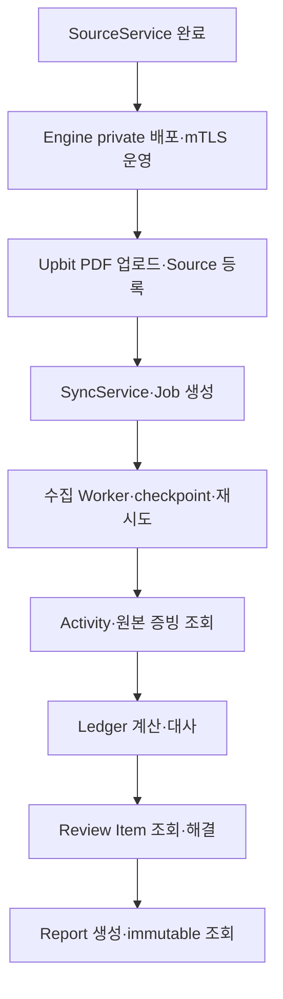

# Engine 연동 구현 현황과 계획

이 문서는 Web API가 도메인 DB를 직접 쓰지 않고 private gRPC Engine을
통해 처리한다는 기술 명세를 기준으로 현재 구현과 다음 작업을 구분합니다.

## 현재 구현

| 경계 | 상태 | 검증 기준 |
| --- | --- | --- |
| Session·동의·지갑 challenge | 구현 | Web API가 `web_private`만 직접 사용 |
| SourceService 계약 | 구현 | canonical protobuf의 등록·목록·연결 해제 RPC |
| 지갑 source 저장 | 구현 | Engine이 `daejang_source_app`으로 `source_private` 사용 |
| 내부 인증 | 구현 | mTLS, 서버 Session 기반 `RequestContext`, mutation idempotency key |
| 장애 변환 | 구현 | Engine unavailable `503`, deadline `504` |
| Web의 source DB 접근 차단 | 구현 | migration 권한 검증에서 USAGE·table 권한 부재 확인 |
| Engine production 배포 | 미구현 | container, mTLS secret, private service와 health probe 필요 |

## 다음 구현 순서

1. Engine container, mTLS secret 주입·회전, private service와 health probe를 추가합니다.
2. Upbit PDF의 제한된 업로드 URL, 확정, source 등록 계약을 추가합니다.
3. `SyncService`와 durable Job 상태, idempotency, 취소·재시도 규칙을 확정합니다.
4. Source worker가 checkpoint와 원본 artifact를 남기도록 연결합니다.
5. Activity 조회 후 Ledger·Review·Report API를 읽기 모델 순서로 추가합니다.
6. 각 단계마다 BFF가 해당 Engine schema에 직접 접근하지 않는 권한 검사를
   배포 gate로 유지합니다.

## 단계별 완료 조건

- protobuf lint·생성과 Go/TypeScript 타입 검사가 통과합니다.
- 해당 Engine runtime role만 자기 schema에 접근할 수 있습니다.
- 동일 idempotency key 재요청이 중복 durable row를 만들지 않습니다.
- 실제 PostgreSQL과 Engine process를 사용한 등록·조회·상태 변경 통합 테스트가
  통과합니다.
- 실패한 Engine 호출은 공개 API에서 안전한 오류 코드로 변환되고 내부 endpoint나
  DB 오류를 노출하지 않습니다.
