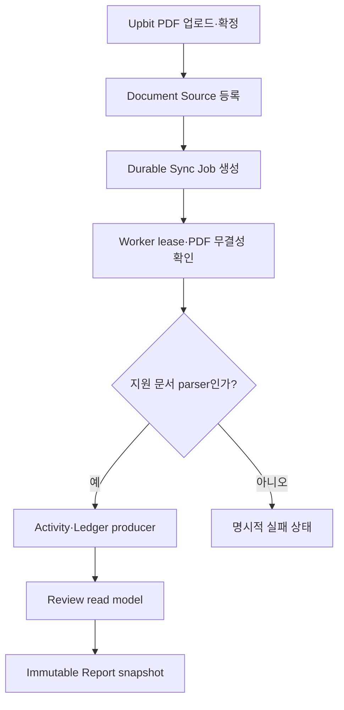

# Engine 연동 구현 현황과 계획

이 문서는 Web API가 도메인 DB를 직접 쓰지 않고 private gRPC Engine을
통해 처리한다는 기술 명세를 기준으로 현재 구현과 다음 작업을 구분합니다.

## 현재 구현

| 경계 | 상태 | 검증 기준 |
| --- | --- | --- |
| Session·동의·지갑 challenge | 구현 | Web API가 `web_private`만 직접 사용 |
| SourceService 계약 | 구현 | canonical protobuf의 등록·목록·연결 해제 RPC |
| 지갑 source 저장 | 구현 | Engine이 `daejang_source_app`으로 `source_private` 사용 |
| 내부 인증 | 구현 | mTLS, 서버 Session 기반 `RequestContext`, mutation idempotency key |
| 장애 변환 | 구현 | Engine unavailable `503`, deadline `504` |
| Web의 source DB 접근 차단 | 구현 | migration 권한 검증에서 USAGE·table 권한 부재 확인 |
| Engine production 패키징 | 구현 | non-root container, mTLS secret mount, private network, gRPC DB health probe |
| Upbit PDF 업로드 | 구현 | 20 MiB 제한, private object root, PDF magic·size·SHA-256 확인, source·job 원자 경계 |
| Sync Job | 구현 | durable idempotency, fenced lease, `SKIP LOCKED`, 성공·실패 상태 |
| Activity·Ledger·Review 조회 | 구현 | Web JSON → QueryService → read-only DB role |
| Report snapshot | 구현 | immutable digest snapshot, 실제 계산 전 `PARTIAL` 표시 |
| Upbit 행 추출·정규화 | 후속 | 공식 PDF fixture와 문서 버전 계약 필요 |
| Ledger 계산·Review 해결·세금 Lot | 후속 | 기존 ledger/review/lot producer 연결 필요 |
| 운영 환경 배포 | 배포 대기 | DB 변경 commit 배포, 인증서·DSN·Cloudflare `/api/*` route 필요 |

## 현재 실행 흐름

다음 구현은 지원할 Upbit PDF 실물 fixture를 고정한 뒤 행 추출·정규화 producer를
worker에 연결하는 작업입니다. 그 결과를 기존 ledger/review/lot 저장 계약으로
발행한 뒤 Review 해결 mutation과 최종 세금 Report 산출을 활성화합니다. parser가
없는 문서는 성공한 거래 0건으로 위장하지 않고 지원 불가 실패로 종료해야 합니다.

## 단계별 완료 조건

- protobuf lint·생성과 Go/TypeScript 타입 검사가 통과합니다.
- 해당 Engine runtime role만 자기 schema에 접근할 수 있습니다.
- 동일 idempotency key 재요청이 중복 durable row를 만들지 않습니다.
- 실제 PostgreSQL에서 migration, 역할 권한, 등록·lease·완료, query, report
  integration test가 통과합니다.
- 실패한 Engine 호출은 공개 API에서 안전한 오류 코드로 변환되고 내부 endpoint나
  DB 오류를 노출하지 않습니다.
