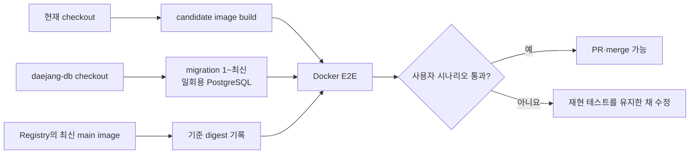
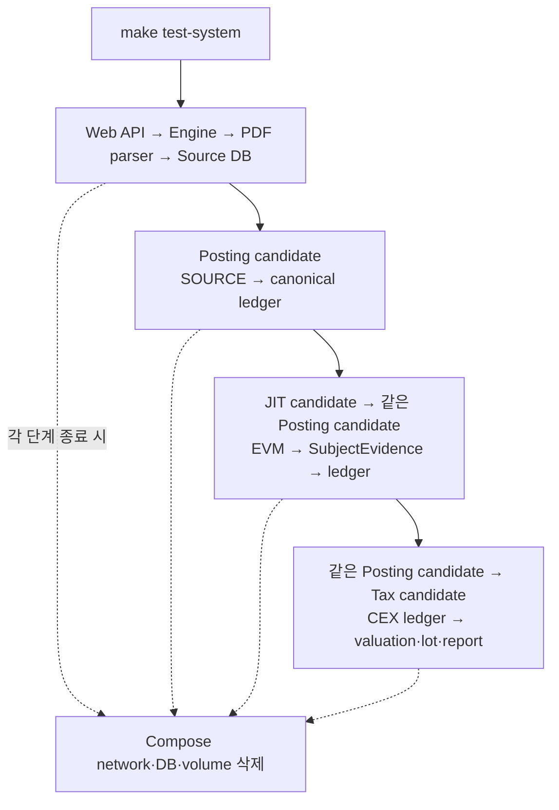
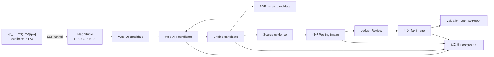
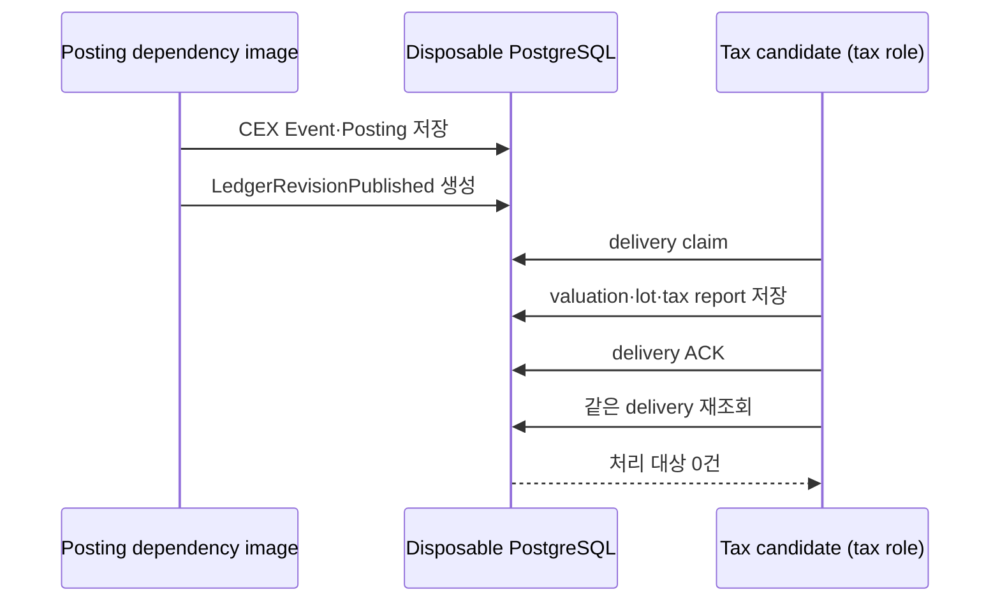
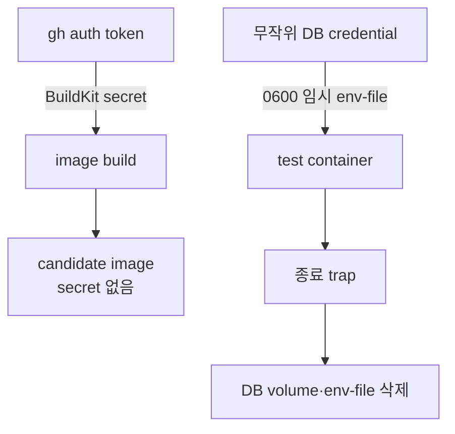

# 로컬 dev E2E 실행 방법

## 무엇을 확인하는가

로컬 dev E2E는 운영 서버를 복제하는 작업이 아니다. 개발 중인 현재 checkout을
Docker image로 만들고, 필요한 이웃 서비스와 실행할 때마다 새로 생성되는 PostgreSQL에
연결해 사용자가 겪은 흐름을 다시 확인하는 절차다.



최신 image를 pull하는 이유는 현재 `main`의 기준점을 명확히 하기 위해서다. 실제
검증 대상은 pull한 image가 아니라 현재 checkout으로 새로 만든 candidate image다.
따라서 아직 merge하지 않은 API나 로직 변경도 Docker 서비스 경계에서 확인할 수 있다.

## 개발자가 실행할 명령

각 저장소에서는 같은 명령을 사용한다.

```bash
make test
```

DB와 schema는 Mac Studio의 공용 개발 경로를 기본으로 사용한다.

```bash
DAEJANG_DB_DIR=/다른/daejang-db SCHEMA_DIR=/다른/schema make test
```

변경 중인 DB나 schema checkout을 함께 검증할 때만 위처럼 경로를 덮어쓴다.

최초 한 번은 Registry와 GitHub CLI 로그인이 필요하다.

```bash
docker login backwardlabss-mac-studio.tail344fa1.ts.net
gh auth status
```

DB 초기화·검증 SQL은 host 경로를 container에 bind mount하지 않고 표준입력으로
PostgreSQL에 전달한다. 따라서 개인 worktree가 `/Users/<사용자>/code` 아래에 있어도
Docker Desktop의 file sharing 경로를 추가할 필요가 없다. Registry 주소가 달라진
경우에만 `REGISTRY=새주소 make test`로 덮어쓴다.

여러 저장소의 변경을 함께 검증하려면 `daejang`에서 전체 시나리오를 실행한다.

```bash
make test-system
```

이 명령은 Posting candidate를 먼저 만든 뒤 그 동일한 image를 JIT→Posting과
Posting→Tax 시나리오에 넘긴다. 각 시나리오는 별도 Compose network와 일회용 DB를
사용한다. 모든 컨테이너를 하나의 network에 장시간 올려 두면 어느 시나리오가 만든
데이터 때문에 통과했는지 불분명해지므로, 제품 흐름은 연결하되 상태는 격리한다.



## 화면을 직접 확인할 때

`make test`는 자동 검증이므로 성공·실패와 관계없이 container와 일회용 DB를
정리한다. 브라우저로 화면을 보면서 API와 DB 반영 결과를 확인할 때는 유지형 환경을
별도로 실행한다.

```bash
make dev-e2e-up
```

이 명령은 현재 checkout으로 Web UI, Web API, Engine, PDF parser image를 만들고,
Registry의 최신 Posting·Tax image를 같은 일회용 PostgreSQL과 artifact volume에 연결한
다음 백그라운드에서 계속 실행한다. Mac Studio에서는
[http://localhost:15173](http://localhost:15173)으로 접속한다.

```text
이메일: test@example.test
비밀번호: test1234!
```

기존 계정 로그인뿐 아니라 신규 회원가입도 확인할 수 있다. 시작 화면에서 회원가입을
선택하고 아직 DB에 없는 `@example.test` 이메일을 사용한다. dev E2E는 외부 메일을
보내지 않으며 아래 고정 인증번호를 사용한다. 이 우회는 `NODE_ENV=development`에서만
활성화되고 test와 production에서는 설정 자체를 거부한다.

```text
인증번호: 000000
테스트 비밀번호 예시: test1234!
```

이메일 확인 → 비밀번호 설정 → 필수 약관 동의 → 가입 완료 → 대시보드 이동까지가
회원가입 E2E의 범위다. 같은 이메일로 다시 가입하려면 환경을 내렸다 올려 일회용 DB를
초기화하거나 다른 이메일을 사용한다.

환경을 올린 뒤에는 같은 DB·network·Engine을 유지한 채 테스트만 반복한다.

```bash
make dev-e2e-test
make dev-e2e-test
```

이 명령은 image를 다시 만들거나 Registry image를 다시 pull하지 않는다. migration을
다시 적용하거나 환경을 내리지도 않고, 고정 거래의 Posting → Tax → Report 결과와
Web API source pipeline을 다시 검증하는 container만 실행 후 제거한다.
따라서 화면을 열어 둔 상태에서 코드를 확인하고 여러 번 테스트할 수 있다. 현재 코드를
다시 image에 반영해야 할 때만 기존 환경을 내리고 `make dev-e2e-up`을 다시 실행한다.

상태와 로그는 다음 명령으로 확인한다.

```bash
make dev-e2e-status
make dev-e2e-logs
```

코드를 더 고친 경우 `make dev-e2e-down`으로 기존 환경을 내린 뒤 다시
`make dev-e2e-up`을 실행한다. Docker build cache를 재사용하므로 바뀌지 않은 layer는
다시 만들지 않는다. 확인을 마친 뒤에만 다음 명령으로 일회용 DB까지 제거한다.

```bash
make dev-e2e-down
```

같은 Mac Studio에서 이미 다른 환경이 실행 중이거나 기존 환경을 유지한 채 두 번째
환경을 확인하려면 포트와 상태 디렉터리를 함께 분리한다.

```bash
DAEJANG_DEV_E2E_WEB_PORT=16011 \
DAEJANG_DEV_E2E_STATE_DIR=/tmp/daejang-dev-e2e-$USER \
make dev-e2e-up
```

`dev-e2e-status`, `dev-e2e-test`, `dev-e2e-logs`, `dev-e2e-down`에도 같은 두 변수를
전달해야 같은 환경을 가리킨다.

개인 노트북에서 볼 때는 Mac Studio의 외부 포트를 열지 않고 SSH tunnel을 사용한다.
아래 명령은 개인 노트북에서 실행한다.

```bash
ssh -N -T \
  -o ExitOnForwardFailure=yes \
  -o ServerAliveInterval=30 \
  -L 15173:127.0.0.1:15173 \
  <Mac-Studio-사용자>@backwardlabss-mac-studio.tail344fa1.ts.net
```

터널이 열린 동안 개인 노트북 브라우저에서
[http://localhost:15173](http://localhost:15173)에 접속한다. Compose port는 Mac
Studio의 `127.0.0.1`에만 bind되므로 Tailscale이나 공유기에서 별도 포트를 열지 않는다.
인앱 브라우저처럼 임의의 `localhost` port로 중계되는 경우, Web API는
`NODE_ENV=development`일 때만 같은 protocol과 hostname의 port 차이를 허용한다.
예를 들어 `http://localhost:60101`은 허용하지만 `http://127.0.0.1:60101`이나
외부 hostname은 허용하지 않는다. test와 production 환경은 port까지 정확히 일치해야 한다.



환경을 올릴 때 테스트 계정에는 2025년 Upbit BTC 매수 한 건이 고정 fixture로 들어간다.
이 거래는 단순 화면 샘플이 아니라 Source publication부터 Posting, Ledger publication,
Tax Engine, ReportModel까지 실제 runtime이 처리한다. 브라우저에서 조회 기간을 2025년으로
선택하면 장부와 보고서 결과를 확인할 수 있다. 이후 화면에서 추가한 PDF도 같은 artifact
volume과 Posting worker를 사용한다. 다만 고정 Tax profile에 없는 계정·자산은 Tax가
추측하지 않고 명시적으로 실패하므로, 임의 PDF의 세금 결과까지 검증하려면 그 재현 입력에
맞는 profile·asset mapping fixture를 별도로 추가해야 한다.

## 저장소별 실제 경계

| 실행 위치 | 현재 코드로 만드는 것 | 끝까지 확인하는 흐름 |
| --- | --- | --- |
| `daejang` | Web UI, Web API, Engine, PDF parser | PDF/source fixture → 최신 Posting → Ledger·Review → 최신 Tax → Report → 인증 Web API·UI |
| `daejang-jit-engine` | `jitd` runtime과 test image | fixture RPC → 실제 `jitd` gRPC → SubjectEvidence → 최신 Posting → canonical ledger → Go race |
| `daejang-posting-service` | Posting test image | SOURCE/JIT evidence → Event·Posting·delivery, Go race + Python adapter |
| `daejang-tax-engine` | Tax runtime과 test image | 최신 Posting의 CEX 장부 → `LedgerRevisionPublished` → valuation → lot → tax report |

Tax 연결은 다음 순서를 한 DB 안에서 지킨다. 전체 Tax 회귀 테스트는 연결 fixture에
다른 delivery가 섞이지 않도록 이 시나리오 뒤에 실행한다.



## 환경 변수와 secret 처리

개발자가 운영 `.env`를 복사할 필요는 없다. DB 사용자와 password는
`daejang-db/scripts/with-disposable-postgres.sh`가 실행마다 무작위로 만들고, 테스트
runner가 권한 `0600`의 임시 env 파일로 컨테이너에 전달한다. 종료 시 컨테이너,
network, volume과 임시 파일을 삭제한다.

private Go module을 읽는 GitHub token도 `gh auth token`에서 임시 파일로 받아
BuildKit secret으로만 사용한다. Dockerfile `ARG`, image layer, 저장소의 `.env`에는
저장하지 않는다.



## 오류를 다시 테스트하는 방법

실제 오류가 난 입력이나 상태를 해당 저장소의 통합 테스트로 먼저 남긴다. 그 뒤
`make test`를 실행하면 수정 전에는 같은 오류로 실패하고, 수정 후에는 candidate
image에서 통과해야 한다. DB schema와 client를 함께 고치는 경우에는 변경한
`daejang-db` checkout을 `DAEJANG_DB_DIR`로 지정하므로 아직 merge되지 않은 두
저장소 변경도 함께 검증할 수 있다.

운영 DB, 운영 secret, production Compose, 실행 중인 Supervisor/launchd 서비스는 이
검증에 연결하지 않는다. Local E2E 통과는 merge 전 검증 결과이고, 실제 release는
main에서 publisher가 만든 image digest를 별도로 확인한 뒤 진행한다.
