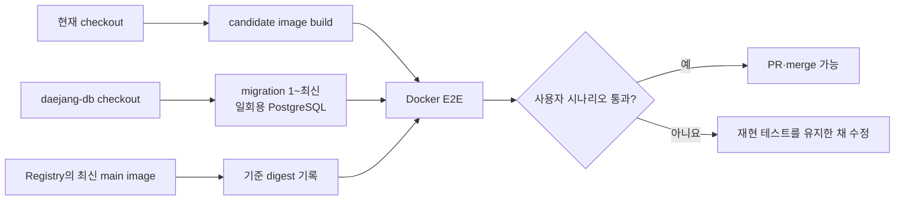
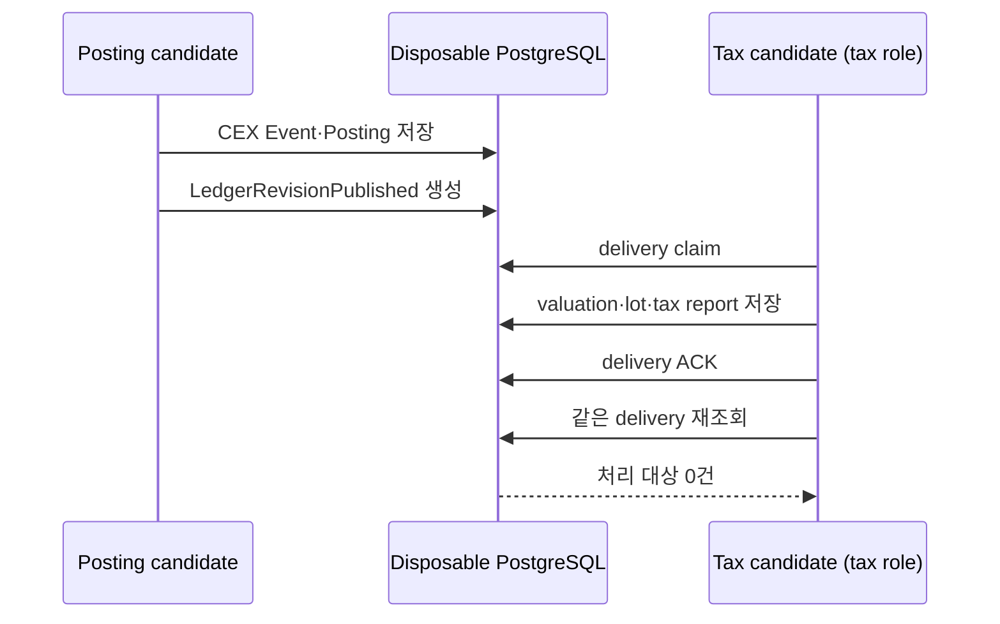
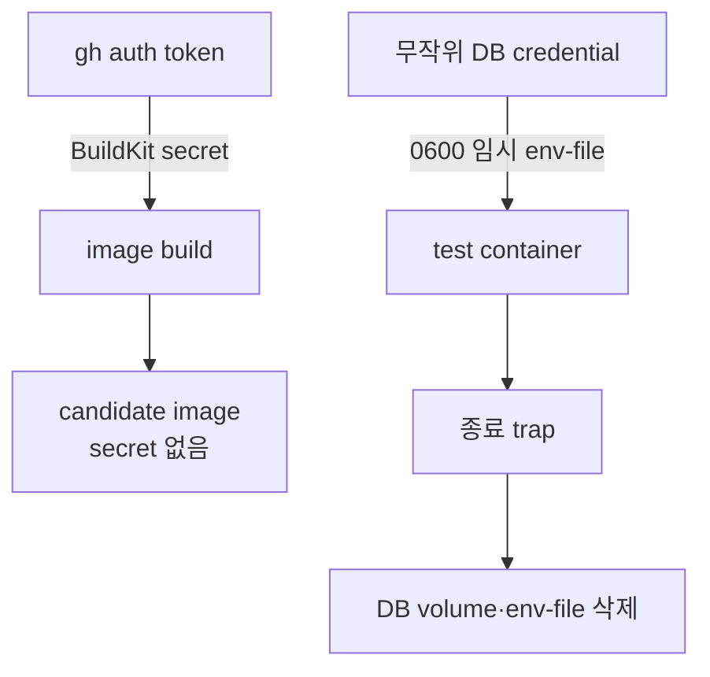

# 로컬 dev E2E 실행 방법

## 무엇을 확인하는가

로컬 dev E2E는 운영 서버를 복제하는 작업이 아니다. 개발 중인 현재 checkout을
Docker image로 만들고, 필요한 이웃 서비스와 실행할 때마다 새로 생성되는 PostgreSQL에
연결해 사용자가 겪은 흐름을 다시 확인하는 절차다.



최신 image를 pull하는 이유는 현재 `main`의 기준점을 명확히 하기 위해서다. 실제
검증 대상은 pull한 image가 아니라 현재 checkout으로 새로 만든 candidate image다.
따라서 아직 merge하지 않은 API나 로직 변경도 Docker 서비스 경계에서 확인할 수 있다.

## 개발자가 실행할 명령

각 저장소에서는 같은 명령을 사용한다.

```bash
make test DAEJANG_DB_DIR=/Users/Shared/Projects/01_Daejang/daejang-db
```

Tax Engine만 Posting Service의 현재 checkout도 필요하다. 두 저장소가 형제
디렉터리가 아니면 경로를 함께 지정한다.

```bash
make test \
  DAEJANG_DB_DIR=/Users/Shared/Projects/01_Daejang/daejang-db \
  DAEJANG_POSTING_SERVICE_DIR=/path/to/daejang-posting-service
```

최초 한 번은 Registry와 GitHub CLI 로그인이 필요하다.

```bash
docker login backwardlabss-mac-studio.tail344fa1.ts.net
gh auth status
```

Docker Desktop이 읽을 DB checkout은 `/Users/Shared` 아래처럼 Docker file sharing이
허용된 경로에 두는 편이 안전하다. Registry 주소가 달라진 경우에만
`REGISTRY=새주소 make test`로 덮어쓴다.

## 저장소별 실제 경계

| 실행 위치 | 현재 코드로 만드는 것 | 끝까지 확인하는 흐름 |
| --- | --- | --- |
| `daejang` | Web API, Engine, PDF parser | Web API 요청 → Engine Unix socket → networkless parser → source DB |
| `daejang-jit-engine` | `jitd` runtime과 test image | 실제 entrypoint → JIT DB 계약 → Go race 통합 테스트 |
| `daejang-posting-service` | Posting test image | SOURCE/JIT evidence → Event·Posting·delivery, Go race + Python adapter |
| `daejang-tax-engine` | Tax와 Posting test image | Posting의 CEX 장부 → `LedgerRevisionPublished` → valuation → lot → tax report |

Tax 연결은 다음 순서를 한 DB 안에서 지킨다. 전체 Tax 회귀 테스트는 연결 fixture에
다른 delivery가 섞이지 않도록 이 시나리오 뒤에 실행한다.



## 환경 변수와 secret 처리

개발자가 운영 `.env`를 복사할 필요는 없다. DB 사용자와 password는
`daejang-db/scripts/with-disposable-postgres.sh`가 실행마다 무작위로 만들고, 테스트
runner가 권한 `0600`의 임시 env 파일로 컨테이너에 전달한다. 종료 시 컨테이너,
network, volume과 임시 파일을 삭제한다.

private Go module을 읽는 GitHub token도 `gh auth token`에서 임시 파일로 받아
BuildKit secret으로만 사용한다. Dockerfile `ARG`, image layer, 저장소의 `.env`에는
저장하지 않는다.



## 오류를 다시 테스트하는 방법

실제 오류가 난 입력이나 상태를 해당 저장소의 통합 테스트로 먼저 남긴다. 그 뒤
`make test`를 실행하면 수정 전에는 같은 오류로 실패하고, 수정 후에는 candidate
image에서 통과해야 한다. DB schema와 client를 함께 고치는 경우에는 변경한
`daejang-db` checkout을 `DAEJANG_DB_DIR`로 지정하므로 아직 merge되지 않은 두
저장소 변경도 함께 검증할 수 있다.

운영 DB, 운영 secret, production Compose, 실행 중인 Supervisor/launchd 서비스는 이
검증에 연결하지 않는다. Local E2E 통과는 merge 전 검증 결과이고, 실제 release는
main에서 publisher가 만든 image digest를 별도로 확인한 뒤 진행한다.
