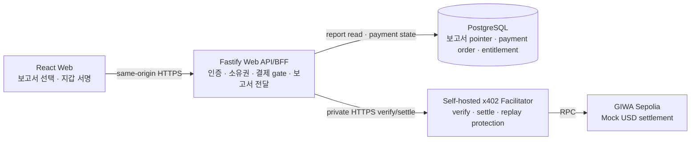
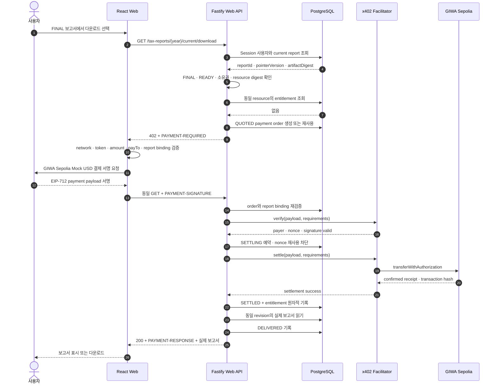
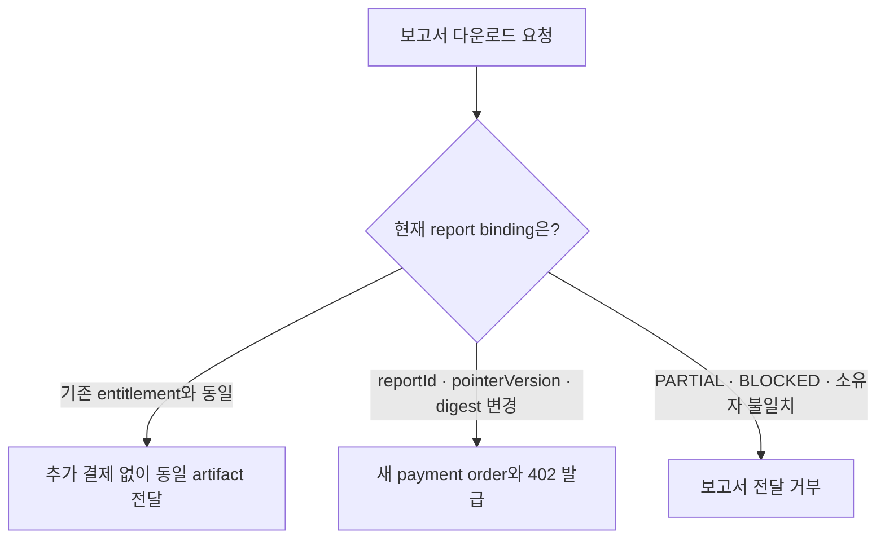
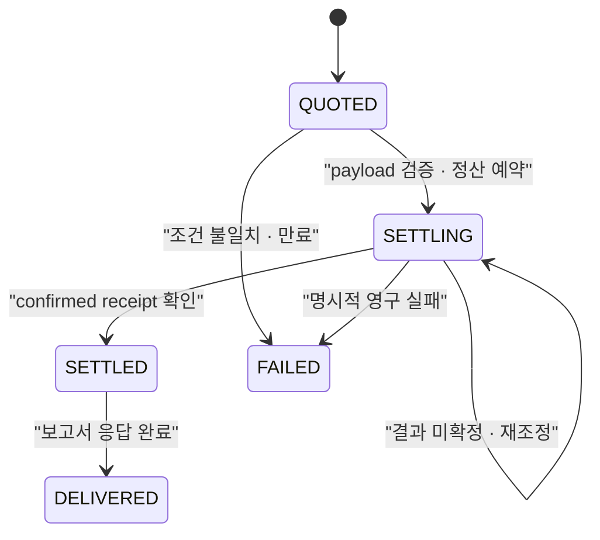

# 실제 보고서 x402 결제

## 1. 목적

이 문서는 사용자가 대장에서 생성한 **실제 FINAL 세금 보고서**를 GIWA Sepolia의 x402 결제와 연결하는 계약을 정의한다.

결제 대상은 고정된 synthetic fixture가 아니다. 결제와 다운로드 권한은 현재 로그인한 사용자, 보고서 ID, 발행 revision과 artifact digest에 함께 묶인다. MVP 결제 자산은 가치가 없는 GIWA Sepolia Mock USD이며 Mainnet 결제, 환불, 구독과 실제 가치가 있는 토큰은 범위에 포함하지 않는다.

## 2. 시스템 경계



- React는 PostgreSQL, 보고서 저장소 또는 facilitator를 직접 호출하지 않는다.
- Fastify는 Session의 사용자 UUID로 보고서 소유권과 현재 revision을 검증한다.
- facilitator는 보고서 본문을 읽지 않는다. 결제 payload 검증과 GIWA Sepolia 정산만 담당한다.
- facilitator signer private key는 Web API 환경변수, 브라우저, 응답과 일반 로그에 들어가지 않는다.
- Go Engine은 결제 상태를 알지 않는다. 보고서는 결제 전에 이미 생성·검증된 불변 산출물이어야 한다.

## 3. 정상 시퀀스



## 4. 재다운로드와 revision 변경



결제 권한은 다음 값의 결합이다.

```text
userId
+ reportId
+ residentId
+ taxYear
+ finality
+ pointerVersion
+ reportArtifactDigest
+ format
+ resourceDigest
```

보고서 pointer가 새 revision으로 이동하면 이전 entitlement를 자동으로 재사용하지 않는다. 같은 report ID를 재사용하는 구현이라도 pointer version이나 artifact digest가 달라지면 별도 resource로 취급한다.

## 5. HTTP 계약

### 요청

```http
GET /api/v1/tax-reports/2027/current/download?finality=FINAL&format=json
Cookie: __Host-daejang_session=...
```

### 미결제 응답

```http
HTTP/1.1 402 Payment Required
PAYMENT-REQUIRED: <base64 JSON>
Cache-Control: private, no-store
```

`PAYMENT-REQUIRED`는 x402 v2 형식을 사용하고, 허용 조건의 `extra`에 아래 binding을 포함한다.

```json
{
  "reportId": "...",
  "pointerVersion": 3,
  "reportArtifactDigest": "...",
  "resourceDigest": "...",
  "paymentOrderId": "..."
}
```

### 결제 재요청

```http
GET /api/v1/tax-reports/2027/current/download?finality=FINAL&format=json
Cookie: __Host-daejang_session=...
PAYMENT-SIGNATURE: <base64 JSON>
```

### 정산 성공

```http
HTTP/1.1 200 OK
PAYMENT-RESPONSE: <base64 JSON>
Cache-Control: private, no-store
Content-Type: application/json
```

응답 본문은 결제 견적을 만들 때 고정한 동일 revision의 실제 `giwa.web.tax-report.v1` 보고서다.

## 6. 결제 상태



- `SETTLING`을 단순 timeout이나 재시도 횟수만으로 `FAILED` 처리하지 않는다.
- 동일 payload는 30초 settlement lease가 끝난 뒤 같은 nonce로 다시 정산을 조회·시도할 수 있다. 이때 facilitator와 token contract의 nonce replay protection이 중복 전송을 막아야 한다.
- facilitator는 같은 authorization nonce를 두 번 정산하지 않아야 한다.
- Web API는 동일 payment order가 재요청되면 기존 정산 결과 또는 entitlement를 사용한다.
- 결제 성공과 entitlement 생성은 PostgreSQL 트랜잭션 하나에서 기록한다.

## 7. 거부 조건

다음 조건에서는 정산하거나 보고서를 반환하지 않는다.

- Session이 없거나 정지된 사용자
- 다른 사용자의 보고서
- `PARTIAL`, `PROVISIONAL` 또는 `BLOCKED` 보고서
- 현재 pointer와 다른 report ID, pointer version 또는 artifact digest
- network, token, amount, `payTo`, resource URL 또는 payment order 불일치
- 잘못되거나 만료된 signature
- signer와 settlement payer 불일치
- 이미 다른 resource에 사용한 authorization nonce
- facilitator가 정산 성공을 증명하지 못한 응답

## 8. 보안과 운영 고려사항

- `PAYMENT-SIGNATURE`, 전체 지갑 주소와 결제 authorization은 일반 로그와 분석 이벤트에 남기지 않는다.
- 로그에는 request ID, payment order ID, report ID, 상태와 축약된 transaction hash만 기록한다.
- 모든 결제·보고서 응답은 `private, no-store`를 사용한다.
- 운영 facilitator URL은 HTTPS를 사용하고 ingress에서 Web API만 접근할 수 있게 제한한다.
- GIWA 공개 RPC는 rate limit이 있으므로 운영 경로에는 전용 RPC를 사용한다.
- Mock USD 결제는 실제 구매·환불 정책이 적용되는 상용 결제가 아님을 UI에 표시한다.
- 실제 가치가 있는 자산을 사용하기 전 이용약관, 환불, 전자상거래와 회계 처리 기준을 별도로 승인한다.

## 9. 필수 검증

정상 계약 테스트는 구현 함수 호출이 아니라 HTTP 관찰 결과로 다음을 증명해야 한다.

1. 사용자가 자신의 `FINAL + READY` 보고서를 요청하면 `402`와 정확한 report binding을 받는다.
2. 올바른 서명과 정산 결과가 있을 때만 동일 report revision을 `200`으로 받는다.
3. 같은 entitlement로 같은 revision을 다시 받을 때 추가 정산이 없다.
4. 다른 사용자, PARTIAL 보고서와 변경된 revision은 기존 결제로 열리지 않는다.
5. network, token, amount, `payTo`, resource, payer가 하나라도 다르면 보고서를 받지 못한다.
6. 같은 payload의 동시·반복 요청이 중복 settlement나 중복 entitlement를 만들지 않는다.

## 10. 구현 위치와 배포 순서

| 경계 | 구현 |
| --- | --- |
| React 결제 서명·재요청 | `apps/web/src/features/reports/reportPaymentApi.ts` |
| 보고서 화면 진입점 | `apps/web/src/features/reports/ReportPage.tsx` |
| Fastify x402 resource route | `apps/web-api/src/routes/report-payments.ts` |
| facilitator HTTPS adapter | `apps/web-api/src/report-payment/facilitator.ts` |
| 결제 order·entitlement 저장소 | `apps/web-api/src/report-payment/postgres-report-payment-store.ts` |
| PostgreSQL schema | `daejang-db/migrations/000025_create_report_x402_payment_persistence.sql` |

배포는 다음 순서를 지킨다.

1. `daejang-db` migration 25를 먼저 적용한다.
2. GIWA Sepolia Mock USD를 지원하는 self-hosted facilitator를 private HTTPS 주소에 배포한다.
3. Web API에 `X402_REPORT_PAYMENTS_ENABLED=true`와 facilitator, token, amount, `payTo` 설정을 주입한다.
4. Web API preflight가 order, authorization replay, entitlement table과 schema contract를 확인한 뒤 기동되는지 확인한다.
5. React에서 실제 FINAL 보고서의 ID와 402 binding이 같은 경우에만 지갑 서명을 요청한다.

facilitator는 이 저장소 안에서 private key를 소유하지 않는다. `X402_FACILITATOR_URL`의 서비스가 GIWA Sepolia RPC, gas payer key와 `transferWithAuthorization` 실행 책임을 가진다. 해당 서비스가 배포되지 않았거나 verify·settle 계약을 만족하지 않으면 Web API는 보고서를 fail-closed로 반환하지 않는다.
