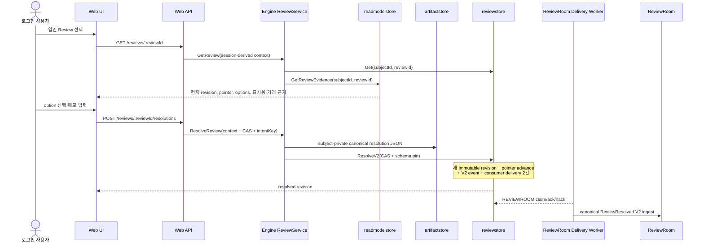

# Account-scoped Review 응답 흐름

이 문서는 분석 Engine이 만든 열린 Review를 로그인 사용자가 확인하고, 응답
revision과 ReviewRoom·application engine 전달 대기열까지 안전하게 저장하는
현재 구현 경계를 설명한다. `BackwardLabs/daejang-reviewroom`에는
`REVIEWROOM` delivery worker, strict canonical V2 ingest와 Anchor Worker가
구현되어 있다. `APPLICATION_ENGINE` worker, Report gate와 최종 PDF 생성은
아직 후속 의존성이다.

## 구현된 경계

브라우저가 보내는 해결 본문은 다음 값으로 제한한다.

- `expectedRevisionId`
- `expectedPointerVersion` — JavaScript 정밀도 손실을 피하기 위한 10진 문자열
- `resolutionCode`
- `resolutionNote`
- `intentKey`

`subjectId`, `actorType`, `actorId`와 session ID는 요청 본문에 존재하지 않는다.
BFF가 인증 session에서 `RequestContext`를 만들고 Engine은 검증된
`ActorContext.user_id`를 account subject와 `USER` actor ID로 사용한다. 따라서
다른 계정의 Review ID를 알아도 `reviewstore.Get(subjectId, reviewId)` 범위를
벗어날 수 없다.

## 상세 조회와 해결 계약

`ReviewService.GetReview`는 목록보다 풍부한 현재 상태를 반환한다.

- immutable Review·execution ID
- 현재 revision ID·number와 pointer version
- 상태, input digest, reason codes
- 사용 가능한 option의 code·label·근거 요구 여부
- 근거 observation의 fragment·observation ID
- raw artifact를 제외한 거래 식별자·발생 시각·계정/지갑·chain·자산·canonical
  integer 수량과 asset decimals

`ReviewService.ResolveReview`는 현재 revision과 pointer가 요청의 예상값과 같은지
먼저 검사한다. 다른 요청이 먼저 반영되었으면 gRPC `ABORTED`를 반환하고 BFF는
안전한 `409 REVIEW_STALE`로 변환한다. UI는 최신 상세를 다시 읽고 사용자가 새
내용을 확인한 뒤 재제출하게 한다. 허용되지 않은 option이나 근거 설명이 필요한
option의 빈 메모는 artifact나 DB 쓰기 전에 거절한다.

표시용 근거는 현재 Review revision이 참조한 published observation과 정확히
일치해야 한다. subject scope가 다른 행, 누락 또는 중복 projection이 있으면
Engine은 상세/해결 응답을 `INTERNAL`로 fail-closed하고 opaque observation ID만
보여 준 채 사용자의 판단을 받지 않는다. UI는 canonical integer 수량을
JavaScript `Number`로 변환하지 않고 asset decimals만 문자열에 적용한다. decimals가
없는 수량은 `raw units`로 명시한다.

## intentKey와 immutable evidence

같은 account, Review와 `intentKey` 조합은 항상 같은 resolution revision ID와
outbox event ID를 만든다. canonical artifact에는 다음 안정적인 사실만 들어간다.

- schema, subject·Review ID
- 예상 revision·pointer
- 선택한 resolution code·note
- session에서 파생한 actor
- intentKey와 recalculation scope

request ID, session ID와 처리 시각은 artifact에서 제외하므로 네트워크 재시도에도
SHA-256 digest가 변하지 않는다. 이미 같은 내용이 저장된 재시도는 새로운 artifact
또는 outbox를 만들지 않고 `replayed=true`로 응답한다. 같은 intentKey를 다른
내용에 재사용하면 gRPC `ALREADY_EXISTS` / HTTP
`409 REVIEW_INTENT_CONFLICT`로 거절한다.

artifact는 `SUBJECT_PRIVATE` privacy·retention으로 먼저 등록한다. `Pin`은 이
단계에서 올리지 않는다. `reviewstore.ResolveV2`가 성공할 때 canonical artifact
domain reference를 pinned 상태로 만들기 때문에 이중 pin과 경쟁 실패 시
audit-pinned orphan을 피할 수 있다. 다만 artifact `Put` 뒤 CAS 또는 DB transaction이
실패하면 content-addressed object와 unpinned metadata는 남을 수 있다. 현재 API에는
이를 같은 transaction에서 회수할 delete/list 계약이 없으므로 subject-private ACL과
volume monitoring을 유지하고, storage owner가 retention 및 reconciliation/GC 후속
작업을 맡는다. 이 문서는 cross-store atomicity를 보장한다고 주장하지 않는다.

Engine 배포는 review mutation DSN과 artifact writer DSN을 별도 설정값으로
받는다. 두 DSN은 같은 물리 database를 가리켜야 ResolveV2 transaction이 앞서
등록한 artifact metadata를 참조할 수 있다. 현재 production 예시는 이미 Engine이
사용하는 `daejang_source_app`을 artifact writer에도 재사용하며, DB에
artifact-only role이 추가되면 더 좁은 role로 교체해야 한다.

Review DB transaction은 다음을 한 번에 수행한다.

1. advisory lock과 expected revision·pointer CAS 검증
2. 기존 OPEN revision을 계승한 RESOLVED immutable revision 추가
3. reason·option·observation lineage 복사
4. current pointer를 한 번 증가
5. legacy `ReviewResolved` outbox 추가
6. exact ReviewRoom input을 나타내는 immutable `ReviewResolved V2` event 추가
7. `REVIEWROOM`과 `APPLICATION_ENGINE`의 독립 delivery row 추가

Web이나 BFF는 ReviewRoom 컨트랙트, EAS 또는 ReviewProofRegistry를 직접 호출하지
않는다. 두 delivery row는 durable handoff 기록이며 자체로 recalculation, anchoring
또는 report delivery 완료를 증명하지 않는다. ReviewRoom delivery worker는
`REVIEWROOM` row만 독립적으로 lease·retry하고 immutable `eventId`를
idempotency key로 사용한다. canonical HTTP ingest를 완료한 뒤 ReviewRoom 내부
Anchor Worker가 온체인 proof를 발행한다. 별도 `APPLICATION_ENGINE` row를
소비해 실제 장부·세금 계산에 반영하는 worker는 `daejang-tax-engine`에 구현해야
한다.

## API와 UI 상태

- `GET /api/v1/reviews?cursor=...`: `(createdAt, reviewId)` keyset cursor 기반 열린
  Review 목록. cursor는 Engine이 발행하는 opaque token이며 BFF나 브라우저가
  내부 필드를 해석하지 않는다.
- `GET /api/v1/reviews/:reviewId`: account-scoped 상세 조회
- `POST /api/v1/reviews/:reviewId/resolutions`: CAS 기반 해결
- 첫 성공은 `201`, 동일 intent replay는 `200`
- missing detail은 `404`, stale/not-open/intent conflict는 각 안전한 `409`

UI는 option과 근거 요구 여부를 표시하고, 요청 중에는 revision/V2 delivery 저장 중임을
알린다. 일반 전송 실패에서는 같은 intentKey를 유지해 안전하게 재시도한다.
stale 응답에서는 intentKey를 폐기하고 최신 revision을 다시 불러온다.

migration 17은 기존 OPEN Review가 한 건이라도 있으면 적용을 중단한다. PR #20에는
migration-16 호환 resolver artifact가 포함되지 않으므로, OPEN Review가 있는
운영 DB는 전환하지 않는다. 버전된 cutover 명령·입력 manifest·dry-run·audit
log·migration 16 복제 DB 테스트를 갖춘 후속 변경을 독립적으로 리뷰한 뒤에만
전환한다. 자동 삭제나 검증되지 않은 SQL로 이 게이트를 우회하지 않는다.
migration 17 이후 새 Review는 immutable opening ledger revision
연결 없이는 생성되지 않으므로 `REVIEW_LINEAGE_UNAVAILABLE`은 정상 lifecycle이
아니라 미적용 migration 또는 데이터 손상을 막는 fallback이다. 이를 새 Review로
재분석했다는 이유만으로 기존 OPEN 행을 숨겨서는 안 된다.

legacy V1 RESOLVED 행은 historical record로 보존할 수 있지만 V2 event, 두 consumer
delivery와 anchored receipt가 없으므로 proof-complete가 아니다. 향후 Report gate는
모든 역사 Review가 아니라 해당 Report가 고정한 최신 analysis execution/generation의
required Review set만 평가하고, V1-only 행을 Manifest 후보로 선택하지 않아야 한다.

## 아직 구현하지 않은 후속 의존성

현재 완료는 “사용자 응답 revision과 전달할 V2 event가 durable하다”는 뜻이며
“온체인 proof가 확정됐다”는 뜻이 아니다. 최종 Report/PDF를 열기 전에 별도
구현에서 최소한 다음 조건을 검사해야 한다.

1. 모든 필수 Review에 최신 사용자 응답과 ReviewResolved V2 event가 존재하고,
   legacy OPEN/V1-only RESOLVED Review가 남아 있지 않다.
2. 분석 Engine이 각 응답 revision을 ledger/tax 계산에 반영했다.
3. 각 최신 `ReviewResolved V2` event에 대응하는 proof가 anchored되고 receipt가
   저장됐다. 이 기능의 구현 소유자는 `BackwardLabs/daejang-reviewroom`이다.
4. DB의 최신 proof ID와 `ReviewProofRegistry.latestProofId`가 일치한다.
5. 그 proof 목록을 immutable Review Proof Manifest로 고정했다.

그 뒤에만 Manifest를 입력으로 최종 PDF를 만들고, PDF hash는 별도 ProofGate에
기록한다. Anchor 상태·receipt 저장 schema/API, 재계산 완료 신호, Report gate,
Manifest와 PDF 렌더링은 이 변경에 포함되지 않는다.
