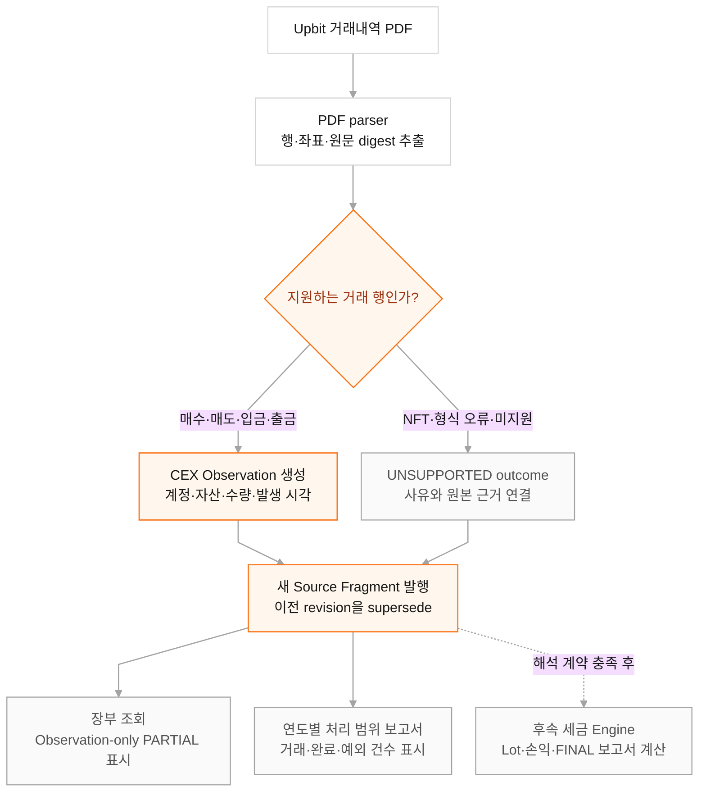

# Upbit PDF Observation 정규화

> 상태: Implemented
>
> 대상: Upbit 거래내역 PDF, Engine Source Evidence, 장부·보고서 조회
>
> 관련 문서: [데이터 소스 등록 및 수집 기간 설정](02-data-source-collection.md), [Engine 연동 구현 현황과 계획](engine-integration-roadmap.md)

## 목적

Upbit PDF parser가 추출한 거래 행을 금액 문자열 그대로 보존하는 중간 결과에 머물게 하지 않고, `subject_evidence`의 계정·자산·Observation으로 정규화한다. 정규화된 거래는 세금 해석이 완료되기 전에도 장부에서 확인할 수 있고, 보고서 목록에는 처리 건수와 예외 건수가 `PARTIAL` 상태로 표시된다.

`PARTIAL` 보고서는 원천 거래의 수집·정규화 범위를 보여 주는 중간 산출물이다. 취득가액, 처분손익과 최종 세액을 계산한 세금 신고서는 아니다.

## 처리 순서



## Observation 매핑

| Upbit 행 | 생성 Observation | 수량 방향 |
| --- | --- | --- |
| 매수 | 기준 자산 `FILL`, KRW 거래금액 `FILL`, KRW `FEE` | 기준 자산 유입, 거래금액·수수료 유출 |
| 매도 | 기준 자산 `FILL`, KRW 거래금액 `FILL`, KRW `FEE` | 기준 자산 유출, 거래금액 유입·수수료 유출 |
| 입금 | 자산 `DEPOSIT` | 유입 |
| 출금 | 자산 `WITHDRAWAL`, 수수료가 있으면 `FEE` | 모두 유출 |

- 거래의 KRW principal에는 PDF의 거래금액을 사용하고 수수료는 별도 `FEE`로 보존한다. 정산금액은 `매수=거래금액+수수료`, `매도=거래금액-수수료` 검산에만 사용한다. exact decimal로 계산하되 PDF의 원 단위 표시값과 원 미만 수수료가 독립 반올림되는 범위인 1원 이내 차이만 허용한다.
- PDF가 제공하는 최대 8자리 소수를 손실 없이 정수로 운반하기 위해 모든 Upbit 문서 자산에 `upbit-document-decimal8/v1` scale을 사용한다. 자산 ID와 locator에도 이 정책을 포함해 기존의 잘못된 18자리 정의나 향후 venue resolver 결과와 충돌하지 않게 한다. 이는 온체인 token precision을 추정한 값이 아니며, `OBSERVATION_ONLY` 조회 전용이다. 세금 posting은 별도 venue Asset resolver 또는 근거 있는 `QuantityTransition`이 확정되기 전까지 만들지 않는다.
- PDF의 한국 시각은 `Asia/Seoul`로 해석한 뒤 UTC instant로 저장하며, 보고 연도는 다시 한국 민간 시각 기준으로 계산한다.
- 매핑에 필요한 필드가 없거나 단위·정밀도·시각을 정확히 해석할 수 없으면 값을 추정하지 않고 해당 행을 `UNSUPPORTED`로 닫는다.

## Parser 입력 계약

정규화기는 private artifact의 실거래 값을 문서나 로그로 내보내지 않고 다음 구조만 계약으로 고정한다.

| 영역 | 필수 구조 |
| --- | --- |
| 문서 | `contractVersion=internal-document-evidence-input/v2` 또는 `v3`, `providerId=UPBIT`, `documentType=TRADE_STATEMENT` |
| 행 payload | `eventAt`, `eventType`, `description`, `asset`, `quantity`, `grossAmount`, `fee`, `settlementAmount`의 `state`와 `raw`. v3는 입·출금의 `counterparty`, `walletAddress`, `travelRuleInfo`도 restricted evidence로 보존 |
| 행 provenance | `sourceArtifactId`, 1부터 시작하는 page, item index, SHA-256 record hash |
| 실행 | `status=COMPLETE` 또는 `PARTIAL`, 완료 시각, source record count |
| 사용자 대응 | `MATCH` 또는 raw 값을 보존하지 않은 명시적 MVP 비교 생략 정책 |

계약 밖 run status, 중복 record ID, 알 수 없는 canonical duplicate 대상과 잘못된 provenance는 fragment 전체를 거부한다. 개별 거래의 필드·산식 오류와 미지원 섹션은 원본 근거가 연결된 명시적 outcome으로 남긴다.

## 장부와 보고서 노출

실제 세금 Engine이 아직 posting으로 물질화하지 않은 CEX Observation은 Query Service가 읽기 전용 장부 event로 투영한다. 이 event는 `resolution=PARTIAL`, `interpretationSupport=OBSERVATION_ONLY`로 표시하며, 입·출금 상대를 아직 읽지 못한 단계에서는 외부 전송으로 단정하지 않고 `flowShape=UNKNOWN`을 사용한다. 이후 동일 Observation을 참조한 실제 posting이 생성되면 임시 투영은 자동으로 제외되어 중복 표시되지 않는다.

Parser v3의 상대 이름·주소 원문은 `GIWAOBJ3` restricted artifact에만 암호화 저장한다. Observation과 canonical ledger에는 원문 대신 마스킹 표시, 주소 계열, 등록 wallet source ID, chain 후보와 검토 상태만 전달한다. 등록 지갑과 주소가 일치하면 `SELF_TRANSFER` 후보가 되지만 반대편 지갑 Observation이 확인되기 전까지 `taxReady=false`, continuity `CANDIDATE`를 유지한다. 이름·주소가 없으면 `UNKNOWN`, 외부 주소만 확인되면 `EXTERNAL_IN` 또는 `EXTERNAL_OUT`으로 기록하되 거래 목적 검토 상태를 유지한다.

PDF `description`(적요) 원문은 조회 역할에 공개하지 않고 normalizer가 허용한
`activityClass`로만 변환한다. `원화` 입·출금은 본인 계좌 흐름으로,
`예치금 이용료`는 거래소 수익으로, `디지털 자산 지급`은 에어드롭으로
표시한다. 일반 `디지털 자산` 입·출금만 송·수신자 지갑 확인 대상으로
남겨 둔다. 알 수 없는 적요는 추정하지 않고 `UNSPECIFIED`로 닫는다.

백필은 연도별 source coverage snapshot도 함께 만든다. snapshot은 다음 값만 보장한다.

- `transactionCount`: 해당 연도 원천 행 수
- `completeCount`: Observation으로 정규화된 행 수
- `exceptionCount`: 미지원 또는 정규화 실패 행 수
- `status`: 항상 `PARTIAL`
- `profitAmount`: `UNKNOWN`

## 불변성과 재처리

기존에 발행한 Source Fragment는 수정하지 않는다. 동일 원본을 새 normalizer 버전으로 다시 처리할 때는 같은 fragment series의 다음 revision을 발행하고 `supersedes_fragment_id`로 이전 revision을 연결한다. 현재 정규화 계약은 `observation/v5`이며 root digest가 전체 Observation projection digest를 포함한다. ID와 digest는 원본 fragment, subject, producer version으로 결정되므로 같은 입력의 재실행이 중복 revision이나 Observation을 만들지 않는다.

일회성 백필 명령은 다음 입력을 외부 환경에서 받는다.

```text
DAEJANG_SOURCE_DATABASE_URL
DAEJANG_REPORT_DATABASE_URL
DAEJANG_PRIVATE_OBJECT_ROOT
DAEJANG_PRIVATE_OBJECT_TEMP
DAEJANG_BACKFILL_SUBJECT_ID
DAEJANG_BACKFILL_FRAGMENT_ID
DAEJANG_BACKFILL_EXPECTED_SUBJECT_NAME  # 이름 기반 본인 판정이 필요한 경우에만
PRIVATE_OBJECT_ENCRYPTION_KEY
PRIVATE_OBJECT_ENCRYPTION_KEY_ID
PRIVATE_OBJECT_DECRYPTION_KEYS          # key rotation 중인 경우
```

명령은 private artifact를 읽으므로 운영 secret과 subject ID를 코드·로그·문서에 기록하지 않는다. 성공 로그에는 원본 거래 내용이나 금액 대신 전체 행 수, 정규화 행 수, Observation 수와 종료 상태만 남긴다.

Query Service를 배포하기 전에 `daejang-db` migration 52까지 먼저 적용한다. Migration 36은 query role에 source revision과 Observation 순서를 읽는 데 필요한 최소 컬럼만 허용하고, migration 46은 restricted 원문 없이 안전한 transfer endpoint assertion만 장부 read model에 연결한다. Migration 52는 Observation `detail_json`의 allowlist `activityClass`만 안전한 view로 공개한다. Query role은 원문 `detail_json`과 private artifact에 접근하지 않는다.

## 현재 경계

현재 구현으로 원본 거래 행은 장부와 처리 범위 보고서에서 조회할 수 있다. 실제 취득원가, 양도손익, 공제와 세액은 tax profile, 가격 근거, lot 계산 및 검토 확정이 완료된 뒤 별도 tax Engine이 생성해야 한다. 그 전에는 `PARTIAL`을 `FINAL`로 승격하거나 알 수 없는 손익을 0원으로 표시하지 않는다.
